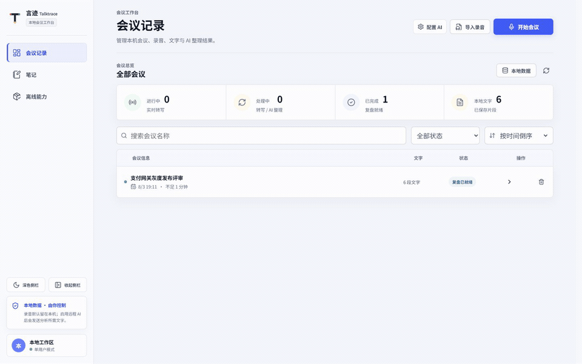
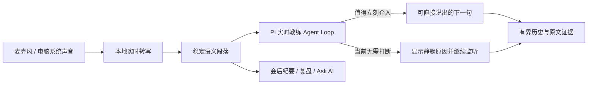
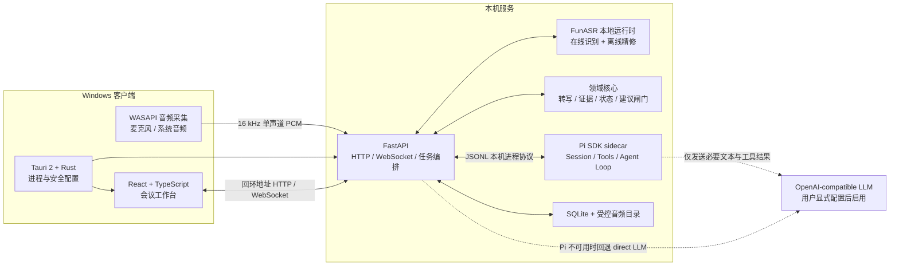
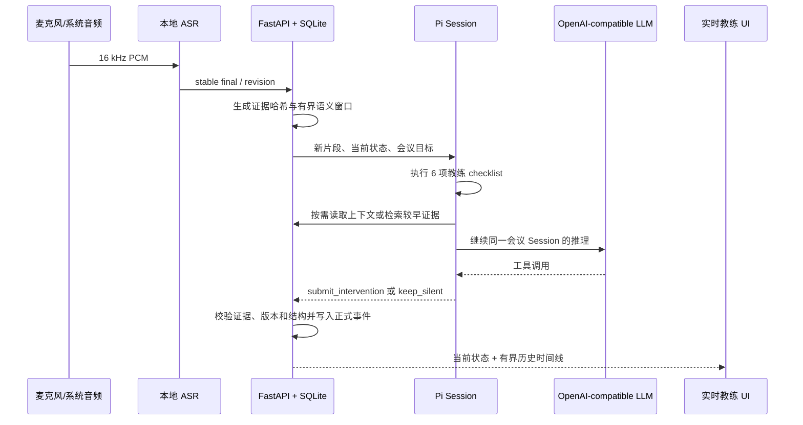
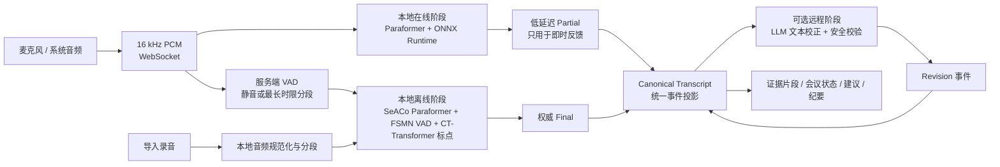
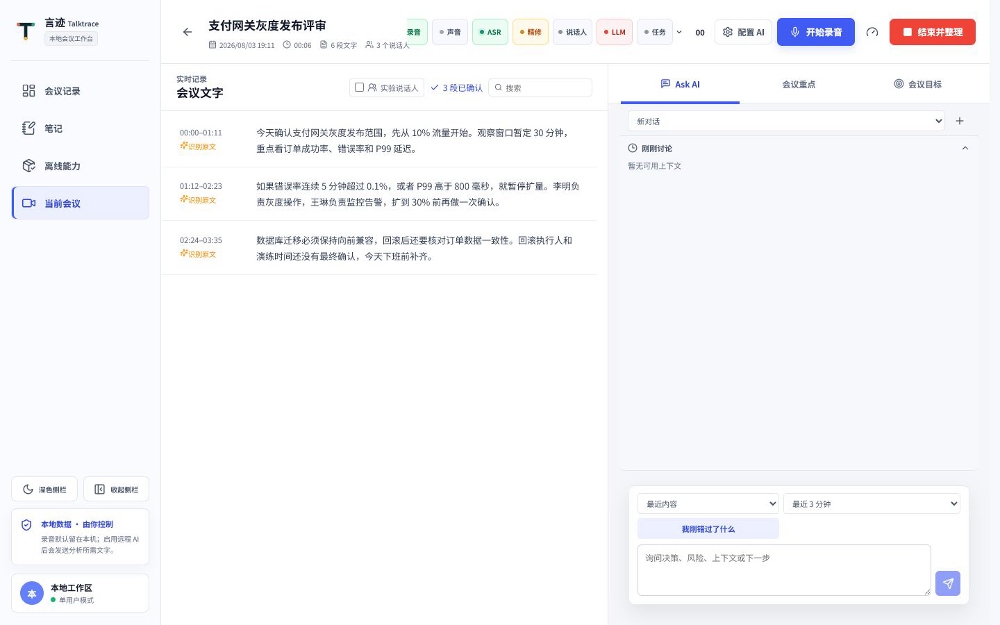
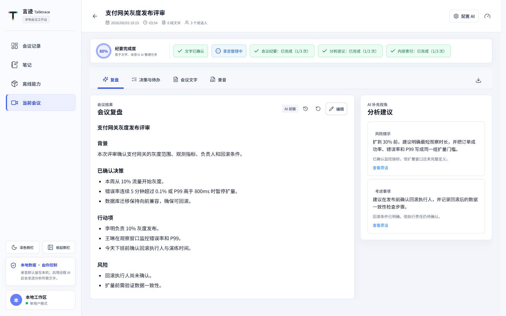
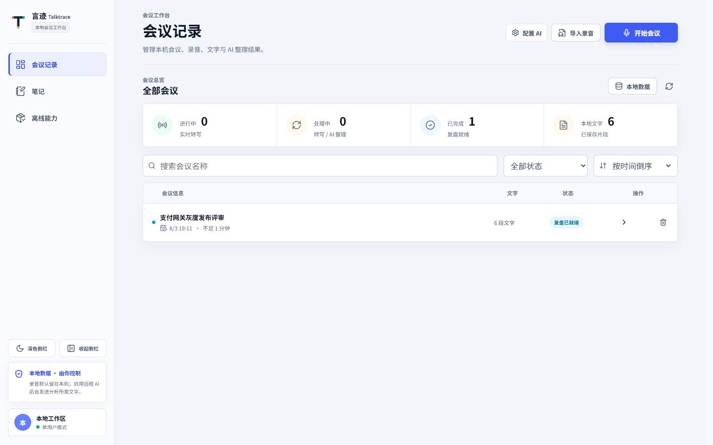

# 言迹 Talktrace

本地优先的实时语音理解与私人教练。言迹 Talktrace 监听用户授权的麦克风和电脑系统音频，把稳定转写持续交给 AI 理解，在对话仍在进行时给出少量、可直接说出口、可追溯原文的建议，同时保留会后复盘和个人笔记。

它不是腾讯会议或 Zoom 的替代品，也不依赖加入某个会议平台。腾讯会议、浏览器视频、播放器等声音只要从当前 Windows 输出设备播放，就可以通过 WASAPI loopback 进入系统音频轨；现场发言则进入麦克风轨。

[官网](https://talktrace.codexai.club/) · [GitHub](https://github.com/luguochang/meeting-copilot) · [CSDN 博客](https://blog.csdn.net/luguochang) · [AI 赞助商](https://codexai.club/)



> 当前 `feat/pi-realtime-coach-agent-loop` 分支集成 Pi SDK 作为实时教练 Agent runtime，尚未合并到 `main`。Pi 不替代 ASR 或底层 LLM，而是在稳定转写之上增加持续会话、工具调用、历史检索、介入判断和可审计的 Agent Loop。

## 产品工作方式



会中与会后采用不同目标：

- **会中**：优先低延迟和介入价值。每个新稳定片段触发一次检查，但只有能避免具体损失、补上关键回答或改善当前表达时才展示建议。
- **会后**：允许后台慢速整理整场内容，生成纪要、事实、行动项、风险和复盘结果。
- **全程可追溯**：AI 结论必须带原文 segment ID 和逐字证据；转写被修订后，过期结果不能覆盖新状态。

## 技术架构

Talktrace 采用桌面采集、Web 工作台、本地编排、领域核心、模型运行时和持久化事件六层结构。Tauri 负责原生音频和进程生命周期，React 负责交互，FastAPI 编排 ASR 与 AI 任务，Pi sidecar 负责持续 Agent Loop，SQLite 保存规范转写、会议事实、任务和正式事件。



### 会中 Agent 数据流



### 语音转文字链路



这条链路实际包含三个职责不同的层次：

1. **本地在线 ASR**：音频通过 WebSocket 持续送入 FunASR 在线 Paraformer ONNX 模型，快速产生 `partial`，保证会中界面有连续反馈。在线输出只用于实时预览，不作为最终权威文本。
2. **本地离线精修**：服务端 VAD 根据自然静音或最长段时限切出完整 PCM 片段，交给常驻的离线 FunASR worker。离线 SeACo Paraformer 配合 FSMN VAD、CT-Transformer 标点和热词生成 `final`；模型只加载一次并复用，避免每段重复启动。
3. **可选远程 LLM**：只在用户配置 OpenAI-compatible 服务后启用，用于文本校正和会议语义分析。它接收必要的会议文本，不接收原始录音；不可用时，本地转写与会议记录仍然工作。

### 为什么能兼顾实时性和准确率

- **延迟与准确率解耦**：在线模型负责“尽快显示”，离线模型负责“最终落盘”，避免用更重的离线推理阻塞实时反馈。
- **服务端端点检测**：VAD 在自然停顿处收束句子，同时用最大段长限制持续发言，保证精修任务有明确边界。
- **常驻模型进程**：在线 worker 与离线 refiner 都采用进程常驻、会话复用模式，减少模型冷启动和重复加载开销。
- **热词与文本规范化**：本地 ASR 支持会议热词，入库前执行幂等术语规范化，降低技术名词和中英文混排的误差。
- **明确的文本权威级别**：规范转写按 `partial < final < revision` 投影。同一语音段只允许更高等级事件覆盖展示结果，同时保留事件历史用于追踪。
- **安全的 LLM 校正**：校正任务累计到 80 字或等待 15 秒后触发，单批最多 2,000 字；长度比例必须在 `0.65-1.40` 内，文本相似度不得低于 `0.65`，不满足条件的改写会被拒绝。
- **失败可降级**：离线精修不可用时保留在线结果并标记降级；LLM 超时、限流或返回非法结构时不破坏规范转写。任务通过租约、有限重试和审计状态避免重复提交。

### Pi 实时私人教练

原有 LLM 链路适合把一个文本批次转换成主题、待办或纪要，但它本质上仍是一次请求、一次响应。Pi SDK 被用于需要跨轮状态和明确行动边界的实时教练，不用于替代已经能完成结构化抽取的普通 LLM 调用。

Pi Agent Loop 每轮执行以下检查：

| 检查项 | 关注的问题 | 典型输出 |
| --- | --- | --- |
| 问题回应 | 对方是否正在等待直接回答 | 先回答问题，再补背景 |
| 承诺条件 | 时间、范围、结果或责任是否缺少前提 | 给承诺补上测试、审批或资源条件 |
| 目标覆盖 | 当前讨论是否偏离会议目标 | 用一句话拉回需要达成的结果 |
| 前后口径 | 当前说法是否与较早立场冲突 | 立即澄清或撤回冲突表述 |
| 表达清晰 | 是否重复、失焦或迟迟没有结论 | 给出可直接说出口的收束句 |
| 介入价值 | 现在提示是否仍来得及且确有价值 | 选择介入或正式保持静默 |

Pi 相对单次 LLM 增加的是运行机制，而不是一个新的模型能力：

- **会议级 Session**：同一会议复用会话，保留有界的教练判断历史，不必在每轮 Prompt 中重复整场内容。
- **工具调用**：Agent 可以读取当前会议目标、rolling state，并按需检索最多 48 条较早转写证据。
- **明确终止动作**：每轮只能通过 `submit_intervention` 提交建议，或通过 `keep_silent` 说明为何不打断；普通自由文本不能直接进入产品。
- **证据闸门**：Python 与 Node 两侧都会校验 segment ID、逐字引用和转写版本，阻止虚构或过期依据。
- **运行时回退**：Pi sidecar 不可用或协议异常时自动回退 direct LLM，并在界面暴露回退原因。
- **低频但可见**：没有值得介入的内容时，界面显示本轮检查数量和静默原因，用户能区分“正在监听但选择静默”和“AI 没有运行”。

实时建议采用有界信息流，避免新内容覆盖旧内容：当前区只显示本轮有效建议或静默结论；过去建议最多保留 12 条，默认展示 3 条；“刚刚讨论”最多保留 10 条，默认展示 5 条。连续重复项会合并，所有条目都可以回到原文证据。

### 证据化会议理解

远程 LLM 不直接修改会议事实。FastAPI 先从规范转写中构造带时间范围和段落 ID 的证据，再通过 OpenAI-compatible Chat Completions 或 Responses API 生成结构化结果。传输默认优先使用 SSE 流式响应，不支持流式的服务可显式降级到非流式模式。

生成结果需要通过领域闸门后才能进入工作台：

- 建议必须引用当前有效的原文证据，证据被转写修订替代后会变为 `superseded`，不能继续支撑强建议。
- 会议状态围绕负责人、截止时间、测试验证、指标监控和回滚条件建模，用于识别技术讨论中的未闭环项。
- ASR 语义质量不足或链路处于降级状态时，系统阻止生成高置信度建议，保留转写并明确暴露质量状态。
- 增量 AI 任务保存输入转写版本和证据哈希；提交前再次检查证据版本，避免过期结果覆盖新内容。

## 本分支的改进

| 原有能力或问题 | 本分支改进 | 用户可见结果 |
| --- | --- | --- |
| LLM 按批次抽取主题、待办和风险 | 稳定转写驱动持续 Pi Agent Loop | 对话仍在发生时给出下一句建议，而不只做会后总结 |
| 只关注结构化会议实体 | 增加问题回应、承诺、目标、矛盾、表达清晰和介入价值检查 | 能处理“没回答”“承诺过头”“说了很久没结论”等实时表达问题 |
| 每轮上下文主要依赖 Prompt 拼接 | 会议级 Session + 按需历史检索 | 跨多轮理解较早条件，同时控制上下文和调用成本 |
| 新一轮结果覆盖右侧旧内容 | 12 条教练历史 + 10 条最近讨论的有界时间线 | 用户错过即时提示后仍能回看，不形成无限卡片墙 |
| 静默时看起来像 AI 没工作 | `keep_silent`、checklist 指标和静默原因可见 | 能知道 Pi 已检查，只是判断当前不应打断 |
| 旧建议在问题解决后仍可能显得有效 | 最新静默轮次撤下主卡，旧建议进入历史 | 不把已经解决的问题继续当作当前风险 |
| 转写精修可能使在途证据过期 | 取消旧任务并对最新 evidence hash 补排分析 | 左侧文字修订后，教练不会永久漏掉本轮分析 |
| Agent runtime 异常可能阻断建议 | Pi 自动回退 direct LLM | 降级可见，基础 AI 能力继续工作 |

边界也保持明确：Pi 不提高 ASR 本身的识别率，不保证弱模型自动变强，也不会在没有新稳定转写时持续轮询。它的价值是把模型放进可持续、可取证、会判断是否介入的业务循环。

### 部署成本与当前状态

- **不新增服务器或数据库**：Pi 以一个懒启动的本机 Node sidecar 运行，继续复用 FastAPI、SQLite 和用户已经配置的 LLM Provider。
- **增加一个本机运行时**：源码开发需要 Node.js `>=22.19.0` 和约束锁定的 npm 依赖；Python 通过 JSONL 管理 sidecar 生命周期和超时。
- **增加实时模型调用**：只有出现新稳定转写时才运行 Agent Loop；静音、ASR partial 和没有新内容的等待期不调用模型。
- **安装包尚未完成**：当前 Windows Release 不包含 Node runtime 和 Pi sidecar。本分支已跑通源码环境，正式发布前仍需完成 helper 打包、SBOM、签名和升级策略。
- **失败不会阻断基础链路**：Pi 启动、协议或 Provider 失败时回退 direct LLM；即使所有远程 AI 都不可用，本地录音和转写仍继续工作。

## 技术栈

| 层次 | 技术 | 用途 |
| --- | --- | --- |
| 桌面端 | Tauri 2、Rust、Windows WASAPI | 客户端生命周期、麦克风与系统回放音频、双轨采集、系统安全存储 |
| Web 前端 | React 18、TypeScript 5.9、Vite 8、Lucide | 会中工作台、历史、复盘、笔记、设置与离线能力管理 |
| 本地后端 | Python 3.11-3.13、FastAPI、Pydantic、Uvicorn | 本地 API、WebSocket、ASR 编排、任务和静态资源托管 |
| 数据与任务 | SQLite、受控文件目录、持久化 Job/Outbox | 会议事实、音频、事件、租约、重试与异常恢复 |
| 本地 ASR | FunASR 1.3.10、FunASR ONNX、ONNX Runtime、Paraformer | 在线低延迟识别与本地离线精修 |
| 语音后处理 | SeACo Paraformer、FSMN VAD、CT-Transformer Punctuation | 端点检测、完整段重识别、标点与热词增强 |
| 远程 AI | OpenAI-compatible Chat Completions / Responses、HTTPX、SSE | 可选文本校正、实时建议、纪要与复盘生成 |
| Agent runtime | `@earendil-works/pi-agent-core` 0.84.2、Node.js sidecar、JSONL | 会议级 Session、工具循环、历史检索、介入或静默决策 |
| 工程质量 | Pytest、Vitest、Testing Library、Ruff、ESLint、Cargo Check | 单元、契约、集成、前端和桌面端验证 |
| 发布 | Tauri/NSIS、`.mcpkg`、CycloneDX SBOM | Windows 安装包、独立模型能力包与供应链清单 |

## 可靠性与数据边界

- 桌面后端只监听随机的 `127.0.0.1` 回环端口，由 Tauri 负责启动、健康检查和退出回收。
- 本地 API 使用启动时生成的令牌完成引导，再通过 `HttpOnly`、`SameSite=Strict` Cookie 访问工作台。
- Provider 密钥由桌面端写入操作系统安全存储，前端只读取脱敏配置状态。
- 规范化会议数据保存在 SQLite；录音与派生文件位于受控数据根目录，导入、导出和删除均执行路径边界校验。
- 后台任务使用持久化状态、租约、截止时间和重试策略，应用异常退出后可恢复未完成任务。
- 诊断输出会过滤密钥、URL 凭据和本机绝对路径；官网与客户端运行数据完全隔离。
- ASR 模型不写入 Git，也不绑定在基础安装包中；`.mcpkg` 能力包通过清单、平台信息和哈希进行校验。

## 主要功能

- **会议工作台**：麦克风与系统音频输入、连续转写、当前议题和会议状态集中展示。
- **Pi 实时私人教练**：监听稳定转写，围绕问题回应、承诺条件、目标、前后口径和表达清晰度给出可直接说出的下一句；无介入价值时保持静默。
- **可回看时间线**：当前建议、过去教练建议和最近讨论分层展示，限制数量、合并重复并保留原文定位。
- **证据化会议理解**：围绕负责人、截止时间、验证、监控和回滚条件生成带原文依据的主题、事实、行动项与风险。
- **会后复盘**：在同一场会议中查看纪要、方案与风险、待确认项、完整文字和录音。
- **录音导入**：导入已有音频并跟踪转写和分析进度。
- **会议与笔记管理**：搜索、筛选、重命名、删除历史会议，并整理个人笔记。
- **离线能力管理**：导入本地 ASR 能力包并查看模型与运行状态。

| 实时会议 | 会后复盘 |
| --- | --- |
|  |  |



## 下载 Windows 版

[GitHub Release v0.1.0](https://github.com/luguochang/meeting-copilot/releases/tag/v0.1.0) 提供 Windows x64 基础客户端：

| 文件 | 用途 | SHA-256 |
| --- | --- | --- |
| [Windows x64 安装程序](https://github.com/luguochang/meeting-copilot/releases/download/v0.1.0/Talktrace-0.1.0-windows-x64-base-unsigned.exe) | 当前用户安装与卸载 | `7d077e35f1e67da059a1291865d858f95eaa25c7257387b298b80187cc405463` |

基础客户端包含桌面应用和本地服务，不包含 ASR 模型。实时转写和录音文件转写需要与平台匹配的 `.mcpkg` 能力包。当前安装程序尚未进行代码签名，详细步骤和校验方式见 [安装指南](docs/installation.md)。

## 从源码运行

环境要求：Windows 10/11、Python 3.11-3.13、Node.js 22，以及 [uv](https://docs.astral.sh/uv/)。

```powershell
git clone https://github.com/luguochang/meeting-copilot.git
cd meeting-copilot\code\web_mvp\frontend_v2
npm ci
npm run build

cd ..\..\agent_runtime\pi_coach_bridge
npm ci

cd ..\..\web_mvp\backend
uv sync --frozen --group dev
uv run python ..\..\..\tools\workbench_server.py start
```

Pi 是本分支默认的实时教练 runtime。仍需在设置中配置可用的 OpenAI-compatible Provider；Pi SDK 不自带模型。需要临时切回原有单次 LLM 路径时设置：

```powershell
$env:MEETING_COPILOT_REALTIME_COACH_RUNTIME = "direct"
```

完全关闭实时教练时设置 `MEETING_COPILOT_REALTIME_COACH_ENABLED=0`。默认 Agent 路径、回退行为和无声验证结果见 [Pi 持续教练实现说明](docs/pi-continuous-coach-loop.md)。

打开 `http://127.0.0.1:8765/workbench`。停止服务：

```powershell
uv run python ..\..\..\tools\workbench_server.py stop
```

模型能力包、桌面构建和配置方式见 [安装指南](docs/installation.md) 与 [开发指南](docs/development.md)。

## 代码结构

```text
meeting-copilot/
├─ code/
│  ├─ core/                 # 会议状态、证据契约与建议闸门
│  ├─ web_mvp/
│  │  ├─ backend/           # FastAPI、SQLite、ASR 与 AI 任务编排
│  │  └─ frontend_v2/       # React + TypeScript 工作台
│  ├─ desktop_tauri/        # Tauri 桌面壳、WASAPI 音频与进程管理
│  ├─ asr_runtime/          # FunASR worker、模型清单与转写工具
│  └─ agent_runtime/
│     └─ pi_coach_bridge/   # Pi SDK Session、工具边界与 JSONL sidecar
├─ configs/                 # 配置模板与术语表
├─ data/                    # 脱敏演示数据和评测词表
├─ docs/                    # 用户与技术文档
├─ tests/                   # 跨模块契约和工具测试
├─ tools/                   # 启动、诊断、打包和发布工具
└─ website/                 # Vite + React 产品官网
```

## 验证

```powershell
# 前端
cd code\web_mvp\frontend_v2
npm run lint
npm run typecheck
npm test
npm run build

# 后端
cd ..\backend
uv run --frozen ruff check meeting_copilot_web_mvp
uv run --frozen pytest -q

# Pi 实时教练（faux provider，不访问麦克风或扬声器）
cd ..\..\agent_runtime\pi_coach_bridge
npm test
npm run smoke

# 桌面端
cargo check --locked --manifest-path ..\..\desktop_tauri\src-tauri\Cargo.toml

# 官网
cd ..\..\..\website
npm run check
```

## 文档

| 文档 | 内容 |
| --- | --- |
| [安装指南](docs/installation.md) | 安装、能力包、源码运行和 AI 服务配置 |
| [使用指南](docs/user-guide.md) | 会议、导入、复盘、笔记和离线能力 |
| [架构说明](docs/architecture.md) | 组件职责、数据流和安全边界 |
| [实时智能质量提升方案](docs/realtime-intelligence-quality-and-agent-decision-plan.md) | 分片诊断、语义窗口、任务拆分、质量评测与 Pi Go / No-Go |
| [实时对话 Agent 产品与技术方案](docs/pi-agent-product-and-technical-design.md) | 双音轨实时教练、Pi 边界、腾讯会议采集、介入策略与实施路线 |
| [Pi 持续教练实现说明](docs/pi-continuous-coach-loop.md) | SDK 集成、Agent Loop、checklist、历史信息流、回退与真实 Provider 验收 |
| [Pi SDK 技术调研](docs/realtime-coach-pi-spike-report.md) | SDK 能力、PoC、部署成本、风险和 Go / No-Go 结论 |
| [开发指南](docs/development.md) | 开发环境、命令、测试和贡献约定 |
| [隐私说明](docs/privacy.md) | 本地数据、远程调用和删除边界 |
| [故障排查](docs/troubleshooting.md) | 启动、音频、转写与 AI 配置问题 |

## 许可

第一方代码使用仓库中的 [Talktrace Source License](LICENSE)。第三方依赖、模型、字体和二进制文件受各自许可约束，详见 [NOTICE](NOTICE) 与 [SBOM](sbom.cdx.json)。

Copyright (c) 2026 [luguochang](https://github.com/luguochang).
