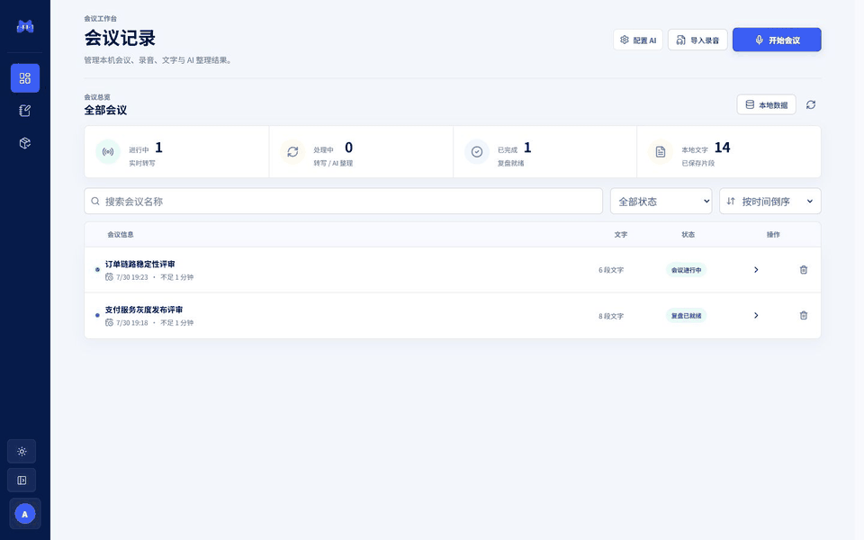
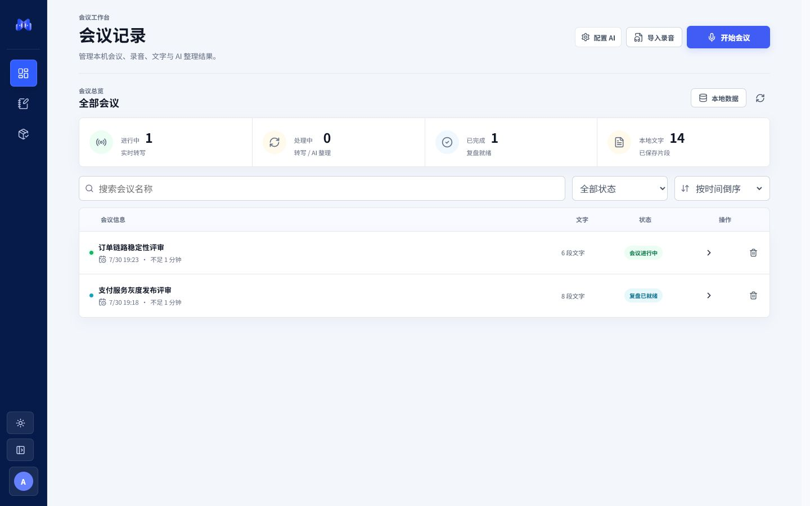
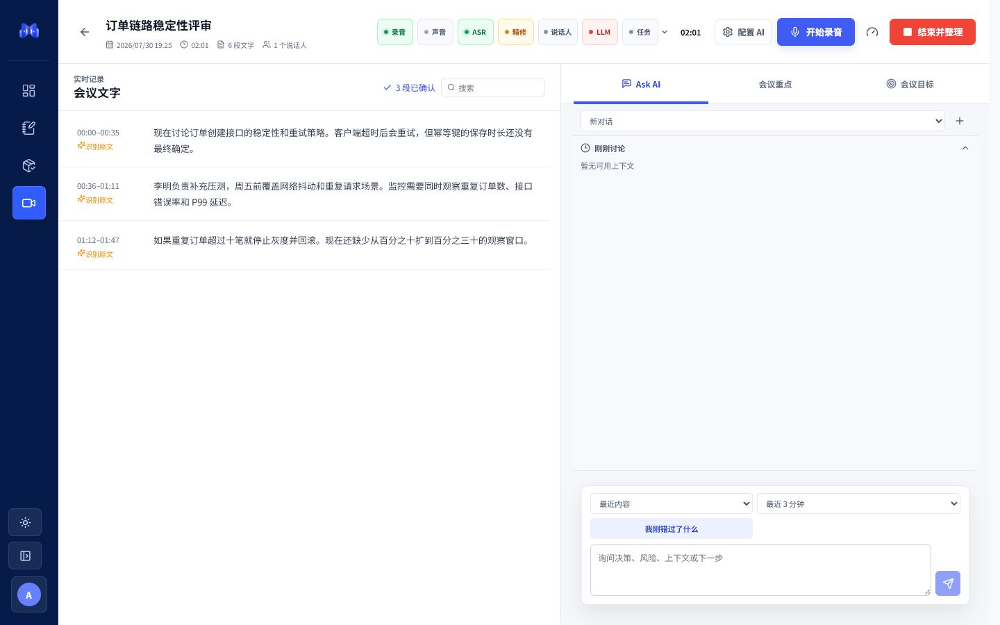
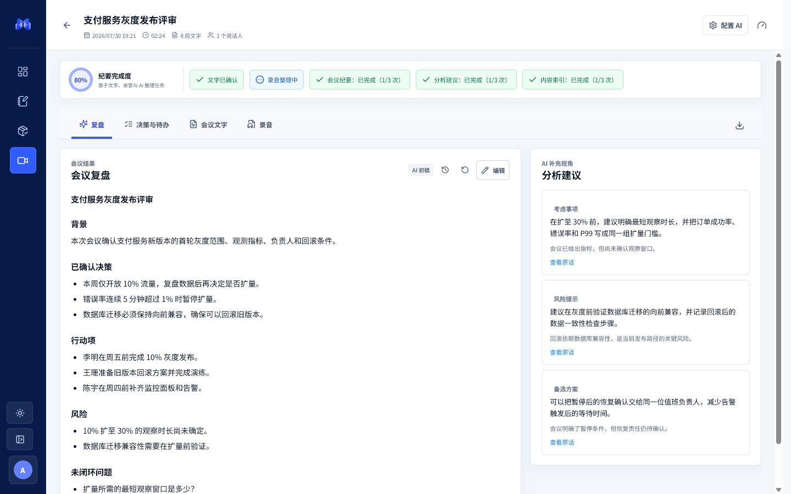

# Meeting Copilot

本地优先的中文技术会议助手。Meeting Copilot 将实时转写、议题跟踪、证据化建议、会后复盘和个人笔记放在同一个桌面工作台中。

[官网](https://codexai.club/) · [GitHub](https://github.com/luguochang/meeting-copilot) · [CSDN 博客](https://blog.csdn.net/luguochang) · [AI 赞助商](https://codexai.club/)

> 当前版本：Windows `0.1.0` 公开预览。项目采用单用户、本地运行模式；远程 AI 分析仅在用户主动配置 OpenAI-compatible 服务后启用。Windows 安装包尚未进行代码签名。



## 主要功能

- **会议工作台**：麦克风与系统音频输入、连续转写、当前议题和会议状态集中展示。
- **AI 建议**：围绕负责人、截止时间、验证、监控和回滚条件生成带原文依据的追问建议。
- **会后复盘**：在同一场会议中查看纪要、方案与风险、待确认项、完整文字和录音。
- **会议历史**：搜索、筛选、重命名、删除和重新打开历史会议。
- **录音导入**：导入已有音频并跟踪转写和分析进度。
- **个人笔记**：记录、搜索和整理会议之外的个人内容。
- **离线能力**：管理本地 ASR 能力包与运行状态。
- **服务配置**：在桌面端保存并检测 OpenAI-compatible 分析服务。



### 实时会议



### 会后复盘



## 下载 Windows 版

[GitHub Release v0.1.0](https://github.com/luguochang/meeting-copilot/releases/tag/v0.1.0) 提供 Windows x64 基础客户端：

| 文件 | 用途 | SHA-256 |
| --- | --- | --- |
| [Windows x64 安装程序](https://github.com/luguochang/meeting-copilot/releases/download/v0.1.0/Meeting-Copilot-0.1.0-windows-x64-base-unsigned.exe) | 当前用户安装与卸载 | `c14a267dcac6fc8641b02bc1e3d14255169a275acc2b697e3fcb0cb7c23e79c4` |

基础客户端包含桌面应用和本地服务，可以启动工作台、管理会议与笔记、配置 AI 分析服务并导入离线能力包。仓库和基础客户端不包含 ASR 模型；实时本地转写和录音文件转写需要另行取得许可明确、与平台匹配的 `.mcpkg` 能力包。当前完整能力包尚未公开分发。

安装程序未签名，Windows SmartScreen 可能显示提示。请只使用 GitHub Release 中的文件，并在安装前核对 SHA-256。完整步骤见 [安装指南](docs/installation.md)。

安装器不要求管理员权限，不注册 Windows 服务，不添加开机启动项或防火墙规则。桌面端后台只监听随机的本机回环端口，并在客户端退出时一并结束。会议数据和能力包默认保存在当前用户的应用数据目录，也可通过 `MEETING_COPILOT_STORAGE_DIR` 整体迁移到其他磁盘；它们不会写进程序安装目录。

## 从源码运行

环境要求：Windows 10/11、Python 3.11-3.13、Node.js 22，以及 [uv](https://docs.astral.sh/uv/)。

```powershell
git clone https://github.com/luguochang/meeting-copilot.git
cd meeting-copilot\code\web_mvp\frontend_v2
npm ci
npm run build

cd ..\backend
uv sync --frozen --group dev
uv run python ..\..\..\tools\workbench_server.py start
```

打开 `http://127.0.0.1:8765/workbench`。停止服务：

```powershell
uv run python ..\..\..\tools\workbench_server.py stop
```

安装程序、源码模式和桌面构建说明见 [安装指南](docs/installation.md) 与 [开发指南](docs/development.md)。

## 文档

| 文档 | 内容 |
| --- | --- |
| [安装指南](docs/installation.md) | 安装、源码运行、AI 服务配置 |
| [使用指南](docs/user-guide.md) | 会议、导入、复盘、笔记和离线能力 |
| [架构说明](docs/architecture.md) | 前端、后端、桌面壳、ASR 与数据流 |
| [开发指南](docs/development.md) | 目录、命令、测试和贡献约定 |
| [隐私说明](docs/privacy.md) | 本地数据、远程调用和删除边界 |
| [故障排查](docs/troubleshooting.md) | 启动、音频、转写与 AI 配置问题 |

## 代码结构

```text
meeting-copilot/
├─ code/
│  ├─ core/                 # 会议状态、证据与建议领域逻辑
│  ├─ web_mvp/
│  │  ├─ backend/           # FastAPI 本地服务与 SQLite 持久化
│  │  └─ frontend_v2/       # React + TypeScript 工作台
│  ├─ desktop_tauri/        # Tauri 桌面壳与原生音频桥接
│  └─ asr_runtime/          # 本地 ASR 运行时和文件转写
├─ configs/                 # 可公开的配置模板与术语表
├─ data/                    # 脱敏演示数据和评测词表
├─ docs/                    # 用户与技术文档
├─ tests/                   # 跨模块和打包工具测试
├─ tools/                   # 本地启动、诊断、打包与发布工具
└─ website/                 # Vite + React 产品官网
```

## 验证

```powershell
# 前端
cd code\web_mvp\frontend_v2
npm run lint
npm run typecheck
npm test
npm run build

# 后端
cd ..\backend
uv run --frozen ruff check meeting_copilot_web_mvp
uv run --frozen pytest -q

# 官网
cd ..\..\..\website
npm run check

# 桌面端
cargo check --locked --manifest-path ..\code\desktop_tauri\src-tauri\Cargo.toml
```

## 隐私与边界

- 会议数据库、录音、转写结果、模型、密钥和诊断产物均被排除在 Git 之外。
- 本地 ASR 是默认路径；项目不会自动上传会议录音。
- 配置远程 AI 服务后，分析所需的会议文本会发送到用户指定的服务地址。
- 官网是独立静态站点，不连接本地数据库，也不保存产品密钥。
- 当前为单用户公开预览版，不提供公网多租户服务或生产 SLA。

更多信息见 [隐私说明](docs/privacy.md) 和 [NOTICE](NOTICE)。

## 许可

第一方代码使用仓库中的 [Meeting Copilot Source License](LICENSE)。第三方依赖、模型、字体和二进制文件仍受各自许可约束，详见 [NOTICE](NOTICE) 与 [SBOM](sbom.cdx.json)。

Copyright (c) 2026 [luguochang](https://github.com/luguochang).
