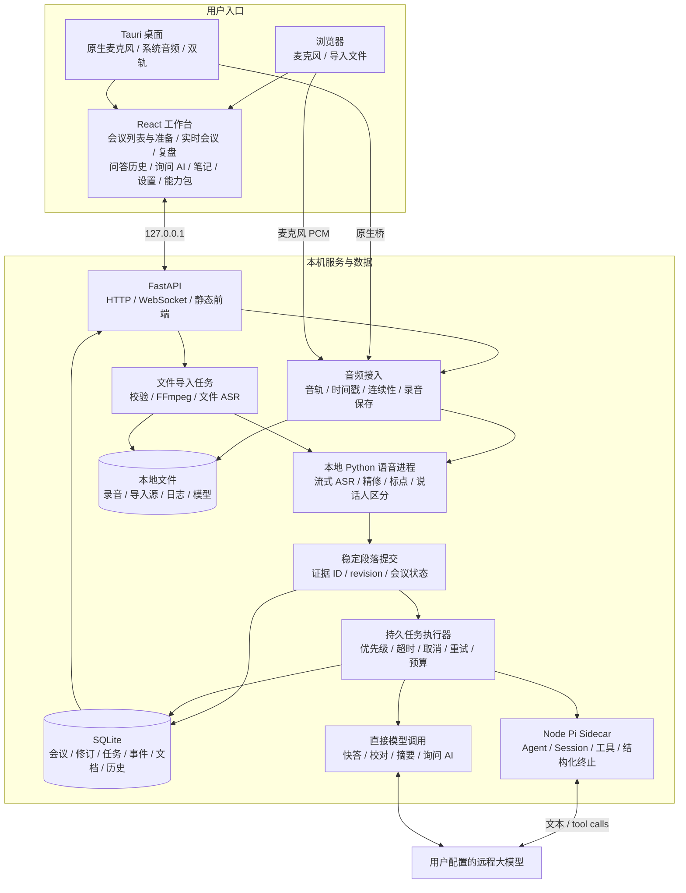
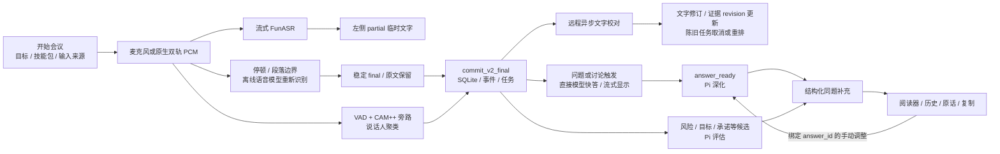
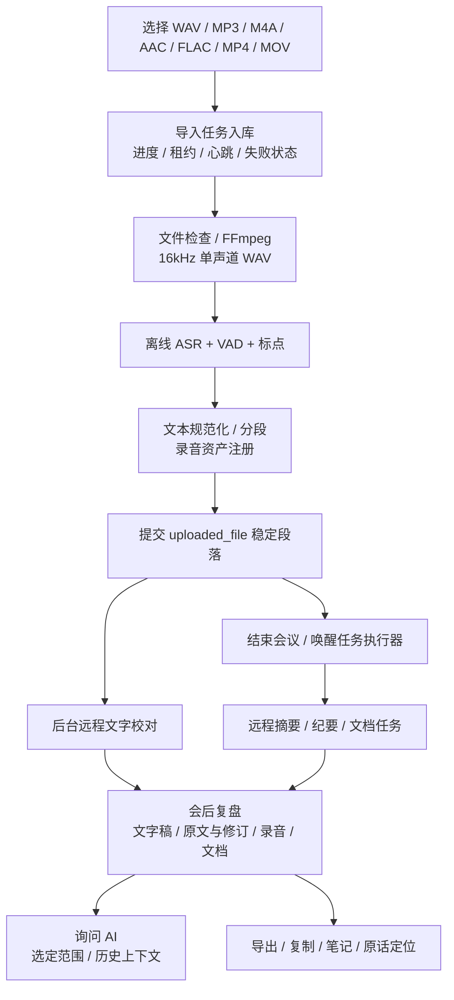
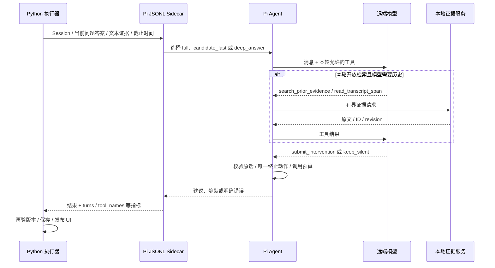

# Talktrace 完整架构与 Pi 的实际职责

核对日期：2026-10-01。对应分支：`feat/pi-realtime-coach-agent-loop`。本文描述当前代码，明确区分已实现能力与后续设想。部署与模型下载见 [网页版部署](web-deployment.md)。

## 1. 产品边界与总览

Talktrace 是单用户、本地优先的会议助手。浏览器或 Tauri 显示同一套 React 工作台；本地 FastAPI 托管前端、音频、转写、后台任务和数据库。语音识别在本地执行；文字校对、快答、Pi 深化、摘要和文档使用用户配置的远程 Provider。没有本地通用大语言模型，也没有默认启用的云端语音识别。

Pi 是 Node 进程里的受限 Agent 执行器，不是语音模型，也不是整个产品的任务调度器。

浏览器版和桌面版共享后端，但采集能力不同：当前浏览器使用 `getUserMedia` 获取麦克风；系统音频和双轨走 Tauri 原生桥，没有浏览器 `getDisplayMedia` 系统音频实现。纯网页不能当作桌面双轨的完全替代。

## 2. 实时会议完整链路

- **流式识别**：先 partial 后 final。有 PyTorch、ONNX/sherpa 实现；交付基线应固定一种，不能因为某台电脑残留实验目录就切换。
- **本地精修**：`asr_refiner.py` 用离线 SeACo-Paraformer、VAD 和标点模型重处理音频段，不是本地聊天模型改文字。精修在段落边界执行，可能影响 final 到达时间，不能说所有精修都在 final 后异步完成。
- **远程文字校对**：`realtime_transcript_correction.py`、`asr_correct.py` 及 correction 任务处理稳定文本，受设置、预算、证据质量和调度约束。失败保留原文。
- **说话人区分**：旁路提取声纹并聚类，得到 Speaker 1/2 等标签；不等于真实姓名识别，也不能把 microphone 直接等同于本人。
- **采集与恢复**：录音资产、音轨连续性、健康诊断与 AI 建议分开处理。模型断网不应丢失已录音频。

### 出建议的实际触发规则

不是每秒检索互联网，也不是命中关键词就贴固定答案。

1. **接纳与调度层**：明确问句通过问句边界、表达和来源约束触发；持续讨论按新增有效内容触发。当前 `detect_discussion_trigger()` 要求新增可读字符至少 100，且时长达到 15 秒或字符达到 220；已有回答后还要求对应音频时间推进至少 20 秒。这不是承诺每 20 秒必出一张卡。
2. **模型层**：直接模型调用生成快答；完成后产生 `answer_ready`，Pi 补充该回答。风险、无条件承诺、目标遗漏等还有独立候选路径。

没有稳定 final、建议策略关闭、预算/资源不足、Provider 失败或证据过期都会影响实际出卡。8 秒实时就绪预算不等于“从用户开口到完整 Pi 分析必定 8 秒”。代码入口：`realtime_answer_copilot.py` 的检测函数，`app.py` 的 `_commit_v2_final` 与 answer/intelligence 处理器。

## 3. 导入录音、会后复盘与文档

- 首选 `batch_transcribe.transcribe_file_report()`；不可用时可使用就绪的 resident refiner 完成文件识别。
- 导入任务完成不等于全部远程校对、摘要和文档已完成，它们有各自后台状态。
- 当前 `_split_import_transcript_segments()` 按文本长度和录音时长分配段落时间，不是可靠逐字强制对齐；不能将其宣传为精确逐字时间戳。
- 实时流有说话人旁路，当前文件导入路径没有完整串接同一 CAM++ 聚类流程。安装 CAM++ 不代表导入录音已经完成多人分离。
- 导入历史文本不等于真实会议实时节奏测试，也不启动麦克风。

## 4. Pi harness 和 loop 的代码落点

当前依赖 `@earendil-works/pi-agent-core`、`@earendil-works/pi-ai`，版本由 bridge 的 `package-lock.json` 固定。使用的是 SDK，尚未 fork/修改 Pi 源码。

`code/agent_runtime/pi_coach_bridge/src/runtime.mjs` 创建 `new Agent(...)`，提供模型适配、上下文转换、受限工具、执行钩子和停止条件。Agent 组织请求、解析 tool call、执行工具、将结果接入下一轮。这是实际使用的 Agent loop。

外层 harness 分工：

- **Python 产品侧**：触发时机、优先级、持久化任务、Provider 并发、超时取消、证据版本、结果入库和 UI 发布。
- **Node/Pi 侧**：有限 Session 复用、消息裁剪、工具范围、参数与引用校验、轮次限制、终止动作和执行指标。

音频处理、数据库、产品状态和 UI 阅读保护不是 Pi SDK 自动提供的。

### 当前三种执行档位

| 档位 | 实际开放能力 | 用户价值 | 限制 |
| --- | --- | --- | --- |
| `full` | 上下文读取、历史搜索、段落邻域、提交/静默 | 风险、矛盾、遗漏等取证判断 | 有界工具与上下文，不是自主全库研究 |
| `candidate_fast` | 默认紧凑提交/静默；需历史的候选再开放检索 | 快速确认宿主候选 | 候选提取主要由产品负责 |
| `deep_answer` | 当前主要开放深化提交和静默两个终止工具 | 快答后的分析、可直接说的话、风险和追问 | **当前未开放自主历史检索工具**，常接近结构化单轮生成 |

### 工具职责

| 工具 | 做什么 |
| --- | --- |
| `read_realtime_context` | 读取宿主提供的目标、状态或语义窗口 |
| `search_prior_evidence` | 使用宿主回调或所给历史段落查找证据；不是网络搜索 |
| `read_transcript_span` | 根据段落 ID 读取原文及小范围邻居 |
| `submit_intervention` | 校验字段与原话引用后提交建议并终止 |
| `keep_silent` | 明确不介入并终止 |

当前代码限制：最多 **2 turns / 4 tool calls**；最多 **8 个 Session**；消息裁剪保留最近 **2 次用户轮次**；默认 10 秒决策预算，最多 25 秒，宿主可缩短。Session 位于 Node 内存，重启后不会原样恢复；正式事实和建议以 SQLite 为准。

旧文档“4 turns / 8 calls、必须先调用 review_coaching_checklist”已过时。现在 checklist 在宿主准备，运行前设置 `checklistReviewed: true`；模型没有这个 checklist 工具。不能把该指标说成模型真的逐项调用工具验证了六件事。

## 5. 和直接调用大模型的真实差异

| 维度 | 一次直接调用 | 当前 Pi |
| --- | --- | --- |
| 语言与推理能力 | 取决于底层模型 | 同样取决于底层模型，SDK 不会凭空提升智力 |
| 上下文 | 调用方一次准备 | 有限 Session 复用；开放工具时按需取证 |
| 执行过程 | 请求→返回 | 可以模型→工具→证据→模型闭环 |
| 输出约束 | 同样可以用 JSON Schema 或 tool calling | 产品将提交/静默、引用与停止条件固化在工具边界 |
| 持久化、取消、过期结果 | 产品自行实现 | 当前仍主要是 Python 产品能力，不是 SDK 独占优势 |
| 当前深化体验 | 精心构造上下文也可得到相似答案 | `deep_answer` 多为单轮，差异有限 |
| 延迟与成本 | 往返较少 | 真多轮需要额外往返，必须衡量收益 |

**Pi 已真实集成，但没有证据证明同一个模型经 Pi 就全面优于直接调用。** 快答、校对、摘要、询问 AI 不必为了“用了 Agent”全部迁入 Pi。Pi 额外复杂度应服务跨段取证、持续跟踪和可执行建议。

例：前面说“压测通过才能发布”，几分钟后变成“周五一定上线”。Agent 的有用表现是找回前置条件、核对原话、指出遗漏、给出具体追问，并在条件补齐后关闭该风险。只把最近一分钟重写成摘要，用普通 API 已经足够。

## 6. 下一步优化建议（尚未实现）

| 优先级 | 改动 | 收益 | 验收 |
| --- | --- | --- | --- |
| P0 | `deep_answer` 按需开放一次有界历史取证 | 深化能使用前面讲过的条件，不只改写快答 | 同模型同文本 A/B：跨段正确率、引用、延迟、费用 |
| P0 | 待回答问题、风险和承诺形成持久化闭环 | 持续辅导有明确对象，避免重复提醒，重启可恢复 | 新证据更新/关闭原议题，不生成同义卡 |
| P1 | 强化快答与深化的信息增量 | Pi 专门补边界、依据、追问和遗漏 | 盲评可用性、重复率、用户采用率 |
| P1 | 分开测 ASR、快答、Pi 延迟 | 找到网络、final、取证各自瓶颈 | speech→final、final→首字、快答→补充的 P50/P95 |
| P1 | 文件导入补可靠对齐和说话人链 | 改善会后定位与多人录音 | 标注多人录音验收 |
| P2 | 外部资料与跨会议记忆 | 先做好本场会议闭环再拓展 | 单独定义来源、授权与引用，不能默认联网搜索 |

先在产品适配器、工具和状态层做这些实验，再决定是否 fork Pi。当前主要瓶颈不是缺少 Pi 源码修改。

## 7. 全功能归属与代码导航

以下 Python 模块位于 `code/web_mvp/backend/meeting_copilot_web_mvp/`，前端位于 `code/web_mvp/frontend_v2/src/`。

| 功能 | 模块 | Pi 角色 |
| --- | --- | --- |
| 创建/结束/重命名/删除会议、历史恢复 | `app.py`、`v2_persistence.py`、前端 meetings/review | 无 |
| 目标、身份、技能包、关注点 | `meeting_preparation.py`、`coach_skills.py`、`AiWorkspace.tsx` | 作为上下文输入 |
| 麦克风/系统声音/双轨、健康检查 | `useMeetingMicrophone.ts`、原生适配器、`asr_stream.py` | 无 |
| 转写/精修/术语/说话人 | ASR workers、`asr_refiner.py`、`diarization_runtime.py` | 无 |
| 问题快答与讨论重点 | `realtime_answer_copilot.py`、answer 处理器 | 首次快答不依赖 Pi |
| 深化、风险教练、同题调整 | `realtime_intelligence.py`、`pi_coach_runtime.py`、Node bridge | 主要执行器，direct/回退分支除外 |
| 阅读保护、追加、历史、原话定位 | `AnswerCoachReader.tsx`、`useCoachRequests.ts`、事件投影 | UI 产品能力 |
| 录音导入、转码与进度 | `batch_transcribe.py`、`app.py` 导入任务 | 无 |
| 会后摘要/纪要/文档、询问 AI | Python LLM 与文档任务、前端 review/ask | 当前主要直接调用模型 |
| 笔记、复制导出、数据治理 | 前端 notes/review、持久化与数据治理 API | 无 |
| Provider 测试/保存/预算/模型选择 | `provider_config_runtime.py`、`llm_service.py`、设置页 | 共享 Provider |
| 离线能力包导入/校验/激活 | capabilities API、runtime manifest | 无 |
| 安装、后台生命周期、系统密钥 | `code/desktop_tauri/` | 打包必须额外带 Node/Pi bridge |

## 8. 持久化、网络与诊断边界

- SQLite 保存事实、修订、正式事件和任务；Node Session 是可丢弃运行状态。
- 音频、本地模型与日志在本机；当前 ASR 不上传原始声音给远端模型。启用远端 AI 会发送相关会议文本、问题、目标与证据。
- 网页版 Key 由本地后端保存在私有数据目录；桌面版有系统安全存储桥，不能混称所有 Key 都在钥匙串。
- 服务默认只监听 `127.0.0.1`；当前不是已完成认证和数据隔离的多人 SaaS。
- 判断 Pi 实际执行应查看 runtime_used、fallback_reason、tool_names、agent_turns、prompt_profile、revision 与任务错误，不能只看标题。
- 本轮只核对架构并补部署入口，没有修改 Agent 推理策略或实现上面的优化路线。
