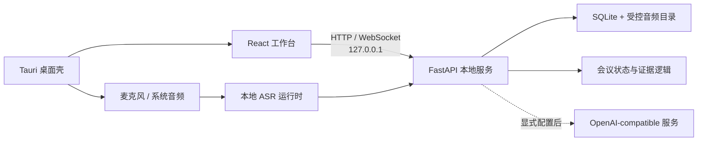

# 架构说明

言迹 Talktrace 是单用户、本地优先的桌面应用。React 工作台通过回环地址访问 FastAPI 服务；Tauri 提供桌面生命周期、安全配置和原生音频桥接；本地 ASR 运行时负责实时与文件转写。

## 组件

### React 工作台

`code/web_mvp/frontend_v2/` 包含会议历史、会中工作台、会后复盘、笔记、离线能力和设置。前端不直接访问数据库或保存服务密钥。

### FastAPI 本地服务

`code/web_mvp/backend/` 提供 `/v2` API、事件流、文件导入、持久化、AI provider 和静态前端托管。生产工作台路径为 `/workbench`，哈希资源位于 `/workbench-assets/`。

### 领域核心

`code/core/` 维护会议证据、缺口、状态与建议候选。该层不依赖浏览器或桌面窗口，可由 API 和测试直接调用。

### Tauri 桌面壳

`code/desktop_tauri/` 负责启动本地后端、打开主窗口、管理原生音频适配器和保存 provider 密钥。桌面命令通过最小 capability 暴露给主窗口。

### ASR 运行时

`code/asr_runtime/` 提供本地实时识别、离线文件转写和转写校正入口。模型与运行时体积较大，作为能力包独立分发。

## 数据流

1. 用户主动开始会议或导入音频。
2. 音频片段由本地 ASR 转成暂定、确认和校正事件。
3. 后端将稳定文字持久化，并交给领域核心更新议题、证据和未闭环项。
4. 用户已配置远程 AI 时，后端发送必要文本生成建议、摘要或文档；未配置时保留本地功能。
5. 会后页面从同一会议记录读取复盘、文字、录音和文档。

## 持久化

主要事实存放在 `meeting_copilot.db`，音频和任务文件位于同一受控数据根目录。开发默认目录为 `artifacts/tmp/web_mvp_data/`；桌面版使用应用数据目录下的 `runtime-data/`。路径校验会阻止导入、导出和删除越过受控根目录。

## 安全边界

- 服务默认仅监听 `127.0.0.1`。
- 桌面 provider 密钥通过系统安全存储管理，前端只获取脱敏状态。
- 诊断信息会过滤密钥、查询参数和本机绝对路径。
- 官网与产品运行时完全分离，不访问会议数据。
