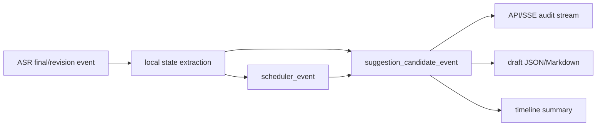

# PCWEB-046 Live ASR Candidate Confidence and Degradation Plan

## Goal

Give every Live ASR `suggestion_candidate_event` a local, auditable quality signal before any paid LLM call exists.

This increment keeps the PCWEB-045 boundary intact:

- no remote ASR call
- no remote LLM call
- no formal `suggestion_card`
- no `llm_schema_result`
- no `suggestion_silenced`
- no formal report request

## Product Rationale

PCWEB-045 can explain which gap rule a state candidate might later trigger, but all candidates currently look equally strong. That is risky for a meeting copilot: users may read an audit candidate as if it were a high-confidence recommendation, even when the text is short, ASR confidence is weak, or the local scheduler has skipped the candidate due to cooldown.

PCWEB-046 adds transparent quality metadata so the product can say:

- this candidate is queue-worthy
- this candidate is locally degraded
- this candidate is evidence-backed but not yet a formal AI suggestion

The value is trust and prioritization, not new automation.

## Contract

Each `suggestion_candidate_event.payload` adds:

- `candidate_policy_version`: fixed string for this local deterministic policy, initially `asr-candidate-policy.v1`.
- `confidence`: float from `0.0` to `1.0`, rounded to two decimals. This is a local deterministic candidate quality score, not ASR raw confidence, LLM confidence, or a correctness probability.
- `confidence_source`: fixed string `local_deterministic_heuristic`.
- `confidence_level`: one of `high`, `medium`, `low`.
- `degradation_reasons`: list of stable string reason codes.

Initial reason codes:

- `low_asr_confidence`: source ASR segment confidence is below `0.80`.
- `missing_asr_confidence`: source ASR segment did not provide confidence.
- `evidence_text_short`: source evidence quote has fewer than six non-space characters.
- `action_owner_missing`: ActionItem candidate does not have an owner.
- `action_deadline_missing`: ActionItem candidate does not have a deadline.
- `risk_mitigation_missing`: Risk candidate does not include a mitigation.

Initial scoring:

- Start at `0.90`.
- Subtract `0.20` for `low_asr_confidence`.
- Subtract `0.15` for `missing_asr_confidence`.
- Subtract `0.15` for `evidence_text_short`.
- Subtract `0.10` for `action_owner_missing`.
- Subtract `0.10` for `action_deadline_missing`.
- Subtract `0.10` for `risk_mitigation_missing`.
- Clamp to `[0.10, 0.99]`.
- Round to two decimals.
- `high` means `confidence >= 0.80`.
- `medium` means `0.55 <= confidence < 0.80`.
- `low` means `confidence < 0.55`.

This score is only a queue-quality signal for the local skeleton. It does not claim ASR correctness, semantic truth, or LLM answer quality.

## Data Flow

The policy uses only local event data already available in the Live ASR skeleton:

- raw ASR `confidence`
- evidence quote length
- local state item fields

The scheduler decision result remains visible through `scheduler_event_type` and `decision_reason`, but it does not reduce candidate quality. Cooldown and budget are scheduling conditions, not evidence-quality problems.

## UI and API Boundary

API and SSE expose the new payload fields as part of the existing candidate event.

Draft JSON includes the new fields because it already collects candidate payloads.

Draft Markdown should render enough information for review:

- candidate id
- gap rule
- confidence level/score
- degradation reason codes
- `not_called`
- `not_created`

Timeline summary should include the confidence level/score and degradation reasons, but must not place candidates into the suggestion card list.

## Tests

PCWEB-046 requires TDD coverage for:

- high-confidence queued ActionItem candidate with no degradation reasons
- low-confidence revision candidate with `low_asr_confidence`; scheduler cooldown remains visible but does not enter `degradation_reasons`
- missing-confidence candidate with `missing_asr_confidence`
- incomplete ActionItem candidate with `action_owner_missing` or `action_deadline_missing`
- Risk candidate without mitigation with `risk_mitigation_missing`
- API/SSE and draft review still expose candidates without cards, schema results, or formal report fetches

## Non-Goals

- No real ranking algorithm.
- No dedupe or merge policy.
- No cross-segment semantic completeness check.
- No LLM prompt execution.
- No formal card creation.
- No remote provider integration.

## Review Triggers

Revisit this policy when:

- real ASR provider confidence behaves differently from mock provider confidence
- real meeting audio creates frequent low-quality candidates
- the first paid LLM suggestion-card engine is introduced
- users see candidate audit records as authoritative recommendations
