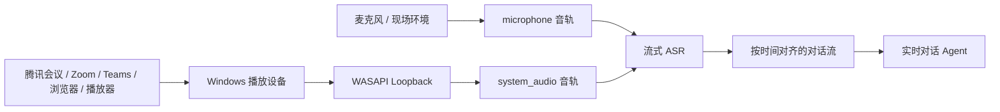
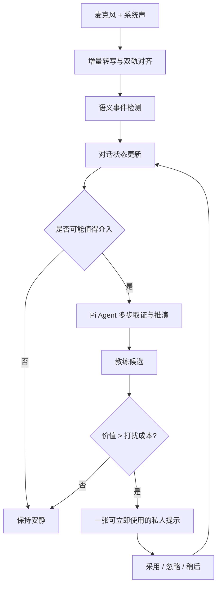
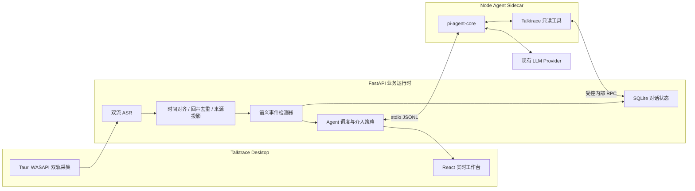

# Talktrace 实时对话 Agent：产品与技术方案

> 状态：方向重置后的评审稿
> 日期：2026-08-13
> 适用范围：Talktrace Windows 本地优先桌面端
> 核心依赖候选：[`@earendil-works/pi-agent-core`](https://github.com/luguochang/pi/tree/main/packages/agent)

> 前置决策：在集成 Pi 前，必须先完成[实时智能质量提升与 Agent 决策方案](realtime-intelligence-quality-and-agent-decision-plan.md)中的质量基线、消融实验与 Go / No-Go 门槛。

## 1. 结论先行

上一版方案把 Talktrace 当成了在线会议和会后执行工具，方向不对。本方案重新以产品真实基础为出发点：

- Talktrace 监听麦克风、现场环境和电脑播放声音。
- Talktrace 将连续音频转写为带时间和来源的文本。
- 现有系统已经能做问答、总结、证据引用、决策/待办/风险提取和建议追问。
- 产品不是腾讯会议、飞书会议或 Zoom 的替代品，也不依赖它们的会议 API。

因此，以下事情不构成集成 Pi 的理由：

- 把转写交给 LLM 总结。
- 对转写进行问答。
- 提取决策、行动项、风险和未决问题。
- 生成纪要、邮件草稿或会前材料。
- 将原来的一次 LLM 请求改成一次 Pi `prompt()`。

这些能力用现有 LLM 链路已经可以完成。仅做这些，**不应该集成 Pi**。

Pi 的合理用途只有一个：帮助 Talktrace 建立一个持续运行的 Agent 控制循环，让系统在不断到来的语音中保留目标和状态，主动识别关键时刻，按需取证和推演，并决定何时保持安静、何时给用户一条可立即使用的私人提示。

新的产品北极星是：

> 一个同时听见“我”和“对方”的私人实时对话教练。它持续守住用户本次谈话的目标，在问题、异议、承诺和决策形成的关键时刻介入，而不是等会后再告诉用户发生了什么。

Pi 不是产品卖点，也不会让模型变聪明。它是可替换的 Agent 基础设施。真正的产品壁垒是：

1. 麦克风与系统声双音轨形成的“我/对方”上下文。
2. 针对连续对话设计的状态模型和语义事件。
3. 知道什么时候不打扰用户的介入策略。
4. 每条建议可回到当时原话，并随着新对话修正。

## 2. 对当前产品的正确理解

### 2.1 产品不是在线会议平台

Talktrace 不负责创建会议房间、邀请参会人、承载音视频或在会议中替用户发言。它工作在操作系统音频层：



这使 Talktrace 可以服务于在线会议、电话外放、面试、销售沟通、技术评审、谈判以及线下讨论，而不必逐个平台集成。

### 2.2 现有能力基线

现有代码已经覆盖：

- `microphone`、`system_audio` 和 `dual_track` 三种输入模式。
- 带证据的实时议题、建议追问、决策候选、行动项、风险和未决问题。
- Ask AI 的选中文本、最近片段、章节和整场会议作用域。
- “我刚错过了什么”、解释文本、提炼行动项以及将回答保存为会议事实。
- 会前目标、关注点和会后复盘文档。

后续方案不能把这些已有功能换个 Agent 名字就算创新。

## 3. 能否听见腾讯会议里的其他人

### 3.1 明确答案

**可以。** 当腾讯会议中其他人的声音通过 Talktrace 选择的 Windows 播放设备输出时，当前桌面端使用 WASAPI render loopback 采集系统混音，能够将这些声音送入 `system_audio` 音轨并进行转写。

开启 `dual_track` 后：

| 声音来源 | 主要进入的音轨 | 产品可用的粗粒度含义 |
| --- | --- | --- |
| 本机用户对着麦克风说话 | `microphone` | 通常是“我” |
| 同一房间里麦克风收进来的声音 | `microphone` | “现场”，不一定都是我 |
| 腾讯会议远端参会者 | `system_audio` | “会议对方/电脑声音” |
| 其他电脑应用播放的声音 | `system_audio` | 也会被采集，需要避免干扰 |

它不是腾讯会议专用集成，而是操作系统级捕获。因此换成 Zoom、Teams、浏览器会议或电脑播放的电话声音，原理相同。

### 3.2 必须诚实披露的边界

- 腾讯会议远端多人通常已经被混成一条系统音轨。Talktrace 能听见他们，但不能仅靠音轨知道每句话具体属于谁。
- 可在系统音轨内继续做 speaker diarization，但短发言、抢话、音质差时身份只能标为不确定；人名应由用户确认。
- 使用耳机时，“麦克风约等于我、系统声约等于对方”最可靠。
- 扬声器外放时，对方声音可能再次漏进麦克风，必须做跨音轨回声检测和文本去重。
- 线下多人共用一个麦克风时，`microphone` 表示“现场”而不是“我”，产品不能错误归因个人承诺。
- 切换耳机或默认输出设备可能中断 loopback；启动时应显示实际捕获设备并持续做音量健康检查。
- WASAPI loopback 只能工作在 shared mode；受保护内容和少数独占模式音频可能无法捕获。

### 3.3 为 Agent 增加的音频基础能力

Agent MVP 上线前需要补齐：

1. 两条 ASR 流使用同一单调时钟，保留 `source_track`、起止时间和 final/revision 状态。
2. 用音频指纹、时间重叠和文本相似度识别麦克风泄漏，保留权威来源而不是重复两次。
3. 明确区分 `self`、`remote_mix`、`room`、`unknown`，不要把所有 microphone 片段永久写成“我”。
4. 个人级判断只在来源和 speaker 置信度达到阈值时启用；否则退化为群体级提示。

## 4. 现有 LLM 与 Pi 的边界

### 4.1 Pi 不会带来的东西

Pi 不提供音频采集、降噪、ASR、说话人识别、领域知识，也不天然提高回答正确率。使用相同模型、提示和上下文时，经 Pi 调用不会比直接调用 LLM 更聪明。

Pi 也不是不可替代的。团队可以自己实现 tool-calling loop、消息队列和上下文管理。使用 Pi 的意义是少维护一套通用 Agent 运行时，而不是购买一项新的业务能力。

### 4.2 Pi 实际提供的工程增量

`@earendil-works/pi-agent-core` 当前提供：

- 有状态的消息历史和 Agent 运行状态。
- 模型 -> 工具 -> 工具结果 -> 再推理的多轮循环。
- 自定义业务工具及 JSON Schema 参数校验。
- 文本、消息、工具和 turn 生命周期事件流。
- 运行中的 `steer` 和结束后的 `followUp` 队列。
- `transformContext`，可在每次模型调用前裁剪旧消息、注入最新外部状态。
- 取消、等待空闲、并行/顺序工具执行和工具前后置拦截。

高层 `@earendil-works/pi-coding-agent` 还提供 session 文件、compaction、skills、extensions 和 RPC，但同时带来默认 Coding Tools 与资源发现。Talktrace 首版不需要这些能力，建议从更小的 `pi-agent-core` 开始。

### 4.3 什么场景该用 Pi

| 场景 | 现有 LLM 是否足够 | 是否需要 Pi | 原因 |
| --- | --- | --- | --- |
| 总结最近五分钟 | 是 | 否 | 单次文本变换 |
| 对选中转写提问 | 是 | 否 | 用户触发的一问一答 |
| 提取决策/行动项 | 是 | 否 | 固定结构化抽取 |
| 固定规则生成建议追问 | 是 | 否 | 无持续自主循环 |
| 持续追踪用户目标是否被覆盖 | 可做但需自建循环 | 是 | 新语音到来后要更新长期状态 |
| 发现对方问题后按需搜索前文和用户立场 | 可做但需自建循环 | 是 | 动态选工具、多步取证 |
| 新发言推翻旧判断时修正正在进行的分析 | 可做但需自建循环 | 是 | 需要 steer、状态和迭代推理 |
| 决定现在是否值得打断用户 | 可做但需自建循环 | 是 | 需要事件、历史介入和策略状态 |
| 同时维护目标、承诺和论证三类状态 | 可做但需自建循环 | 是 | 通用 Agent runtime 能降低编排成本 |

这里的“需要 Pi”准确含义是“适合使用现成 Agent runtime”，不是“离开 Pi 无法实现”。

### 4.4 Go / No-Go 判断

满足以下任一情况，不集成 Pi：

- 产品仍以会后总结和 Ask AI 为主。
- 实时提示完全由固定分类器和单次提示生成。
- 没有长期目标、动态取证、多步分析或中途修正需求。
- 实测 Agent 版本相对现有链路没有提高关键时刻命中率和采纳率。

只有在确认建设第 6 节的实时私人教练后，Pi 才有投入价值。

## 5. 产品定位与核心机制

### 5.1 定位

Talktrace Agent 不是“自动开会”，而是“对话中的第二注意力系统”：

- 用户负责听、思考和表达。
- Agent 在后台跟踪目标、对方问题、双方立场、承诺和论证链。
- 绝大多数时间保持安静。
- 只有在错过后会产生明显损失的时刻，给出一张私人教练卡。

### 5.2 核心循环



关键原则是：**不是每个 ASR chunk 都调用 Agent。** 低成本事件检测器先筛选，Pi 只处理有潜在价值的事件。

## 6. Agent 原生创新方向

### 6.1 P0：目标守护者 Goal Guardian

会前不再只填写泛化的“会议主题”，而是定义一个可跟踪的任务契约：

- 我的角色：汇报者、候选人、采购方、销售、评审者或主持人。
- 本次想达成的结果。
- 必须问清的 1-5 个问题。
- 不愿承诺的边界。
- 可以接受的让步。
- 需要对方确认的成功标准。

Agent 持续维护：`未涉及 -> 已提及 -> 得到模糊回答 -> 已明确 -> 出现冲突 -> 已失效`。

新价值不在会后列出遗漏，而在话题即将离开、会议即将结束或对方准备下结论时提示：

> 价格已经谈到交付，但“数据迁移是否计费”仍未获得明确回答。现在可以问：迁移费用是否包含在当前报价中？

### 6.2 P0：问题雷达与应答教练 Question Radar

当系统声中出现疑似直接问向用户的问题，Agent 判断：

- 对方真正要确认的是事实、立场、承诺还是风险归属。
- 用户是否已经回答了全部子问题。
- 前文中有哪些事实或用户既有立场可用于回答。
- 当前最适合直接回答、反问澄清、限定范围还是暂缓承诺。

界面只给一张短卡：

> 对方问的是“能否周五上线”，但前提“压测通过”还没确认。建议回答：可以把周五作为目标，但需要以周四压测达标为上线条件。

这不是聊天问答，因为用户没有发起请求；Agent 要主动识别时机、检索前文、维护立场并控制介入频率。

### 6.3 P0：承诺防火墙 Commitment Firewall

持续维护双方承诺账本，重点识别：

- 用户刚刚做出的时间、范围、结果或资源承诺。
- 对方将尚未确认的表述包装成用户承诺。
- 承诺缺少前提、负责人、验收或退出条件。
- 新承诺与用户设定的边界或之前说法冲突。

实时提示示例：

> 刚才的“应该没问题”可能被理解为你承诺本周交付，但范围和依赖未确认。可补一句：我先确认接口改动范围，今天下班前给准确日期。

区别于行动项提取：行动项记录“以后做什么”，承诺防火墙在承诺刚形成时帮助用户降低损失。

### 6.4 P1：论证与决策雷达 Argument & Decision Radar

Agent 维护一个轻量论证图，而不是只提取最终结论：

- 主张。
- 支持证据。
- 假设。
- 异议。
- 尚未回答的反例。
- 候选方案和淘汰原因。
- 正在形成但尚未确认的决定。

它可发现：

- 同一指标在前后使用了不同口径。
- 结论依赖一个未验证假设。
- 异议被换话题绕过而不是解决。
- 大家在重复表达立场，没有新增证据。
- 方案准备拍板，但没有讨论失败条件。

提示必须给出可直接说出口的问题，而不是泛泛评价：

> 当前选择方案 B 的依据是“延迟更低”，但两组数据使用了不同并发量。建议先统一到 500 并发再比较。

### 6.5 P1：立场记忆与一致性保护 Position Memory

Agent 只在证据充分时维护用户的个人立场：

- 我明确支持/反对过什么。
- 我曾经给出哪些数字和条件。
- 我答应稍后确认什么。
- 哪些内容只是探索性表达，并非承诺。

当对方误引、当前说法与历史冲突或用户准备重复承诺时，给出提醒。这里的价值不是跨会议知识库，而是保护用户在当前对话中的一致性和信用。

### 6.6 P2：私有后台推演 Shadow Deliberation

在高价值问题到来后，Agent 可以在严格时间预算内进行两步推演：

1. 分析对方最可能的真实意图和下一步追问。
2. 生成三种策略：直接回答、澄清前提、设置边界。

用户默认只看到推荐策略；展开后才看到另外两种。它适合销售异议、技术答辩、面试和谈判，但必须在 P0 证明实时延迟和采纳率后再做。

## 7. 推荐首发产品：实时私人教练

### 7.1 MVP 范围

首版只做一个闭环，不做连接器，不替换现有总结和 Ask AI：

1. 开始监听前，用户设置角色、目标、必须问的问题和承诺边界。
2. 使用 `dual_track` 持续区分本机麦克风与电脑会议声音。
3. 检测四类事件：`question_to_user`、`commitment_risk`、`objection_or_contradiction`、`goal_at_risk`。
4. Pi 根据事件调用只读工具，最多完成两轮推理。
5. 介入策略决定是否展示一张卡。
6. 用户可以“采用”“忽略”“稍后”；反馈用于本次会话的频率和偏好调整。
7. 会后保留“Agent 在哪些时刻帮过忙”的复盘，但沿用现有纪要和事实链路。

### 7.2 明确不做

- 不集成飞书、邮件、Jira 和日历。
- 不自动发送消息、创建任务或替用户发言。
- 不把现有总结、Ask AI 和事实提取迁移到 Pi。
- 不做跨组织知识库。
- 不承诺识别腾讯会议远端每个说话人的真实姓名。
- 不开放 Bash、文件系统、网络请求或 Pi 动态扩展。

### 7.3 教练卡信息结构

同一时间只显示一张卡，稳定占用固定区域，不覆盖转写和录音控制：

| 区域 | 内容 |
| --- | --- |
| 类型 | 对方提问 / 承诺风险 / 异议 / 目标遗漏 |
| 一句话判断 | 发生了什么，以及为什么现在值得注意 |
| 推荐说法 | 20-60 字，可直接说出口 |
| 依据 | 1-3 条可点击原话和时间点 |
| 操作 | 采用、忽略、稍后、降低此类提醒 |

不展示模型思维过程、tool call 名称和长篇分析。卡片超过 6-8 秒未处理且事件已过期，应自动降级到历史轨道。

### 7.4 介入策略

每个候选提示计算：

```text
intervention_value =
  expected_loss_avoided
  * evidence_confidence
  * actionability
  * timing_relevance
  - interruption_cost
  - repetition_penalty
```

硬规则：

- 没有可定位证据，不对人物作出确定归因。
- 低于置信度阈值时不展示，只写入内部候选日志。
- 15 秒内不连续弹出两张普通优先级卡。
- 同一问题没有新增信息时不重复提醒。
- 用户正在说话时先等待 turn boundary；只有高风险承诺才允许在说完后立即显示。
- 新语音推翻候选结论时，在展示前取消，而不是把过时提示交给用户。

### 7.5 四个典型用户旅程

#### 技术评审

用户目标是避免没有压测与回滚方案就拍板。讨论准备选择方案 B 时，Agent 发现延迟数据口径不一致，并提示一个具体追问，而不是再总结方案优缺点。

#### 客户沟通

客户把“我们研究一下”复述成“你们本周上线”。Agent 结合用户承诺边界提示立即澄清，避免会后才从行动项里发现误解。

#### 面试

面试官一次问了三个子问题。用户回答了架构和性能，漏掉故障恢复。Agent 在回答结束后只提醒遗漏的第三项，并给一个短句开头。

#### 谈判

对方连续改变报价口径。Agent 标出当前数字与十分钟前的数字不一致，并建议先确认是否含税、是否包含迁移服务，不直接替用户做商业判断。

## 8. Agent 状态模型

Pi 的消息历史不能成为业务真相。FastAPI/SQLite 持久化下面这些结构化状态，Pi 每轮按需读取：

### 8.1 `conversation_goals`

- `goal_id`
- `meeting_id`
- `text`
- `kind`: `outcome/must_ask/boundary/success_criterion`
- `status`: `uncovered/mentioned/vague/confirmed/conflicted/invalidated`
- `evidence_refs[]`
- `updated_at_ms`

### 8.2 `conversation_events`

- `event_id`
- `type`
- `source_role`: `self/remote_mix/room/unknown`
- `segment_ids[]`
- `confidence`
- `payload`
- `detected_at_ms`
- `superseded_by`

### 8.3 `commitment_ledger`

- `commitment_id`
- `speaker_role`
- `promise`
- `scope`
- `deadline`
- `conditions[]`
- `status`: `tentative/explicit/disputed/clarified/withdrawn`
- `evidence_refs[]`

### 8.4 `argument_nodes` 与 `argument_edges`

- 节点类型：`claim/evidence/assumption/objection/decision_candidate`。
- 关系类型：`supports/contradicts/depends_on/answers/replaces`。
- 只保存高价值节点，不把每句话都图谱化。

### 8.5 `interventions`

- `intervention_id`
- `trigger_event_id`
- `kind`
- `message`
- `suggested_phrase`
- `evidence_refs[]`
- `score`
- `status`: `candidate/shown/adopted/ignored/expired/retracted`
- `shown_at_ms`
- `feedback_at_ms`

## 9. 技术架构

### 9.1 总体结构



### 9.2 为什么仍需要 Node Sidecar

当前业务后端是 Python，Pi 是 TypeScript/Node 包，不能直接 `pip install`。桌面 React 构建产物运行在 WebView 中，也不应持有 Provider 凭据或业务工具权限。

建议随桌面应用分发一个单实例 Node Sidecar：

- FastAPI 懒启动并负责退出回收。
- 通过 stdin/stdout JSONL 通信，不新增本地端口。
- 一个 meeting 对应一个轻量 Agent context，业务状态仍在 SQLite。
- 只把触发事件和必要证据发送给 Pi，不发送原始音频。
- Sidecar 崩溃时录音、ASR、现有实时建议和会后流程继续运行。

### 9.3 为什么选择 `pi-agent-core`

首版只需要 Agent loop、工具、状态、事件和 steer/follow-up。`pi-agent-core` 的边界更贴合需求：

- 不需要 Coding Agent 的 TUI、文件工具、shell、skills 和项目资源发现。
- Talktrace 自己已经有会议持久化、证据版本和业务 API。
- 上下文可通过 `transformContext` 每轮从最新状态重建，避免 Pi session 与 SQLite 出现两个真相。
- 工具 allowlist 可以在 Agent 构造时显式给出。

如果后续实测证明需要 Pi 高层 session compaction，再单独评估 `@earendil-works/pi-coding-agent`，并使用 `noTools: "all"`、内存 settings 和自定义 ResourceLoader。不能直接使用它的默认资源发现。

### 9.4 Agent 工具

首版只注册只读和受控状态更新工具：

| 工具 | 作用 |
| --- | --- |
| `get_recent_turns` | 获取指定秒数内已对齐、去重的双方发言 |
| `search_earlier_evidence` | 按问题、实体或主张查找更早原话 |
| `get_goal_state` | 读取目标、必问项、边界和当前覆盖状态 |
| `get_commitment_ledger` | 读取双方当前承诺及条件 |
| `get_argument_context` | 读取当前主张、异议和未解决关系 |
| `get_user_position` | 读取证据充分的用户既有立场 |
| `update_working_hypothesis` | 保存可覆盖的 Agent 工作假设，不写正式会议事实 |
| `propose_intervention` | 提交结构化候选，由确定性策略决定是否显示 |

不注册：

- `bash/read/write/edit`。
- 任意文件路径访问。
- 任意 URL 请求。
- 发邮件、发消息、创建任务和操作会议软件。
- 直接修改正式 transcript、decision 或 action item 的工具。

### 9.5 Pi 运行方式

每个语义事件不是新建一个聊天机器人，而是向当前会话追加一条自定义事件消息：

```json
{
  "role": "conversation_event",
  "event_id": "evt_123",
  "event_type": "question_to_user",
  "source_role": "remote_mix",
  "segment_ids": ["seg_81", "seg_82"],
  "confidence": 0.91,
  "received_at_ms": 1786600000000
}
```

`convertToLlm` 将它转换为受控 LLM 消息，`transformContext` 注入最新目标摘要和最近介入记录。新语音在 Agent 运行时到达：

- 会使判断失效的事件用 `steer` 排入下一 turn，要求撤销或修正。
- 相关但不紧急的事件用 `followUp` 等本轮结束后处理。
- 高于实时 deadline 时取消本轮，不能让迟到建议继续弹出。

### 9.6 实时预算

建议首版硬预算：

- 事件检测不调用 Pi，目标是在 final segment 后 300 ms 内完成。
- 一次实时 Agent run 最多 2 个 LLM turn、4 次只读工具调用。
- 工具结果总字符上限 12,000，默认只取最近 90 秒和最多 8 条历史证据。
- 教练卡目标在说话 turn boundary 后 2.5 秒内出现，4 秒后到达则降级为历史提示。
- 同一 meeting 同时最多一个实时 Pi run；高优先级新事件可取消低优先级旧 run。
- 后台 argument map 更新使用独立低优先队列，不能阻塞实时卡。

这些是产品 SLO 起点，最终值必须按当前 ASR 和 Provider 实测调整。

## 10. 事件检测与调度

### 10.1 语义事件

```text
question_to_user
question_partially_answered
explicit_commitment
ambiguous_commitment
commitment_attributed_to_user
objection_raised
contradiction_detected
decision_forming
goal_topic_leaving
meeting_closing
speaker_turn_boundary
source_device_changed
```

事件检测优先使用规则、小模型或单次结构化 LLM 分类，不需要 Agent 自主循环。只有下列条件满足才调度 Pi：

- 事件与用户目标或个人风险相关。
- 需要搜索不止一个上下文来源。
- 需要在多个行动策略间权衡。
- 新信息可能推翻已有判断。

### 10.2 调度优先级

1. 对方正在等待用户回答的问题。
2. 刚形成的高风险个人承诺。
3. 对方错误归因给用户的承诺。
4. 与目标直接相关的异议或矛盾。
5. 话题即将离开时的必问遗漏。
6. 普通论证图更新，仅后台处理。

### 10.3 降级策略

- Pi 未配置：保留 ASR、现有实时智能、Ask AI 和会后复盘。
- Provider 超时：事件进入历史，不显示迟到卡。
- 来源身份不确定：提示改成“会议中有人提到”，不写“你/对方某人”。
- 双轨失去一轨：退化为单轨内容级分析，关闭个人承诺归因。
- 成本预算耗尽：只保留确定性目标遗漏和设备健康提醒。

## 11. Sidecar 协议与安全边界

### 11.1 请求

```json
{
  "protocol_version": 1,
  "request_id": "req_123",
  "command": "event.process",
  "meeting_id": "meeting_123",
  "deadline_at_ms": 1786600002500,
  "payload": {
    "event_id": "evt_123",
    "allowed_tools": [
      "get_recent_turns",
      "get_goal_state",
      "get_user_position",
      "propose_intervention"
    ]
  }
}
```

### 11.2 输出

```json
{
  "protocol_version": 1,
  "request_id": "req_123",
  "event": "intervention_candidate",
  "sequence": 8,
  "payload": {
    "kind": "question_to_user",
    "summary": "对方询问上线日期，但依赖条件未确认",
    "suggested_phrase": "可以把周五作为目标，但需要以周四压测达标为条件。",
    "evidence_segment_ids": ["seg_81", "seg_52"],
    "confidence": 0.88,
    "expires_at_ms": 1786600006000
  }
}
```

### 11.3 安全原则

- transcript、导入文本和工具结果都是不可信数据，不能改变系统指令和工具权限。
- `allowed_tools` 由 FastAPI 根据事件类型生成，模型不能自行扩大。
- Pi 只读到当前 meeting 的必要片段，不能枚举文件、其他会议或本机凭据。
- Provider 密钥仅驻留内存，不写入 Pi message、日志和 session。
- Agent 提出的 intervention 还要经过 FastAPI 的 evidence、deadline、去重和介入策略校验。
- 会议删除时同步删除对话目标、事件、工作假设、介入记录和 Pi 派生上下文。

## 12. 部署成本

### 12.1 结论

部署成本是**中等**，不是引入一套服务器集群，但也不是装一个 npm 包就结束。

`pi-agent-core` 当前要求 Node `>=22.19.0`。生产版 Tauri WebView 不自带可执行 Node runtime，所以需要：

- 随安装包分发固定版本的 Node runtime 和打包后的 Sidecar JavaScript。
- 将子进程纳入启动、崩溃恢复、退出回收、代码签名和自动更新。
- 固定 Pi 精确版本和 lockfile，纳入 SBOM、许可证和供应链扫描。
- 测量安装包增量、冷启动、常驻内存和升级兼容性。

Node runtime 很可能是体积增量的主要来源；具体 MB 数必须通过构建 spike 实测，不在设计阶段虚报。

### 12.2 工作量拆分

| 工作 | 粗略量级 | 主要风险 |
| --- | --- | --- |
| SDK hello world + 2 个工具 | 1-2 天 | Provider 兼容性 |
| Node Sidecar 与 JSONL 协议 | 3-5 天 | 流式、取消、进程回收 |
| Windows 打包、签名、升级 | 3-5 天 | Node 版本和安装体积 |
| 事件与状态模型 | 1-2 周 | 准确率和状态漂移 |
| 实时教练 UI 与介入策略 | 1-2 周 | 打扰感和时效性 |
| 双轨去重、评测与可靠性 | 1-2 周 | 回声、错归因、真实设备差异 |

一个能演示 Pi 工具循环的原型很便宜；一个用户敢在真实会议中常开的实时教练，成本主要在音频质量、事件评测和介入策略，而不是 SDK 接线。

### 12.3 更轻的备选方案

先不集成 Pi，用现有 LLM 实现四类事件检测和一轮教练卡生成，可以验证用户是否需要该产品。若一轮调用已经满足效果，则继续保持简单；只有动态取证、状态修正和多步推演成为瓶颈时，再启用 Pi。

这也是推荐的产品验证顺序，能避免为了 Agent 架构寻找需求。

## 13. 评测体系

### 13.1 北极星指标

**每小时对话中，被用户采用且避免了可识别损失的实时介入次数。**

不能只统计卡片点击率。还要判断它是否发生在正确时刻，以及没有提醒是否真的会遗漏目标、误解问题或形成错误承诺。

### 13.2 核心指标

- 关键事件召回率：真实高价值时刻中成功发现的比例。
- 有效介入精确率：展示后被采用或被用户判定有帮助的比例。
- 误打扰率：用户认为不该出现的卡 / 展示卡。
- 迟到率：事件已经过去才展示的卡 / 展示卡。
- 重复率：没有新增信息却重复同类建议的比例。
- 错归因率：把他人或现场声音错误归为用户的比例。
- 建议可说出口率：无需编辑或只轻微编辑即可采用的比例。
- 目标覆盖提升：有 Agent 与无 Agent 时必问问题的完成差异。

### 13.3 离线评测集

至少包含真实脱敏或角色扮演录音：

- 腾讯会议耳机双轨。
- 腾讯会议外放造成的跨轨回声。
- 远端多人抢话。
- 线下多人共用麦克风。
- 技术评审中的口径矛盾。
- 客户把模糊表态升级成明确承诺。
- 多子问题只回答一部分。
- 用户明确不想被提醒的低价值闲聊。

每段需要人工标注事件、说话来源、最佳介入窗口、可接受建议和“不应介入”区间。

### 13.4 A/B 判断 Pi 是否有价值

用完全相同的模型比较：

- A：现有 LLM 单次调用，输入最近上下文和目标。
- B：Pi Agent，允许按需搜索前文、读取状态并在新事件到来时修正。

只有 B 在关键事件命中率、建议采纳率或长会稳定性上有显著提升，且延迟和成本可接受，才进入生产集成。不能把“成功调用了工具”当成产品成功。

## 14. 分阶段路线

### 阶段 0：无 Pi 产品验证，1-2 周

- 补齐双轨来源标签、回声去重和设备状态。
- 实现四类语义事件离线检测。
- 用现有 LLM 生成单轮教练卡。
- 在录音回放模式评测时机、准确率和文案。

退出条件：目标遗漏、提问和承诺风险至少有两类显示出真实用户价值。

### 阶段 1：Pi 技术 Spike，3-5 天

- 固定 `pi-agent-core` 和 Node 版本。
- 打通 Sidecar、现有 Provider、事件流、取消和 3 个只读工具。
- 对同一评测集做 A/B。
- 实测安装包、冷启动、内存、token 和卡片延迟。

退出条件：多步取证或中途修正在效果上胜过单次 LLM，而不是只增加调用次数。

### 阶段 2：实时私人教练 MVP，3-5 周

- 上线目标守护、问题雷达和承诺防火墙。
- 完成结构化状态、调度、介入策略和单卡 UI。
- 加入来源不确定降级、超时撤销、反馈和审计。
- 保持 Feature Flag，Pi 故障时回退现有产品。

退出条件：真实会议中误打扰率、错归因率和迟到率达到内测门槛，且不会影响录音/ASR 主链路。

### 阶段 3：论证雷达与个性化，3-4 周

- 引入轻量 argument graph。
- 根据用户反馈调节介入类型和频率。
- 增加面试、技术评审、销售和谈判的目标模板。
- 评估跨会议个人立场记忆，默认关闭并要求明确授权。

## 15. 主要风险

| 风险 | 后果 | 控制方式 |
| --- | --- | --- |
| 把普通 LLM 功能包装成 Agent | 没有用户价值却增加复杂度 | 先做 A/B 和 No-Go 条件 |
| 远端多人身份不可靠 | 错误归因承诺和立场 | 首版只用 self/remote_mix，个人身份需确认 |
| 麦克风和系统声重复 | 同一句被当作双方发言 | 音频+文本跨轨去重，耳机模式优先 |
| 建议到达太晚 | 干扰且不可行动 | 严格 deadline，迟到自动撤销 |
| Agent 太爱说话 | 用户关闭功能 | 单卡、冷却、价值阈值、负反馈即时生效 |
| 长会状态漂移 | 目标和立场越跟越错 | 结构化状态独立于 Pi 消息，证据可回查、可失效 |
| Pi 默认能力越权 | 本机数据或凭据风险 | 使用 agent-core、显式工具表、无资源发现 |
| Node 增加桌面复杂度 | 体积、更新、子进程故障 | Spike 实测、单 sidecar、主链路隔离 |
| 用户不知道正在监听什么 | 隐私和信任问题 | 常驻录音状态、两轨电平、设备名、暂停和删除入口 |

## 16. 最终建议

1. 认可用户的核心判断：总结、问答和提取不需要 Pi；上一版连接器方向删除。
2. 把产品从“会议记录 + 会后处理”推进为“全场景双音轨实时私人对话教练”。
3. 先用现有 LLM 验证四类关键事件和教练卡价值，再决定是否把多步循环交给 Pi。
4. 若验证通过，直接集成 `@earendil-works/pi-agent-core`，不 fork Pi，也不引入完整 Coding Agent 默认能力。
5. 首发只做目标守护、问题雷达和承诺防火墙；论证雷达排在下一阶段。
6. 产品宣传不说“接入 Pi”，而说：在你开口前后守住目标、问题和承诺，并能同时听懂电脑中的对方与现场的你。

## 17. 参考资料与代码依据

外部资料：

- [Pi 项目 README](https://github.com/luguochang/pi)
- [Pi Agent Core README](https://github.com/luguochang/pi/tree/main/packages/agent)
- [Pi SDK 文档](https://pi.dev/docs/latest/sdk)
- [Microsoft WASAPI Loopback Recording](https://learn.microsoft.com/en-us/windows/win32/coreaudio/loopback-recording)

当前项目依据：

- `code/desktop_tauri/src-tauri/src/windows_audio_capture_runtime.rs`：`eCapture` 麦克风与 `eRender + AUDCLNT_STREAMFLAGS_LOOPBACK` 系统声。
- `code/web_mvp/backend/meeting_copilot_web_mvp/meeting_preparation.py`：三种输入源契约。
- `code/web_mvp/frontend_v2/src/features/live-meeting/useNativeDualTrack.ts`：双音轨运行时。
- `code/web_mvp/frontend_v2/src/features/live-meeting/TranscriptPane.tsx`：麦克风/会议声音来源呈现。
- `code/web_mvp/backend/meeting_copilot_web_mvp/realtime_intelligence.py`：现有实时智能。
- `code/web_mvp/backend/meeting_copilot_web_mvp/meeting_state_extractor.py`：现有议题、决策、行动项和风险提取。
- `code/web_mvp/frontend_v2/src/features/live-meeting/AiWorkspace.tsx`：现有 Ask AI 与证据交互。
