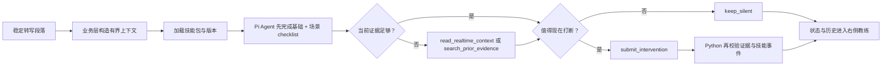

# Talktrace 场景技能包方案

> 状态：MVP 已接入功能分支 `feat/pi-realtime-coach-agent-loop`
>
> 日期：2026-08-18

## 1. 产品判断

Talktrace 的核心不是会议纪要，也不是把录音转成更长的摘要。它的核心任务是：

> 在用户正在说话或正在听别人说话时，判断“现在是否有一个具体损失可以避免”，如果有，就给出一句此刻能说出口的下一句话。

因此，场景技能包是目前最值得做的业务亮点。它让同一段声音在不同工作目标下得到不同的实时判断：

- 讨论决策时，提醒尚未验证的风险、反对意见和成功标准；
- 推进项目时，提醒负责人、截止时间、依赖和验收条件没有闭环；
- 做用户访谈时，提醒把“很麻烦”追问到具体行为、场景、频率和影响；
- 头脑风暴时，不打断发散，但在方向变得有希望时推动一个最小实验。

这不是把五个 Prompt 换个名字，而是给 Agent 一组可执行的边界：目标、检查项、允许的事件类型、介入风格、证据要求和评测指标。

## 2. Pi 为什么有价值

Pi 不会提高 ASR 识别率，也不会凭空让底层模型更聪明。它带来的价值在于把“实时教练判断”从一次 JSON 调用变成一个受限、可观察、可复用的 Agent Loop：

| 能力 | 直接 LLM 调用 | Pi 在 Talktrace 中的作用 |
| --- | --- | --- |
| 持续上下文 | 每轮由业务层拼接 | 同一会话复用 Agent Session，并在轮次间保留有限判断状态 |
| 按需取证 | 需要业务层预先塞入全部内容 | Agent 只有在需要时调用受限的上下文读取/历史检索工具 |
| 结束条件 | 依赖 JSON 是否完整 | `submit_intervention` 和 `keep_silent` 是互斥终止动作 |
| 安全边界 | 主要靠 Prompt | 工具白名单、工具调用上限、证据 ID/原文校验和技能事件白名单 |
| 可观测性 | 记录一次模型请求 | 记录技能版本、检查项、Agent turns、工具调用、历史检索、延迟和是否静默 |
| Provider 适配 | 由业务层维护 | `@earendil-works/pi-ai` 提供统一的 OpenAI-compatible 流式模型适配 |

所以，Pi 的实际提升是“让实时判断可持续、可取证、可终止、可评测”，而不是增加一个更会聊天的模型。当前实现仍保留 direct LLM 路径，Pi 启动失败时可以回退；模型已经开始执行后超时则保持静默，避免再串行请求一次模型。

本方案使用的事实依据：

- [luguochang/pi 项目 README](https://github.com/luguochang/pi)：项目由 `pi-agent-core`、`pi-ai`、coding agent 和 TUI 组成；当前依赖版本锁定为 `0.84.2`。
- [pi-agent-core Agent Loop 文档](https://github.com/earendil-works/pi/blob/main/packages/agent/README.md)：Agent 支持 Session、工具执行、工具结果驱动的后续 turn、`beforeToolCall` 以及 `terminate`。
- [pi-ai 包说明](https://www.npmjs.com/package/@earendil-works/pi-ai)：提供多 Provider 统一模型和流式调用接口。
- Pi README 明确说明默认没有文件、进程、网络和凭据权限系统。因此 Talktrace 不开放 Pi 的通用 coding-agent 工具，只给它四个本地、只读或终止型工具。

## 3. 首批技能包

首期复用已有 `preset_id`，不引入第二套平行配置。每个技能包都有版本号，便于后续 A/B 和回溯。

| 技能包 | 目标 | 场景事件 | 用户看到的典型建议 |
| --- | --- | --- | --- |
| 通用对话 | 保持当前对话目标，低频避免明显损失 | 基础五类事件 | “这个问题还没回答完，可以先确认对方最关心的条件。” |
| 决策准备度 | 在拍板前补齐依据、备选、反对意见、负责人和成功标准 | `decision_readiness` | “现在还缺少回滚成本和成功标准，先确认这两个条件再拍板。” |
| 项目执行 | 把讨论变成可执行承诺 | `execution_gap` | “这件事还没有负责人和截止时间，先确认谁负责、什么时候交付。” |
| 用户访谈 | 从观点追到真实行为，不诱导被访者 | `discovery_gap` | “你提到‘很麻烦’，可以追问最近一次发生在什么场景？” |
| 头脑风暴 | 保留发散，再把方向变成可验证实验 | `experiment_gap` | “这个方向可以先做一个最小实验，成功信号是什么？” |

基础五类事件继续适用于所有技能：未回答问题、危险承诺、目标偏离、前后矛盾、持续表达不清。场景技能最多增加一个专属事件，避免技能包变成无限增长的分类器。

## 4. 用户使用流程

1. 会前准备选择“教练技能包”，并看到这个技能会检查什么、会以什么方式打断。
2. 录音和转写正常进行。只有稳定的转写段落进入实时教练，ASR partial 不触发 Agent Loop。
3. 右侧“AI 实时教练”显示当前技能标签、Pi 运行状态和本轮检查结果。
4. Pi 判断需要介入时，卡片显示一条可直接说出的建议、原因和可定位原文依据；没有足够价值时，显示“本轮结论：暂不打断”，历史建议仍保留在列表中。
5. 用户可以查看依据、复制建议、保留、忽略、标记误报或标记太晚。技能包不是自动替用户发言，也不改写原始转写。

当前 MVP 已完成第 1、2、3、4、5 步的协议和 UI 链路；真实 Provider 的质量和延迟仍需按第 7 节的 A/B 评测证明。

## 5. Agent Loop 设计

Pi 的工具只有：

- `read_realtime_context`：读取会议目标、滚动状态或最近语义窗口；
- `search_prior_evidence`：在最多 48 条较早段落中做轻量检索；
- `submit_intervention`：提交一条建议并终止本轮；
- `keep_silent`：明确选择不打断并终止本轮。

每轮最多 2 个 Agent turn、4 次工具调用；模型最多 512 output tokens，Provider 重试关闭。技能切换时不复用旧 Session，避免上一种场景的判断污染当前场景。证据必须来自输入段落，引用文本必须逐字匹配，不能凭模型“常识”补充姓名、日期、数字或身份。

## 6. 实时性与降级

实时预算从“新稳定转写段落进入教练”开始计算，不把录音和 ASR 本身的等待混进模型决策指标：

| 指标 | 目标/上限 | 处理方式 |
| --- | ---: | --- |
| P50 决策延迟 | <= 2,000 ms | 通过固定输出、短上下文和无重试实现 |
| P95 决策延迟 | <= 3,500 ms | 作为真实 Provider A/B 的放行目标 |
| 单轮硬上限 | 10,000 ms | Pi Provider 超时或模型执行后异常，保持静默 |
| Pi 未启动/不可用 | 尽快回退 direct | 仅在模型尚未执行时回退，避免双倍等待 |
| Provider 超时 | 不再调用第二个模型 | 记录 `fallback_suppressed` 和 `provider_timeout` |
| Pi 失败 | 不影响录音、ASR、转写和历史 | 教练能力降级，不阻断基础产品 |

已有真实 Provider 的历史验证曾测得：静默约 3.46 秒，介入约 9.37 秒。这说明原始 Agent Loop 还不能宣称满足 P95 目标；本轮通过减少 turn、工具调用、输出 token 和重试，先把最坏等待封顶，再用同一数据集做 direct/Pi A/B。当前提交没有伪造真实 Provider 质量结果，faux provider 只证明协议、工具和证据边界。

## 7. 可行性与验收

| 维度 | 判断 | 依据与边界 |
| --- | --- | --- |
| 接入可行性 | 高 | Node sidecar 已运行，Python JSONL 桥接和前端 preset 已接通 |
| 业务差异 | 中高 | 场景事件和 checklist 能改变“下一步建议”，但必须用真实样本证明不是换皮 Prompt |
| 实时性能 | 中 | 有 10 秒硬预算，但 P95 <= 3.5 秒尚未由真实 Provider 证明 |
| 部署成本 | 中低 | 需要 Node >=22.19.0 和 Pi sidecar；依赖为 MIT，当前版本精确锁定，生产打包仍需补齐 |
| 数据与隐私 | 可控 | 只传有界转写证据，不开放文件/命令/任意网络工具；系统混音不能可靠提供远端姓名 |
| 回退风险 | 低 | direct 路径保留；Pi 失败不能影响 ASR 和录音 |

放行前每个技能至少准备 20 个“应该介入”和 20 个“应该静默”的稳定转写案例，报告按技能统计：

- intervention precision / recall；
- silent accuracy 和误报率；
- 证据 ID、逐字引用和事件白名单通过率；
- P50/P95 决策延迟、Pi turn、工具调用和 Provider 错误；
- 用户反馈中的“保留 / 误报 / 太晚”；
- 场景专项指标：决策缺口命中、执行字段闭环、访谈追问有效性、实验可验证性。

## 8. 实施状态与下一阶段目标

### 已完成的 MVP

- 五个版本化技能包及共享契约；
- direct 与 Pi 两条路径都注入技能目标、风格和 checklist；
- Pi Agent Loop 的技能事件白名单、证据校验、Session 隔离和延迟指标；
- 2-turn/4-tool/512-token/10 秒预算；
- Pi 模型执行后的静默降级，避免重复调用 direct；
- 会前技能选择、右侧当前技能标签、场景事件前端解析；
- 技能评测 schema、回放统计和四个场景 smoke fixture；
- Python、Node、前端自动化测试。

### 近期目标：把“可用”证明成“值得用”

1. 先只把“决策准备度、项目执行、用户访谈”作为公开 Beta，通用和头脑风暴保持可选；
2. 收集每个技能 20+20 的无声文本回放，跑 direct/Pi 同模型 A/B；
3. 若 P95 超过 3.5 秒，优先减少触发频率和输入窗口，而不是继续增加 Agent 工具；
4. 在右侧增加“本轮为何介入 / 检查到哪一项 / 是否命中场景缺口”的折叠详情，帮助用户判断建议价值；
5. 只有当场景专项命中率和用户保留率明显优于通用模式，才扩展技能包或开放团队自定义。

### 后续可探索的业务亮点

- **拍板前缺口雷达**：不是会后列决策，而是在准备拍板的 10 秒内提示“还缺哪个条件”。
- **承诺闭环教练**：识别“安排一下”“尽快处理”这类模糊承诺，实时追问负责人、时间和验收标准。
- **访谈证据深挖**：把抽象评价逐步追到最近一次真实行为，并在达到证据深度后自动停止追问，避免变成审讯。
- **想法到实验转换器**：在发散阶段保持静默，在出现收敛信号后只问一个假设、一个最小实验和一个成功信号。
- **个人化介入节奏**：利用用户对建议的保留、忽略和太晚反馈调整冷却时间和介入阈值，但不改变证据和安全规则。

最后一项属于后续阶段，不在 MVP 中把用户反馈直接写进 Prompt；任何个性化都必须可撤销、可解释，并保留技能版本和原始证据。

## 9. 明确不做的事情

- 不把 Talktrace 变成在线会议、飞书或邮件工作流；
- 不承诺从系统混音中识别每个远端人的姓名或可靠身份；
- 不让 Pi 访问 Bash、文件系统、浏览器或任意外部 API；
- 不用 Pi 处理 ASR partial，不在半句话上做高风险建议；
- 不把 Pi 的存在等同于模型质量提升，真实价值必须由同模型 direct/Pi A/B 和用户反馈证明；
- 不以会后摘要代替实时教练，复盘属于另一条低优先级异步链路。
