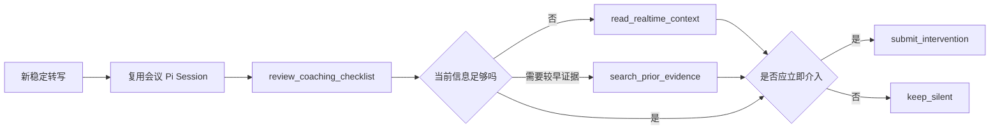

# Pi 持续实时教练 Agent Loop 实施说明

> 分支：`feat/pi-continuous-coach-loop`
>
> 实施提交：`8c36b09`、`9ef5364`、`0cb383d`、`3d271c2`、`6f106eb`
>
> 日期：2026-08-17

## 1. 本轮交付结果

本分支把上一版“Pi 作为可选的单次教练执行器”升级为持续会议教练：

1. Pi 是本分支默认实时教练 runtime，异常时自动回退原有 direct LLM。
2. 同一会议复用同一个 Pi Session，连续保留最近的教练判断历史。
3. 每个新稳定转写片段都会驱动一轮 Agent Loop；系统声音和麦克风片段都会更新状态。
4. 每轮必须先执行 5 项教练 checklist，再决定是否读取上下文、检索历史证据、给出建议或保持静默。
5. 右侧“AI 实时教练”直接展示 Pi 是否监听、检查、回退，以及本轮 checklist 和检索次数。

这里的“持续”是事件驱动常驻 Session，不是静音时无限轮询。没有新稳定转写时不调用模型，避免无意义延迟和费用。

## 2. 用户看到什么

实时教练标题右侧会显示当前状态：

- `Pi 教练监听中`：上一轮确实由 Pi 完成。
- `Pi 教练正在检查`：新片段正在进入 Agent Loop。
- `Pi 已回退普通模式`：Pi sidecar 或 Provider 失败，本轮由 direct LLM 兜底。
- `Pi 教练等待模型`：尚未配置 LLM Provider。
- `实时教练已关闭`：会议准备中的主动建议策略关闭，或全局开关关闭。

没有生成建议卡时，界面仍展示本轮状态，例如：

```text
本轮完成 5 项检查 · 检索历史 1 次 · 已延续会议上下文
```

这让“Pi 正在工作但选择静默”和“Pi 根本没有运行”能够被区分。

## 3. 每轮 Agent Loop



一次评估最多 4 个 Agent turn、8 次工具调用。模型必须调用一个且只能调用一个终止工具，普通文本不会进入产品。

## 4. 教练 Checklist

| 检查项 | 对应事件 | 判断目标 |
| --- | --- | --- |
| 问题回应 | `question_to_user` | 对方的问题是否仍等待用户回答 |
| 承诺条件 | `commitment_risk` | 时间、范围、结果或责任是否缺少必要前提 |
| 目标覆盖 | `goal_at_risk` | 议题离开前，会议目标或关注点是否仍未覆盖 |
| 前后口径 | `contradiction` | 当前说法是否与较早事实、条件或立场冲突 |
| 介入价值 | 静默门槛 | 提示现在是否仍有用，能否避免具体损失 |

checklist 是工具边界，不只是 Prompt 文案。没有先调用 `review_coaching_checklist`，Pi 不能提交建议，也不能结束为静默。

## 5. 历史检索与证据边界

Pi 每轮只直接看到新片段，不自动把整场会议塞进 Prompt。需要旧信息时，它可以：

- 读取会议目标、rolling state 或当前语义窗口。
- 在最近最多 48 条较早转写中执行 `search_prior_evidence`。
- 使用检索命中的原始 segment ID 和逐字引用提交建议。

Python 和 Node 两侧都会再次校验证据 ID 与引用。不存在于模型可见转写中的人名、数字、期限或立场不能进入教练卡。

麦克风片段可用于判断问题是否已经回应、承诺是否仍开放，但不能单独证明说话者就是软件使用者。

## 6. 运行配置

本分支默认请求 Pi：

```powershell
$env:MEETING_COPILOT_REALTIME_COACH_RUNTIME = "pi"
```

该变量可以省略。需要临时回到旧实现时设置：

```powershell
$env:MEETING_COPILOT_REALTIME_COACH_RUNTIME = "direct"
```

完全关闭实时教练：

```powershell
$env:MEETING_COPILOT_REALTIME_COACH_ENABLED = "0"
```

仍需配置一个可用的 OpenAI-compatible LLM Provider。Pi 不提供模型，它负责 Session、工具调用和 Agent Loop。

## 7. 无外放验证

Pi sidecar 使用官方 faux Provider 跑固定转写，不访问麦克风或扬声器：

```powershell
cd code\agent_runtime\pi_coach_bridge
npm.cmd test
npm.cmd run smoke
```

同一批固定 transcript 的 direct/Pi 对照入口仍为：

```powershell
cd code\web_mvp\backend
uv run --frozen python ../../../tools/realtime_coach_eval/replay.py `
  ../../../tools/realtime_coach_eval/fixtures/private_coach_smoke.jsonl `
  --runtime both `
  --output ../../../artifacts/realtime-coach-eval.json
```

A/B 需要真实 Provider 配置，但不需要播放或外放声音。

### 真实 Provider 端到端结果

2026-08-17 使用 `gpt-5.6-sol`、`chat_completions` 和两条直接注入的稳定转写进行验收，未播放音频，也未打开麦克风：

1. 远端先声明“压测通过前不得承诺发布日期”，Pi 完成 5 项 checklist 后选择静默；`runtime_used=pi`，无回退，1 个 Agent turn、1 次 `keep_silent`，约 3.46 秒。
2. 麦克风轨随后出现“即使压测未通过也承诺周五上线”，同一 Pi Session 识别为 `commitment_risk` 并立即建议撤回无条件承诺；`runtime_used=pi`，无回退，1 个 Agent turn、1 次 `submit_intervention`，约 9.37 秒。
3. 第二轮 `session_reused=true`，建议同时引用两条逐字证据。两条证据已在当前有界语义窗口内，因此本例无需额外调用历史搜索工具；更早证据才走 `search_prior_evidence`。
4. Python 与 Node 均支持“每行一条”的多证据引用校验；任何一行不是所选证据的逐字子串都会拒绝，避免用改写内容冒充原话。

工作台验收会议为 `pi-coach-proof-grounded-20260817`。用户可见结果为 `Pi 教练监听中`、`本轮完成 5 项检查 · 已延续会议上下文`，并展示高紧急教练卡、可展开的两条依据、未闭环问题、决策和风险候选。

## 8. 当前边界

- 桌面安装包仍需把 Node `>=22.19.0` 和 Pi sidecar 一起打包；源码开发环境已经跑通，生产打包尚未完成。
- 历史检索目前是本地、只读、最多 48 条转写的轻量检索，不是整场向量索引。
- Agent Loop 只消费稳定转写，不处理 ASR partial，避免在半句话上误报。
- Pi 能改善跨轮状态、按需取证和静默决策，但不会自动提升底层模型本身的语义能力；真实增量仍应通过相同模型的 direct/Pi A/B 数据判断。

## 9. 主要代码位置

- Pi Session、checklist、工具循环：`code/agent_runtime/pi_coach_bridge/src/runtime.mjs`
- Python sidecar 与回退：`code/web_mvp/backend/meeting_copilot_web_mvp/pi_coach_runtime.py`
- 双音轨触发和教练路由：`code/web_mvp/backend/meeting_copilot_web_mvp/realtime_intelligence.py`
- 历史转写投影和运行状态：`code/web_mvp/backend/meeting_copilot_web_mvp/app.py`
- 用户可见教练状态：`code/web_mvp/frontend_v2/src/features/live-meeting/NowRail.tsx`
