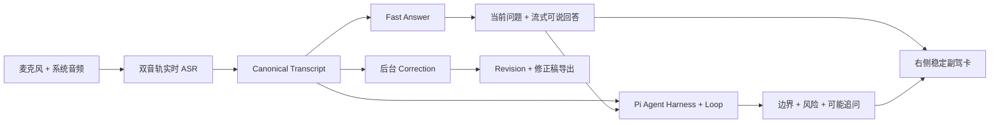

# Meeting Copilot Answer Copilot + Pi 验收报告

> 日期：2026-09-29（最新复验）
> 分支：`feat/pi-realtime-coach-agent-loop`
> 基线：`0b69f1a`
> 结论：Fast Answer、Pi Deep Coach、后台转写精修三条独立通道已通过真实 FunASR + 真实 Provider 验收，Pi 已能给出绑定当前回答的边界、风险和追问。相同固定音频的 `main` 基线、原生双轨协议、五分钟物理 system audio 连续采集以及桌面/移动布局均已有证据。MacBook Air 麦克风 helper 已获权限并连续运行，但设备处于合盖状态（`AppleClamshellState = Yes`），内建麦克风被硬件断开，系统输入电平和 PCM 因此为零；system audio 主链可用，打开上盖或连接外置麦克风后的真正双方发声双轨仍未达到发布线。

## 1. 这次解决的产品问题

旧实现把 Pi 优化成“是否值得打断”的低频提示器，因此即使会议里出现明确问题，用户也经常只看到 `keep_silent`、门槛提示或 Provider 失败，拿不到可以直接说的回答。Pi 的工具循环又和首屏价值耦合，导致慢 Agent 阻塞右侧正文。

本轮将产品固定为两条 AI 通道和一条独立转写通道：



- **Fast Answer**：识别对方的问题后立即创建 Answer Task，流式显示可直接口述的回答，不等待 Pi。
- **Pi Deep Coach**：通过 Pi SDK 的 session、harness、受控工具和 Agent loop 读取当前回答与会议证据，只补充遗漏的边界、风险和可能追问。
- **Correction**：独立后台调用本地精修/远端模型，生成 revision；不阻塞 ASR、Fast Answer 或 Pi，也不允许 Answer/Pi 反向修改原始 ASR。

## 2. 竞品调研结论

2026-09-27 再次核验以下开源仓库均可访问。这里只采用产品和架构思想，不复制受许可证约束的实现代码。

| 项目 | 借鉴点 | 本项目的取舍 |
|---|---|---|
| [Ecoute](https://github.com/SevaSk/ecoute) | 麦克风/系统音频双轨、双方转写合并 | 保留双轨和说话方，canonical transcript 作为唯一事实层 |
| [cheating-daddy](https://github.com/sohzm/cheating-daddy) | 持续会话、Interview/Meeting/Sales profile、答案流式生长 | 采用场景 profile 和首 token 展示；拒绝隐身和规避监控能力 |
| [hacktheinterview](https://github.com/dan1d/hacktheinterview) | `answer_start -> answer_chunk -> answer_done`、最近对话和资料注入 | 问题成为独立 durable Answer Task，不再依赖摘要触发 |
| [zigy](https://github.com/minhtranin/zigy) | 会前资料、长上下文压缩、talk script | 会议目标、角色、关注点成为一等上下文；后续再扩展资料库 |
| [screenpipe](https://github.com/mediar-ai/screenpipe) | 本地时间线检索、Agent 权限边界 | Pi 只能通过宿主工具读取有界证据；本轮不持续采集屏幕 |
| [Interview Ace](https://github.com/SangJieGe/Interview-Ace) | Voice Agent 与 Knowledge Agent 分工 | ASR、快回答、深度 Agent 明确解耦，不把架构文档当完成证据 |

共同规律是：问题必须任务化、首 token 必须可见、首屏必须是“现在怎么回答”，检索和深度推理只能作为第二阶段增强。

## 3. 实现结果

### Fast Answer

- `system_audio` / `remote_mix` 高召回问题检测，覆盖中文/英文、问号丢失和命令式提问。
- 独立 durable `answer` job 和独立 HTTP client；新问题会 supersede 旧在途任务。
- OpenAI-compatible 流式输出，持久化 Provider、model、TTFT、完成时间和错误类别。
- 刷新和 SSE 重连后 Answer 不再消失；Pi 静默或失败不能清空 Answer。
- 个人经历资料不足时使用限定表达，不虚构公司、数字或项目结果。

### Pi SDK Harness + Loop

- Python 宿主把 `rolling_state.current_answer`、最近证据、会议目标和 open items 传入 Node bridge。
- `deep_answer` 自动任务使用 Pi Agent session，并只开放 `submit_intervention` / `keep_silent` 两个终止工具；用户主动深挖时仍可使用受控搜索/读取工具。
- 结构化结果固定为 `boundary`、`risk`、`follow_up`、`why_now` 和证据字段，由宿主组合成深度补充卡。
- Fast Answer、Pi realtime、Pi deep 和 direct semantic 使用独立并发通道；同证据存在 Answer Task 时普通 Pi realtime 直接可审计静默，不调用 Provider。
- 深度卡绑定 `answer_id`；只有新有效 intervention、明确 retract 或 lifecycle resolved 可以替换旧卡。普通 `failed`、`timed_out`、`protected_silent` 只进入诊断历史。
- Deep card 不再套用普通实时提示的 90 秒失效规则；下一条 Answer 出现时旧卡会退出当前区域。

### 左侧转写与导出

- Answer/Pi 只读 canonical transcript，未修改音频采集、FunASR worker、VAD、切段或原始 ASR。
- 未配置价格费率不再错误禁用 correction；状态为 `unknown` 时允许真实调用。
- correction timeout 为 30 秒，单批最大 800 字，避免大批次超时。
- revision 写入 canonical transcript；`transcript.txt` 导出修正稿，raw ASR 留在 revision 审计信息中。

## 4. 真实 Provider 验收

Provider 地址和密钥仅存在本地私有配置，本文不记录凭据。模型为 `gpt-5.5`，OpenAI Responses-compatible 格式。

### Fast Answer 固定题集

会议：`accept_answercopilot_short_20260927`

| 指标 | 结果 |
|---|---:|
| 成功提交 | 5 / 5 |
| TTFT P50 | 约 2.07s |
| TTFT P95 | 约 2.50s |
| 完整响应 P95 | 约 4.37s |

五条真实记录的 TTFT 为 `2067 / 2502 / 2145 / 1924 / 1748ms`，完成时间为 `4366 / 4280 / 3891 / 3808 / 3228ms`。P95 达到既定 `2.5s / 5s` 附近的验收线。

### Pi Deep Coach

会议：`accept_pi_deep_context_20260927`

最新真实成功轮次：

| 指标 | 结果 |
|---|---:|
| Provider attempts | 1 |
| Agent turns | 1 |
| Tool calls / errors | 1 / 0 |
| TTFT | 约 3.84s |
| Decision latency | 约 6.92s |
| E2E projection | 约 6.94s |
| Prompt profile | `deep_answer` |
| Answer binding | 与当前 Fast Answer ID 一致 |

真实输出已经是增量补强，而不是摘要或“未达到介入门槛”：

```text
边界：只有在消费成功后才 ACK，幂等也只能覆盖业务侧按订单号识别重复的场景。
风险：把 ACK 和幂等说成“兜住可靠性”过于绝对，容易被追问失败路径。
追问：消费失败或重复消费时，ACK 和订单号幂等分别如何保证结果正确？
```

生命周期回归也使用了真实历史：失败只进入 `diagnostics.coach_runtime_history`，上一条成功 Pi 卡仍保留在 `coach_intervention`，新成功卡会正常 supersede 上一张有效卡。2026-09-28 又修复了 Deep 事实校验只读取原始 ASR、却忽略已提交 Fast Answer 的问题；真实复验中已不再出现该 `IntelligenceResponseValidationError`。

### Transcript Correction

验收会话：`accept_correction_small_20260927`

| 指标 | 结果 |
|---|---:|
| 输入 final segments | 5 |
| 处理 / revision | 5 / 3 |
| Provider elapsed | 约 18.7s |
| Token usage | 580 prompt / 865 completion / 1445 total |

真实修正包含 `结构化翻新框 -> 结构化 function call`、`Q啊，对你没有听错 -> 对啊，对，你没有听错`。Snapshot 和 `/transcript.txt` 均读取修正后的 canonical 文本。

Correction 的计价边界已固定：Provider 完全没有配置价格变量时不再错误禁用精修，但一旦显式配置价格，`0`、负数、非法值或只配一侧仍 fail closed。只有显式 `unmetered` 才允许零价格。

### 服务重启后真实 Provider 探测

2026-09-27 使用受管启动脚本重启 `8981` 后，runtime identity 的源码、进程、端口、schema 和前端资产检查全部通过。脱敏 Provider 探测结果：

| 字段 | 结果 |
|---|---:|
| model / API style | `gpt-5.5` / `responses` |
| operational / realtime ready | `true` / `true` |
| probe latency | `2211ms` |
| realtime cutoff | `8000ms` |
| Pi realtime circuit | `closed` |

探测 usage 中 prompt token 为 `4389`，对一次微型连接探测偏高。这不影响连通性结论，但需在后续成本优化中核对中转网关的 usage 口径与 prompt 处理。

## 5. 自动化回归

- 后端全量：`1797 passed / 1 skipped`。跳过项为环境条件测试；只有 Starlette `TestClient` 的已知弃用警告。
- 前端全量：`329 passed / 329`，包含 Answer 流式状态、Pi 失败保留旧卡、新 Answer 换题以及回答/Pi 历史去重。
- Pi SDK bridge：`50 passed / 50`，包含 `deep_answer`、自动 Deep 工具收缩和结构标签去重。
- Provider/correction 边界聚焦回归：`73 passed / 73`。
- Ruff、ESLint、TypeScript、Vite production build 和 `git diff --check` 通过。
- Vite 仍提示主 JS chunk `658.03KB`（gzip `188.73KB`），属于后续首屏性能优化项，不影响本轮功能验收。

## 6. 尚未完成的发布阻塞项

- [x] 真实 Chrome 麦克风单轨问题、离题门禁和 Fast Answer 已验收；后续静音注入再次覆盖真实 FunASR WebSocket。
- [x] 使用相同固定音频对比 `main` 与当前分支；启用相同本地 refiner 后 canonical transcript 逐字一致，Pi 集成未改变本地精修结果。
- [x] 通过 `native_pcm_v2` 分别注入 `native_microphone_streaming` 与 `macos_system_audio`，验证双轨身份、capture epoch、帧序、并发 ASR、Fast Answer 和 Pi Deep 主链。
- [x] 桌面原生 helper 连续运行约五分钟，记录 system audio 问题 recall、Fast Answer TTFT/完成时延和 Pi 业务成功率。
- [ ] MacBook Air 麦克风产生非零 PCM 后，补齐真正双方发声的 speaker/track、recall/precision 和连续稳定性验收。
- [x] 验证本地 refiner、远端 correction 和导出在浏览器真实流程中均可见，不只依赖 API/数据库验收。
- [x] 桌面和移动宽度截图验收：无溢出、标题跳动、旧 Pi 卡串题或嵌套卡片。
- [x] 增加最近 Answer 历史视图，明确区分当前回答、过去回答和过去 Pi 建议。

在物理麦克风非零输入和双人双轨验收完成前，不把分支标记为“桌面端可发布”；但 Pi 的产品定位、Harness/Loop 调用、双 lane 主链、Answer 绑定和失败不清卡问题已经有真实 Provider 与自动化证据，不再属于“只接了 SDK 但没用起来”的状态。

2026-09-27 的真实 Chrome 流程已成功创建会议 `rec_mujth0ku_56e33a3c7862`，页面显示“AI 已连接”；点击“开始录音”时 macOS 进入锁屏，原生自动化无法解锁，因此尚未开始麦克风或 system audio 数据，也尚未产生可用于 ASR 质量结论的录音。该结果只记为设备验收阻塞，不计作双音轨通过。

## 7. 2026-09-28 静音真实端到端验收

用户要求后续禁止外放声音，因此本轮没有播放音频，没有打开麦克风，也没有触发录音权限。网页单轨测试将已有语音的 16kHz 单声道 float32 PCM 按 `1600 samples / 6400 bytes / 100ms` 注入 `/live/asr/stream/ws/{meeting_id}`；原生双轨测试则按 `native_pcm_v2` 的 `4800 samples / 300ms` 帧封装，分别声明 track、capture epoch、sequence 和 timestamp。两种测试均经过真实 FunASR、VAD、canonical final、durable executor 和真实 Provider，不是 fake ASR 或 mock Provider。

### 调度缺陷复现与修复

首次静音会议 `accept_silent_pi_deep_20260928_01` 暴露：普通 Pi candidate 先占用 Provider，Fast Answer 三次流式调用失败，Correction 也发生竞争。Provider 独立探测随后成功，证明根因是应用内调度竞争，而不是 Key 失效。

修复后的所有权规则：

- 同证据存在 Answer job 时，普通 Pi job 成功落为 `suppressed_by_answer_lane`，`suppression_reason=fast_answer_owns_question`，`pi_provider_attempted=false`。
- Answer 成功后创建唯一 `answer_ready` Deep job。
- Deep 自动任务可用工具严格为 `submit_intervention` 和 `keep_silent`。
- Correction 前 12 秒为 Answer/Pi 让路，超过 12 秒后强制执行，不再被批处理间隔二次饿死。

### 真实成功样本

会议 `accept_silent_answer_pi_20260928_03`：

| 链路 | 结果 |
|---|---:|
| Provider probe | `operational=true`，`realtime_ready=true`，`2399ms` |
| Fast Answer TTFT / 完成 | `1897ms / 4029ms` |
| 普通 Pi Provider 调用 | `0`，按 Answer 所有权静默 |
| Pi Deep TTFT / decision / projection | `2800ms / 5439ms / 5555ms` |
| Pi Agent turns / tool calls | `1 / 1` |
| Pi Deep 工具 | 仅 `submit_intervention`、`keep_silent` |
| Prompt / Answer 绑定 | `deep_answer` / 精确匹配当前 Answer ID |
| Deep 校验错误 | 无 |

Fast Answer 给出了 Redis Stream/Kafka 的选择依据、失败路径和演进条件。Pi 随后生成：

```text
边界：明确 Redis Stream 适合单业务域内异步削峰，不适合作为企业级事件总线或审计日志。
风险：若不说明迁移触发指标，评审可能认为这是短期省事而非可治理的架构选择。
追问：会预埋消息抽象层，避免业务代码直接绑定 Redis 命令，便于后续平滑迁移 Kafka。
```

这说明 Pi 当前承担的是“基于可见 Fast Answer 的二阶段增量教练”，而不是摘要器或首答阻塞器。

会议 `accept_silent_answer_pi_20260928_04` 验证 Correction 公平调度：

| 指标 | 修复前样本 | 修复后样本 |
|---|---:|---:|
| final 到修正版 | 约 `29.0s` | `16.347s` |
| Correction 实际 attempts | `2` | `1` |
| Fast Answer TTFT / 完成 | - | `3097ms / 5571ms` |

修正版将乱码恢复为“Redis Stream / Kafka / 架构取舍 / 失败路径 / 演进边界”。校对延迟明显下降，但最新 Fast Answer 样本受网关波动影响超过 `2.5s / 5s` 的严格线；因此功能验收通过，性能 SLO 仍需更多样本、专用 realtime model 或网关优化，不能以单次成功宣称完全达标。

### 同音频 `main` 基线

使用 SHA-256 为 `d06ebabb8f9a41b404fc2b0ba9e4aba369860228a1128bb660d04271bfc2ca16` 的同一段 16kHz/mono/PCM16 WAV，对 `origin/main@5cd0ed5` 的只读临时快照和当前 Pi 分支进行对比。两边启用相同本地离线 refiner 和相同模型后，canonical transcript 逐字一致。Pi 分支没有改变该固定输入的切段或本地精修结果。

该结果同时暴露出本地模型的能力边界：它只能改善断句，不能可靠把误识别恢复为 `Redis Stream / Kafka`；未做远端 correction 时，两边都会保留相同的专有词乱码。当前分支的远端 correction 能把该问题修正为：

```text
Redis Stream为什么选择Redis Stream，而不是Kafka？请说明架构取舍、失败路径和未来演进边界。
```

### 原生协议双轨静音验收

会议 `accept_silent_dual_native_20260928_03` 同时建立两个真实 ASR WebSocket：system audio 使用 `macos_system_audio` / epoch `202`，microphone 使用 `native_microphone_streaming` / epoch `101`。两轨均收到 `asr_transport_ready`、`asr_ready`、`final` 和 `end_of_stream`，完整帧、partial tail、track/epoch 归属均按原生协议处理。

| 链路 | 结果 |
|---|---:|
| Provider probe | `operational=true`，`realtime_ready=true`，`2269ms` |
| Fast Answer TTFT / 完成 | 约 `1775ms / 3955ms` |
| Pi Deep TTFT / decision / projection | 约 `3444ms / 5387ms / 5751ms` |
| Pi Agent turns / tool calls | `1 / 1`，工具为 `submit_intervention` |
| Prompt / Answer 绑定 | `deep_answer` / 精确匹配当前 Answer ID |
| Deep terminal | `completed`，无 validation error |

真实 Deep 输出为：

```text
边界：限定在单服务/小规模事件驱动；
风险：若没有量化阈值，演进边界会显得主观且不可验证。
追问：追问候选人给出切换阈值：QPS、积压时长、保留期、消费者数量。
```

该轮还复现了右侧 Pi 卡“一眨眼消失”的直接根因：后到的 microphone final 含有“监控阈值”“已解决”等通用词，普通 realtime lifecycle matcher 仅凭词语重叠，误把绑定 Redis/Kafka Answer 的 Deep 卡标记为 `lifecycle_resolved`。现已将 Deep Answer 卡从普通 transcript resolution matcher 中排除；它只随绑定的当前 Answer 变化而退出。普通 realtime 卡仍保留基于新证据关闭旧建议的能力。修复由自动化回归覆盖；因为真实 Provider 已证明生成与 Answer 绑定成功，修复后没有再次消耗余额有限的测试 Key。

边界必须明确：上述结果证明的是桌面原生 PCM 协议、双 track/epoch 归属、后端并发和 AI 主链，不证明 macOS 物理麦克风和系统音频采集设备本身已经验收。真正的采集稳定性、双方问题检测 recall/precision 和五分钟连续运行仍需用户明确允许后再做；在用户禁止外放和真实麦克风期间不会执行。

会中 Answer/Pi 右栏已使用禁用音频输出、禁用媒体设备的 Chromium headless shell 完成桌面和移动视觉验收。桌面 `1440x1000` 下 document 宽度为 `1440/1440`，右栏 `client/scroll width=556/556`，当前 Answer 与最近回答均为 `520px`；移动 `390x844` 下 document 和正文均为 `390/390`，当前 Answer 与最近回答均为 `354px`。页面展示 1 张当前 Answer、4 条最近回答和 1 条绑定当前 Answer 的 Pi Deep 补充；Pi Deep 未重复进入过去建议，嵌套卡片计数为 0。测试参数包含 `--disable-audio-output` 与 `--disable-features=MediaDevices`，没有打开真实麦克风、触发录音权限或播放声音。

## 8. 2026-09-29 迁移会议的校对状态修复

旧 V1 -> V2 shadow migration 已经把 `transcript_revision` 的 canonical 文本写入 V2，但历史实现同时把 raw `text` 覆盖成 canonical，并沿用默认 `correction_status=pending`；迁移又明确不创建 correction job。结果是内容实际已修正，页面却永久显示“AI 正在校对 / 已校对 0/N”，也无法保留修正前原文。

本轮修复将 migration-owned 段落恢复为双层事实：`text` 保留旧 `original_text`，`normalized_text` 保留 canonical 修正版，有变化时状态为 `changed` 且 revision 至少为 2，无变化时为 `no_change`。修复只允许修改整场会议均由 migration finalized event 构成、目标 event 指向同一 migration 的已登记 checksum、当前运行也有 migration marker、canonical 内容仍一致、且没有真实 correction job 的段落；只要会议含有任意真实 finalized event，就按混合/实时会议整体跳过。即使后来新增无关旧会议导致整表 checksum 变化，旧 checksum 仍可由历史 marker 验证。重复迁移会先修复旧错误投影，再执行不可变内容校验，真实 canonical drift 仍会被报告为冲突。

专项迁移测试 `9 passed`；计入本轮其他修复后，后端全量为 `1797 passed, 1 skipped`。最终安全版受管服务启动后，真实本地会议 `accept_correction_small_20260927` 的 5 段投影为 `3 changed + 2 no_change`，revision 为 `2/1`，correction job 数仍为 0；raw 误识别与 canonical 修正版均完整保留。API runtime 显示“精修已稳定”，浏览器顶部显示“文字已确认”，会议文字页显示 `3 个语义段落 · 5 条识别片段`；修正版 `结构化 function call` 和“对啊，对，你没有听错”可见，旧误识别、`AI 正在校对会议文字` 与 `已校对 0/5` 均不存在。Markdown 导出也只包含 canonical 修正版。

混合实时会议 `rec_mula036s_e9efbdcdb403` 同时用于保护边界复验：其中目标段含真实 finalized event 的同会证据，因此重启后继续保持 `pending`，migration reconciliation 没有改写它。页面复验使用 `--disable-audio-output --mute-audio --disable-features=MediaDevices`，没有访问麦克风、播放音频或调用 Provider。

## 9. 2026-09-29 五分钟真实硬件验收

用户确认参会者知情并允许录音、麦克风与外放测试后，会议 `accept_real_dual_answer_pi_20260929_01` 同时启动 AVAudioEngine 物理麦克风 helper 和 ScreenCaptureKit system audio helper，并通过 MacBook Air 扬声器播放固定中文会议题集。默认输入/输出分别为 MacBook Air 麦克风/扬声器，输出音量 18%。

| 指标 | 结果 |
|---|---:|
| system audio final | `12` |
| 物理麦克风运行时间 | 约 `330s`，但输入电平始终为 `0` |
| 固定问题命中 | 约 `6/7 = 85.7%` |
| Fast Answer TTFT | `P50 1.79s / P95 2.29s / Max 2.40s` |
| Fast Answer 完成 | `P50 3.14s / P95 3.71s / Max 3.74s` |
| Pi Provider | `6/6` 请求完成 |
| 通过事实校验的 Pi 卡 | `1/6 = 16.7%` |

该结果证明 Provider、Pi SDK session/harness/loop 和工具调用确实运行，但旧实现给 Pi 的证据只有最后一小段问题，模型容易新增原文没有的期限、数字、产品名或完成状态，最终被宿主事实门禁拒绝。右侧低价值的根因是多段证据绑定和事实落地失败，不是“Pi 没接上”。

同轮发现静音 microphone track 写入全局 `asr_no_final`，错误阻塞已有 system audio final 的 correction、minutes 和 approach。现改为：诊断仍保留，但只要任一轨已有持久化非空 final，校对和已启用的 LLM 派生可以继续；所有轨都没有 final 时仍 fail closed。

物理麦克风结论保持保守：macOS 已显示 Chrome、ChatGPT 和桌面 helper 均允许访问麦克风；默认输入为 MacBook Air 麦克风，复核时输入音量调至 `60%`，默认输出为 MacBook Air 扬声器、音量 `18%` 且未静音。“声音 > 输入”的系统电平和 3 秒 AVAudioEngine probe 均为零；系统级 `ioreg` 进一步返回 `AppleClamshellState = Yes`，确认 MacBook 正处于合盖状态，Apple Silicon 会在该状态下硬件断开内建麦克风。因此它不是浏览器权限、WebSocket、ASR 或 Pi bug；打开上盖或连接外置麦克风并取得非零 `peak_rms` 前，仍不能宣称物理双轨通过。

复测入口固定为：先确认 `AppleClamshellState = No`，再在 macOS“声音 > 输入”观察到非零电平，并运行原生 helper 的 3 秒 probe；只有 `probe_status=audible` 且 `peak_rms > 0` 才启动新的双轨会议样本。这样不会再把“helper 已启动并发送静音帧”误当成“麦克风真实可用”。

## 10. 证据绑定、事实落地与真实回归

本轮针对五分钟验收暴露的问题完成四项修复：

1. `asr_no_final` 按轨可恢复，不再让静音麦克风阻塞有效 system audio 的校对与派生。
2. Fast Answer 将实际使用的多段 `context_evidence_segment_ids` 传给 Pi，Deep 卡返回对应的多段 verbatim quote。
3. Fast Answer 在 commit 前移除无证据的日期、数字、负责人和已完成状态；仍有价值的有依据语句保留。
4. 同轨紧跟完整问题的低信息尾句（例如“你吗？”）不再新建或覆盖 Answer；独立短问题仍正常触发。

85 秒真实硬件回归 `accept_real_regression_pi_20260929_02` 的 system audio 产生 4 条可读 final 和 3/3 Fast Answer，没有把标题降级为低信息尾句。Answer Provider `3/3` 成功，TTFT `P50 2.36s / P95 2.56s`，完成 `P50 3.89s / P95 4.09s`。Pi Provider `3/3` 被调用，2 张卡通过事实校验并绑定 2 至 3 段证据，业务成功率从 `16.7%` 提升到 `66.7%`；第 1 张仍因模型新增原文没有的完成状态被拒绝。Correction `3/3` 成功，说明静音麦克风的 `asr_no_final` 已不再阻塞其他轨。

为避免“放宽门禁换通过率”，随后增加了 Pi Deep 提交前事实落地屏障：只有无证据的日期、数字、负责人、产品名或完成状态所在行会被替换为事实无关的检查问题，并记录 `host_grounding_applied`、字段和原始失败类别；结构、证据引用和其他安全错误仍按原规则拒绝。该逻辑有单元测试，不保存被拒绝的 Provider 原文。

最小真实 Provider 复验 `accept_real_grounded_pi_20260929_03` 复用了同一段真实 ASR 音频，只发送到首个完整上线问题；没有执行独立连接探测。结果如下：

| 链路 | 结果 |
|---|---:|
| canonical transcript | `支付接口 2.0`、上线条件和安全验收均可读 |
| Fast Answer | `1/1`，TTFT `2.27s`，提交 `3.30s` |
| Pi runtime/profile | `pi` / `deep_answer` |
| Pi Agent turns/tool | `1 / submit_intervention` |
| Pi TTFT / decision / projection | `2.74s / 4.88s / 4.96s` |
| 证据绑定 | 2 段 system audio final，绑定当前 Answer ID |
| Provider probe | `not_run`，真实 Answer/Pi/correction 调用作为连通性证据 |

最终 Fast Answer 为：

```text
本周五能不能上线现在还不能承诺，只能说满足前提后再上线。前提是压测和安全验收最终通过，并且确认核心交易零中断风险可控；否则建议延期或降级发布。
```

Pi Deep 增量卡为：

```text
边界：需要明确适用范围和判断条件
风险：被追问时若没有判定口径，容易变成无依据承诺。
追问：可补一句：若验收未通过，会上同步延期或降级方案。
```

这次结果达到“先给可直接说的回答，再由 Pi harness/loop 补边界和追问”的目标效果；但单个成功样本不替代后续双人双轨长时间验收和独立价值盲评。
