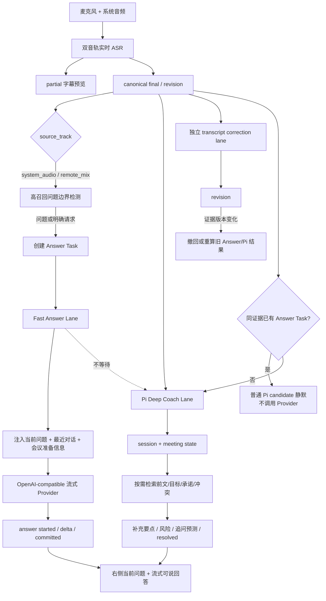

# Meeting Copilot Answer Copilot + Pi 双通道重构方案

> 版本：v1.0
> 日期：2026-09-29（最新复验）
> 目标分支：`feat/pi-realtime-coach-agent-loop`
> 状态：Fast Answer、Pi Deep、Correction 已完成真实 Provider 验收；同音频 `main` 基线、原生双轨协议、五分钟物理 system audio 连续采集和会中 Answer/Pi 布局均已有证据。MacBook Air 物理麦克风 helper 已获权限并持续运行，但系统输入电平与 PCM 仍为零，因此真正的双人双轨验收仍是发布阻塞项。后续代码、测试和验收必须能回到本文件中的用户效果与指标。

## 0. 决策摘要

当前 Pi 已真实接入 Agent session、工具循环和证据校验，但产品主循环优化的是“是否值得打断”，不是“对方刚问了什么、用户现在怎么回答”。这会自然地产生大量 `keep_silent`，最终退化为低频提示卡。

本轮将产品改为两个互不阻塞的通道：

1. **Fast Answer Lane**：系统音轨出现问题或明确请求后，立即流式生成一段可以直接说出口的回答。它负责首屏价值，不等待 Pi tool loop。
2. **Pi Deep Coach Lane**：继续维护会议目标、承诺、冲突、历史事实和未闭环事项，按需检索证据，补充论据、边界和追问预测。它不能阻塞 Fast Answer Lane。

左侧 ASR 是独立事实层。Answer 和 Pi 只能读取 canonical transcript，不能改写原始识别、切段、离线精修或 revision 生命周期。

## 1. 外部项目调研

调研时间为 2026-09-26。只采用产品和架构思想，不复制受 GPL 或其他许可证约束的代码。

| 项目 | 已核实的实现 | 可借鉴内容 | 不采用内容 |
|---|---|---|---|
| [Ecoute](https://github.com/SevaSk/ecoute) | 麦克风和系统扬声器双路采集；按时间合并 `You` / `Speaker` 转写；约 3 秒 phrase timeout | 双音轨是最小上下文单元；左右双方必须明确区分 | 小模型整段反复重转写、仅最近 10 段的简单 UI |
| [cheating-daddy](https://github.com/sohzm/cheating-daddy) | Gemini Live 持续接收系统音频；支持 Interview/Meeting/Sales profile；答案按 chunk 流式更新；重连时恢复最近对话 | Profile 化、持续会话、答案只输出“可直接说出口的话”、首 token 即显示 | 隐身、绕过录屏、规避监控；本项目坚持告知和授权 |
| [hacktheinterview](https://github.com/dan1d/hacktheinterview) | Deepgram interim/final；final 后立即发 `answer_start`，随后发 `answer_chunk` / `answer_done`；Prompt 注入最近 10 段和简历 | 明确的 Answer 事件协议；流式替代空白等待；最近对话和用户资料共同进入回答 | 每个 final 都无条件调用模型；固定英文和固定 Provider |
| [zigy](https://github.com/minhtranin/zigy) | 会前会议背景和笔记；对上下文压缩；生成回答脚本、澄清问题和 talk script | 用户资料/会议材料必须是一等上下文；长会话需要压缩而非全量重放 | 将所有能力堆在一个超大服务文件中 |
| [interview-assistant](https://github.com/qfnfyxtu-netizen/interview-assistant) | Deepgram 实时流、关键词/优先级、Perplexity 或本地 Ollama fallback、浏览器 overlay | 提示优先级和显式 fallback；云模型不可用时仍需交付状态 | 只给关键词资料卡、不生成完整可说回答 |
| [screenpipe](https://github.com/screenpipe/screenpipe) | 本地音频/屏幕时间线、SQLite/FTS 搜索、Agent/Pipe 的确定性数据权限 | 长期会议记忆应本地可检索；Agent 工具权限必须由宿主强制控制 | 连续屏幕采集不是本轮 P0，避免扩大权限和资源消耗 |
| [Interview Ace](https://github.com/SangJieGe/Interview-Ace) | 文档描述 Voice Agent + Knowledge Agent + RAG；代码仍有较多 TODO | “声音识别”和“知识回答”职责分离是正确方向 | 不能把架构文档当成已经跑通的实现证据 |

调研后的共同规律：

- 对方问题是一个独立的 **Answer Task**，不是普通摘要候选。
- UI 必须先创建当前问题和空答案状态，再持续追加 token，不能等完整 Agent 结果。
- 输出首先是“用户可以直接说什么”，解释、证据和风险属于第二层。
- 最近对话、会议目标、用户角色和授权资料决定回答是否有用。
- 快回答和深度检索应分离；工具循环不应成为首字延迟的单点阻塞。

## 2. 冻结后的目标体验

### 2.1 右侧主区域

系统音轨识别到问题后，右侧保持稳定结构，不再让标题和空状态反复替换：

```text
AI 实时副驾                         [快速回答 · 生成中]

当前问题
你们为什么没有选择 Kafka，而是使用 Redis Stream？

建议回答
我们当时更看重低运维成本和现有 Redis 复用，因此先选择 Redis Stream。
在当前吞吐规模下它已经满足需求；如果后续需要更强的消息保留和多消费者隔离，
我们会把 Kafka 作为演进方案。

回答要点
- 当前规模和约束
- 选择依据
- 演进边界

可能追问（Pi 后台补充）
如何保证消息不丢失？什么时候必须迁移 Kafka？
```

交互规则：

- 新问题确认后，立即显示“当前问题”和生成状态。
- 第一段可读 token 到达后直接显示，不等待完整响应。
- 同一问题的内容只增量生长，不一眨眼被“未达到介入门槛”覆盖。
- 新问题到来时旧回答进入最近回答历史，不与当前回答争夺主卡。
- Provider 超时显示“回答服务超时”，不能伪装成正常静默。
- Pi 的监听、检索和 fallback 状态只作为小型来源状态，不代替答案正文。

### 2.2 左侧转写

- partial 继续用于即时字幕预览。
- canonical final/revision 继续由当前 ASR 和精修链路产生。
- Answer/Pi 只保存证据引用，不允许回写 `normalized_text` 或 raw ASR。
- 即使远程模型不可用，左侧文字、录音和导出必须继续工作。

## 3. 整体流程图



## 4. Lane 职责和时间预算

| Lane | 输入 | 输出 | 时间要求 | 失败策略 |
|---|---|---|---|---|
| ASR preview | 音频 | partial | 持续低延迟 | 不依赖 LLM |
| ASR canonical | 音频片段 | final/revision | 保持现有基线 | 原文永远可保留 |
| Fast Answer | 远端问题 final + 有界上下文 | 流式可说回答 | final 到首字 P50 <= 1.5s，P95 <= 2.5s；完整回答 P95 <= 5s | 显式 unavailable；不影响 ASR |
| Pi Deep Coach | final、目标、状态、历史证据 | 补充要点/风险/追问/事项更新 | P95 <= 8s；允许稍后补充 | 超时只影响深度补充 |
| Correction | canonical final | revision | 先为 Answer 让路，最多 12 秒 | 12 秒后强制获得 Provider 执行机会，不永久饥饿 |

## 5. Fast Answer 触发契约

### 5.1 允许触发

- 音轨必须优先是 `system_audio` / `remote_mix`。
- 中文疑问词、问号、请求式表达、面试式命令均可触发，例如：`为什么`、`怎么`、`是否`、`能否`、`介绍一下`、`谈谈`、`说说`、`请解释`。
- Interview profile 对陈述式面试问题提高召回，例如“介绍一下你负责的项目”。
- 问题可结合最近相邻的远端片段组装，但必须保留当前证据 segment id。

### 5.2 禁止触发

- 麦克风/现场音轨不能默认视为面试官问题。
- 空白、纯寒暄、ASR 明显乱码、重复 final 不调用 Provider。
- 同一问题已经有活动 Answer Task 时，只更新上下文或 supersede，不并发生成重复答案。

### 5.3 Prompt 契约

- 第一行直接回答，不输出“你可以说”“建议你”。
- 默认 2-4 句，适合 20-45 秒口述；复杂问题最多给 3 个要点。
- 只使用会议上下文和用户提供的资料描述个人经历；资料不足时采用限定表达或澄清，不虚构数字、公司和项目。
- 当前问题优先于总结会议；禁止输出会议摘要。
- Interview 使用 STAR/结论先行；Meeting 使用结论、依据、下一步；Sales 使用回应、价值、反问。

## 6. Pi 的新定位

Pi 保留并强化以下职责：

- 维护当前问题是否已回答、部分回答还是已关闭。
- 从更早对话、会议目标和授权资料检索支持事实。
- 检查回答是否遗漏结果、数据、条件、责任和边界。
- 生成最多两个可能追问及对应准备点。
- 新证据到来后更新、解决或撤回旧判断。
- 管理承诺、冲突、目标和未闭环事项。

Pi 不再承担：

- 首字答案生成的同步阻塞。
- ASR 修正。
- 每一段文字的摘要。
- 用 `keep_silent` 覆盖 Fast Answer 已经生成的内容。

## 7. 数据与 UI 状态

Answer Task 至少包含：

```text
answer_id
meeting_id
question_text
question_segment_ids
status = queued | streaming | committed | failed | superseded
draft_text / final_text
provider / model / runtime
ttft_ms / completed_ms
error_class
created_at_ms / updated_at_ms
```

本轮实现可复用现有 `suggestions` durable draft 表，但必须增加语义字段区分 `answer` 与 `follow_up`，UI 不能再把 Answer 文案标成“复制追问”。

## 8. 验收线

### 8.1 产品价值

- 固定问题集上问题检测 recall >= 0.90，precision >= 0.80。
- 命中问题后 100% 创建可见 Answer 状态，不出现无反馈空白。
- 可回答问题中有效回答率 >= 0.85；不得以摘要或泛化建议代替回答。
- 回答必须能直接朗读，且不得虚构用户个人经历。
- Pi 失败或静默不撤回仍有效的 Fast Answer。

### 8.2 性能和可靠性

- final 到首个可读 token：P50 <= 1.5s，P95 <= 2.5s。
- final 到回答完成：P95 <= 5s。
- Pi Deep Coach：P95 <= 8s，不占用 Fast Answer 的单飞锁。
- Provider、队列、首字、完成、投影和 UI render 分阶段可观测。
- `failed` / `timeout` / `fallback` / `keep_silent` 必须分别显示。

### 8.3 ASR 不回归

- 本轮不得修改音频采集、FunASR worker、切段、canonical final/revision 算法。
- 现有 ASR、精修、录音和导出测试必须通过。
- 同一固定音频在改造前后 canonical transcript 必须一致；如不一致必须有单独解释和批准。
- Answer/Pi Provider 关闭时，左侧字幕仍可独立工作。

## 9. 实现 Checklist

### A. 调研和设计

- [x] 核实开源面试助手的音频、触发、Prompt、流式输出和上下文做法。
- [x] 冻结目标 UI、双 lane 流程、Pi 边界和 ASR 保护线。
- [x] 定义量化验收指标和失败状态。

### B. Fast Answer 后端

- [x] 新增高召回、可测试的问题边界检测器。
- [x] 在 `llm_first` 模式下新增独立 `answer` durable lane。
- [x] 构造有界上下文：当前问题、最近双方对话、会议目标、角色和关注点。
- [x] 复用 OpenAI-compatible streaming transport，首 delta 即持久化和投影。
- [x] 给 durable draft 增加 `answer` 类型、问题文本、运行来源和耗时字段。
- [x] 新问题 supersede 旧在途 Answer，旧已完成回答进入有界历史。
- [x] Provider 失败显式落为 unavailable，不转成 Pi 静默。
- [x] Fast Answer 在持久化前移除无证据的日期、数字、负责人和完成状态，同时保留可用的有依据语句。

### C. Pi Deep Coach

- [x] Fast Answer 与 Pi Agent loop 解耦，Pi 不再阻塞 Answer。
- [x] Pi 可读取当前 Answer Task 和已生成回答。
- [x] Pi 输出补充边界、风险、证据缺口和追问预测。
- [x] Pi 深度卡绑定当前 Answer；普通失败、超时或静默不得清空上一条有效卡。
- [x] `keep_silent` 只代表没有深度补充，不清空 Answer。
- [x] Pi/direct/fallback/unavailable provenance 在 UI 可见但不抢占正文。
- [x] 同一证据已创建 Answer Task 时，普通 Pi candidate 可审计静默，不再与 Fast Answer 争抢 Provider。
- [x] `answer_ready` 自动 Deep 只开放 `submit_intervention` / `keep_silent`，证据与 Answer ID 由宿主绑定。
- [x] Pi Deep 绑定当前 Answer 实际使用的多段上下文；无证据硬事实在提交前改写为事实无关的检查问题，并保留审计字段。

### D. 前端效果

- [x] 右侧改为稳定的“当前问题 / 建议回答 / Pi 深度补充”布局。
- [x] 显示 streaming 生成状态，禁止标题闪烁替换正文。
- [x] `answer` 的复制按钮文案为“复制回答”，不再叫“复制追问”。
- [x] 最近回答和过去教练建议分开保存与展示；当前 Answer 绑定的 Deep 补充不会在历史区重复出现。
- [x] 桌面和移动宽度无文字溢出、跳动或卡片嵌套；已覆盖 `1440x1000` 与 `390x844`。

### E. 自动化验证

- [x] 中文/英文问题检测单测，覆盖问号丢失和命令式提问。
- [x] Prompt 单测，验证直接回答、资料不足和不虚构规则。
- [x] durable answer draft/commit/supersede/失败恢复测试。
- [x] fake streaming Provider 集成测试，验证 `start -> delta -> commit`。
- [x] 前端测试验证问题、流式回答、来源和失败状态。
- [x] 现有 ASR/correction/recording 回归测试；完整 export 套件随全量回归执行。

### F. 真实验收

- [x] 使用真实 OpenAI-compatible Provider 运行固定中文会议问题集。
- [x] 记录 Fast Answer TTFT、完成时间和有效回答结果；问题检测 recall/precision 的离线固定集已由自动化测试覆盖，真实双音轨统计待补。
- [x] 使用真实浏览器麦克风完成单轨问题、离题门禁和 Fast Answer 测试；用户后续要求禁止外放，新增静音 PCM 注入复验。
- [x] 使用同一固定音频对比 `origin/main@5cd0ed5` 与当前分支；相同本地 refiner 配置下 canonical transcript 逐字一致。
- [x] 使用 `native_pcm_v2` 静音注入 microphone/system audio 两条独立 WebSocket，验证 track/epoch/sequence、并发 ASR、Fast Answer 和 Pi Deep。
- [x] 使用桌面原生 helper 连续运行约五分钟，完成物理扬声器 -> system audio -> ASR -> Answer/Pi 主链并保存指标。
- [ ] 取得 MacBook Air 麦克风非零 PCM，完成真正双方发声的双轨对话和 speaker/track 验收。
- [x] 保存脱敏快照指标并形成验收报告；真实页面已使用禁用音频输出和 MediaDevices 的 Chromium 完成视觉验收。

详细证据、真实输出和剩余风险见 [meeting-copilot_answer-copilot_pi-acceptance_20260927.md](./meeting-copilot_answer-copilot_pi-acceptance_20260927.md)。

## 10. 2026-09-28 最终调度决策

同一个问题的首轮 Provider 所有权固定如下：

1. Fast Answer 优先。存在同证据 Answer job 时，普通 `delta/transcript_delta` Pi 返回 `fast_answer_owns_question`，`pi_provider_attempted=false`。
2. Fast Answer 成功后唯一创建一个 `answer_ready` Pi Deep job；Deep 卡必须精确绑定当前 `answer_id`，不能由普通 candidate 冒充。
3. Correction 最多为活动 Answer/Pi 让路 12 秒；达到上限后绕过普通批处理间隔，避免连续语音导致修正版永久饥饿。
4. Deep 技术补充使用“原始会议证据 + 已提交 Fast Answer”联合事实边界。会议 quote 和 segment id 仍由宿主绑定；这避免原始 ASR 将产品名识别为乱码时，正确 Deep 补充被误判为凭空引入术语。

静音验收使用预生成的 16kHz 单声道 float32 PCM 直接写入真实 ASR WebSocket。网页单轨按每 100ms 一帧发送；原生双轨按 `native_pcm_v2` 的 300ms 帧分别携带 microphone/system audio track、capture epoch、sequence 和 timestamp。该方法经过真实 FunASR、durable jobs、真实 Provider、数据库和页面投影，但不会打开麦克风、播放声音或触发录音权限。它验证了网页单轨主链和桌面原生双轨协议/后端主链，不等价于 macOS 物理设备采集验收。

原生双轨真实 Provider 样本 `accept_silent_dual_native_20260928_03` 中，Fast Answer 约 `1775ms / 3955ms` 首字/完成，Pi Deep 约 `3444ms / 5387ms / 5751ms` 首字/决策/投影，Agent turn/tool call 为 `1 / 1`，`deep_answer` 精确绑定当前 Answer。Deep 卡曾被后到 microphone 文本的通用词错误判定为 lifecycle resolved；现已将绑定 Answer 的 Deep 卡排除在普通实时卡 matcher 之外，只随当前 Answer 变化而退出。

2026-09-29 的补充验收将当前回答与最近 5 条 Answer 历史分区，过去 Pi 建议继续独立展示。桌面右栏和移动正文的 `clientWidth` 与 `scrollWidth` 完全一致，未出现横向溢出；当前 Deep 卡不重复进入历史，也没有卡片嵌套。浏览器以 `--disable-audio-output --disable-features=MediaDevices` 运行，不使用麦克风或扬声器。

同轮修复了 V1 -> V2 shadow migration 的校对状态假 pending：迁移后的 raw `text` 与 canonical `normalized_text` 分离保存，已有 revision 投影为 `changed/no_change`，且不会为已完成的历史 revision 创建虚假 correction job。修复受“整场 migration-only”、migration causation、已登记历史/当前 checksum marker、canonical 一致性和“无真实 correction job”多层条件保护；新增无关会议造成整表 checksum 变化时仍可修复旧 migration-only 段落，含任意真实 final 的混合/实时会议则整体跳过。

## 11. 2026-09-29 真实硬件与事实落地复验

五分钟样本 `accept_real_dual_answer_pi_20260929_01` 同时启动了 AVAudioEngine 麦克风 helper 和 ScreenCaptureKit system audio helper，并通过 MacBook Air 扬声器播放固定中文会议题集。system audio 获得 12 条 final，问题命中约 `6/7 = 85.7%`；Fast Answer TTFT 为 `P50 1.79s / P95 2.29s`，完成时间为 `P50 3.14s / P95 3.71s`。Pi Provider `6/6` 连通，但旧证据边界下只有 `1/6` 卡通过事实校验，证明问题是业务取证而不是 SDK 未调用。

该轮暴露并修复四个根因：静音 microphone 的全局 `asr_no_final` 不再阻塞已有 system audio final 的校对和派生；Pi Deep 改为绑定 Fast Answer 实际使用的多段上下文；Fast Answer 在 commit 前移除无证据硬事实；同轨低信息尾句不再覆盖完整问题。85 秒回归 `accept_real_regression_pi_20260929_02` 产生 4 条可读 system audio final、3/3 Fast Answer，Pi Deep 从 `1/6` 提升到 `2/3`，剩余一张因无证据完成状态被宿主拒绝。

随后增加 Pi Deep 提交前事实落地屏障：仅替换无证据的日期、数字、负责人、产品名或完成状态所在行，结构错误、证据错误和其他安全错误仍 fail closed。最小真实 Provider 复验 `accept_real_grounded_pi_20260929_03` 中，Fast Answer 首字/提交约为 `2.27s / 3.30s`；Pi SDK 使用 `deep_answer` profile、单轮 `submit_intervention`、两段宿主证据，约 `2.74s` 首字、`4.88s` 决策、`4.96s` 投影，最终卡片补充了上线判断边界、无依据承诺风险和验收未通过时的追问。

物理麦克风没有被误报为通过：默认输入已确认是 MacBook Air 麦克风，输入音量为 53%，ChatGPT/Chrome/桌面 helper 权限均已开启；但 macOS“声音 > 输入”的系统电平和 AVAudioEngine PCM 在外放期间都保持为零。当前结论是 system audio 物理链路通过，麦克风可启动且协议可传输静音帧，但仍需一次有人对着机器发声且系统输入电平非零的验收。

## 12. 本轮非目标

- 不开发隐身、反录屏或规避监控能力。
- 不引入屏幕持续录制。
- 不在本轮建设完整简历向量库；先使用会议准备信息和现有上下文，资料库作为后续增量。
- 不宣称 Pi 已可用，直到 Fast Answer 和 Pi Deep Coach 均通过真实端到端验收。
