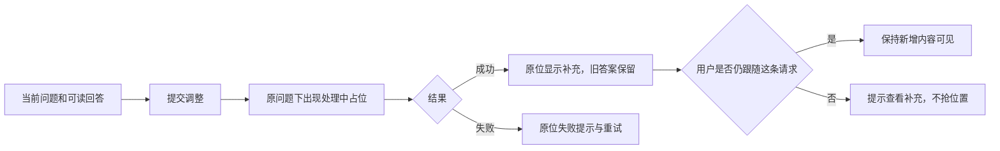

# Pi 实时教练：阅读与调整体验设计评审

日期：2026-09-30。状态：用户已选择 B，产品实现与静默验收完成。下文保留设计依据，末尾记录最终行为和验证结果。

本轮反馈是“建议内容目前可以，但右侧不好读、不好操作”。本轮处理信息布局和交互实现，不调整模型、提示词、触发频率、ASR 或后端。

## 交付物与推荐

打开 [三版可点击设计稿](../design/pi-coach-20260930/index.html)。本次预览地址为 `http://127.0.0.1:8993`，默认 B；顶部可以切换 A/B/C。所有会议文字、时间、识别状态和模型回答均为设计示例，没有录音或模型调用。

推荐 **B：专注阅读 + 同题连续补充**。当前回答占主视图，Pi 的增量内容接在同一阅读面中；上一条保留一行入口，更多历史按问题组织。采用 A 的“调整沿着当前问题继续”的行为，不把整页做成聊天气泡。

| 方案 | 结构 | 收益 | 代价 |
| --- | --- | --- | --- |
| A 连续对话 | 上一轮简述 → 当前问题 → 回答 → 补充 → 调整 | 问答关系自然，调整结果容易理解 | 历史占用首屏，长会话需要更多滚动 |
| B 专注阅读（推荐） | 紧凑上一条入口 → 当前完整回答 → 同题补充；历史临时打开 | 主要空间给当下可用内容，最符合边听边看 | 阅读保护和新内容提示必须清楚，避免自动替换打断 |
| C 问题时间线 | 过去问题以时间行常驻，当前问题展开 | 讨论脉络直观，回顾成本低 | 问题列表仍会压缩正文，更适合会后复盘 |

三版共用同一主题、颜色和回答要点，比较的是信息结构。B 省略了示例中与结论重复的一句导语，这不是建议在正式产品中用 CSS 隐藏任意模型正文。

## 现状为什么不好用

代码主要在 `code/web_mvp/frontend_v2/src/features/live-meeting/NowRail.tsx` 与 `code/web_mvp/frontend_v2/src/styles.css`。

1. 一条回答被分成问题、快答、Pi 外框、内层引语、详细依据、版本和操作，多层容器重复消耗空间。
2. 标题、运行状态、工具栏与徽标占多行，正文起点过低。全面缩小字号会进一步降低阅读体验。
3. 当前双栏样式存在右栏 `clamp(330px, 30vw, 410px)` 的定义；在常见桌面宽度下，不适合承载较长的中文分析。CSS 中另一个 `1fr / 1.25fr` 属于询问 AI 的范围选择行，不能误认为是整个会议双栏比例。
4. 反馈请求状态、原问题、补充结果的位置分散，用户提交后不知道去哪看。
5. “全部记录”混合了问题、回答与更新的认知层次；用户需要的是“刚才那个问题及其后续”。
6. “当前议题 / 未闭环问题 / 会议事实”在本轮使用场景中价值低，却让主面板越来越长。

## 推荐布局

- 桌面默认正文区左 42% / 右 58%，允许拖动分隔线；文字稿建议最小 360px，教练建议最小 440px。不把左侧缩成无法阅读的附属栏。
- 会议中可以折叠全局导航为图标栏，保留展开入口。草图用 68px 图标栏展示空间分配；正式实现必须复用现有导航组件。
- 右侧只有一层阅读面，不再卡片套卡片。左文字稿与右建议各自滚动，右侧内部不再嵌套滚动框；页面本身不叠加第三个滚动区。
- 右侧顶部一行：实时教练、简短阅读状态、历史入口。去掉独立的模型运行状态大标题和常驻置信度百分比。
- 当前问题 → 结论 → 支撑点 → 可直接说/问的内容。Pi 只补充增量，不再完整重复快答。
- 正文字号 15–16px，行高约 1.65–1.8；问题 19–20px；只有结论和要点词加粗。注释与时间 11–12px，不用于承载关键建议。
- 底部固定一个“针对这条回答补充”的输入入口。复制、查看原话为低强调操作；常用动作使用项目已有按钮规格、hover 与 focus 样式。
- 会议事实等从实时教练主阅读区移出，数据继续保留，可在会后复盘或目标页面访问。不是删除底层能力。

不承诺任意长度回答都能无滚动显示。目标是常规回答的结论、主要依据和一个可用追问尽早出现；长内容通过单一阅读区继续看，禁止靠裁剪或隐藏正文制造“完整显示”。

## 交互约定

### 1. 阅读与实时更新

首次进入展示最新完成的回答，“正在生成下一条”不能清空当前可读回答。后续新答案保存并只显示“有 N 条新建议”及问题预览，不跳滚、不替换；即使用户还没有滚动，也不推断其已经读完。

点击“查看最新”切换到最新回答。选择旧问题后，顶部明确显示“正在回看”，返回路径一直可见。

### 2. 同题 Pi 补充

自动补充绑定原问题，追加在它的正文后；已有正文不重排。补充完成时用户如果正在看别处，仅提示“这条回答有新补充”，不强制跳到末尾。

如果模型给的是修订而非新增观点，仍按时间追加，保留此前完整内容和对应的调整要求，主视图不常驻 v1/v2 按钮排。

### 3. 手动调整与滚动

1. 点击“调整回答”聚焦底部输入，明确作用于哪条问题。
2. 提交后在该问题下立即插入本次请求与“正在补充”的占位；只定位一次到这个占位。
3. 结果在原位追加。用户仍跟随该请求时可跟随内容增长；如果中途主动滚走或切到别的问题，停止自动滚动并提供“查看补充”定位入口。
4. 请求绑定原问题 ID，后续新问题到来不能把调整错误地挂到新问题上。
5. 连续调整保留各次记录，同题归档，不覆盖用户正在阅读的旧内容。

### 4. 历史与失败

- 历史的一条记录代表一个问题/讨论焦点，摘要行显示时间、问题、补充数。展开后才看调整明细，不让每次版本更新把列表刷满。
- 历史在右侧临时覆盖展示，关闭后恢复原回答与滚动位置，不改变左侧转写。
- “查看对应问题”改为语义明确的定位动作：查看问题/查看补充；“查看原话”定位左侧相关段落并短暂高亮。
- 失败文案：“这次补充未完成，原回答已保留。”旁边只有统一小尺寸次级按钮“重试”；错误详情收起。失败不能伪装成“无需介入”。
- 重试只重试失败的这次补充，不能重复创建新问题或刷新全部历史。请求中按钮禁用并提供处理中反馈。

## 草图已演示和未演示的边界

已演示：三种布局切换、固定底部输入、当前回答调整的模拟等待和原位结果、打开/关闭历史、一个历史问题样例与返回最新、定位原话。1280×720 检查无页面横向溢出，文字稿无横向滚动；B 首屏可见结论、三项依据及 Pi 追问。右侧示例内容仍有约 85px 纵向滚动，包括底部操作。

草图没有连接后端，也没有生成新的真实会议。历史数量、时间、发言人和生成等待均为示意；没有模拟完整六条历史。切换布局会重置示例状态，没有实现持久化、多请求并发、真实流式输出、完整版本管理、真实失败与重试。不能把草图点击通过当成这些产品行为已经实现。

Image 2：已按对应技能检查并尝试其启动器，但运行依赖从 GitHub 获取失败，错误为连接 github.com:443 超时。没有调用到生图 API；此交付为 HTML/CSS 交互设计稿，不是 AI 生成图片。

## B 方案实施 checklist

- [x] 复用当前项目组件和 tokens 落地 B，拆平容器，不重写业务调度。
- [x] 调整双栏与收起导航；校验 1280×720、1440×900、390×844 的真实正文，不只空状态。
- [x] 保留全部模型正文；关键内容靠结构和空间改善呈现，不靠缩字或截断。
- [x] 历史按问题归组，保留所有回答和修订，离开与返回恢复阅读位置。
- [x] 自动新答案、自动 Pi 补充、主动调整分别保护阅读；新答案显式切换，补充追加。
- [x] 调整结果原位出现，输入绑定问题；跨问题完成后有直接定位提示。
- [x] 统一复制、定位、调整、重试按钮样式；支持键盘调整列宽、Escape 退出历史。
- [x] 失败重试仍绑定原问题，原回答保留；连续点击及提交中离开/返回有回归覆盖。
- [x] 当前议题、未闭环问题、会议事实移至“会议目标”，确认/忽略/证据定位能力保留。
- [x] 浏览器检查真实长回答、历史、调整与窄屏；失败/重试/并发通过组件回归；真实 Provider 静默调用通过。

## 最终实现决策

1. **新问题不自动替换正在读的回答。** 首次进入展示最新完成答案；后续新完整回答在顶部显示数量和问题预览，点击“查看最新”切换。不用停留秒数推测用户已读完，也不增加自动跟随设置开关。流式生成下一条时，已有答案继续显示。
2. **同题补充按时间追加。** 保留快答、自动补充和每次手动调整，不再用 v1/v2 按钮切换掉正文。首屏时间行提供“Pi 补充 N”定位入口；全部分析要点直接可读，原话来源收在“查看分析依据”。
3. **调整是同题任务。** 固定底栏可写具体要求，常用调整只填入草稿，提交才调用模型。立即出现处理中占位，结果原位填入。读者向上滚动或切换问题后不自动跳滚；跨问题完成时显示“另一问题的补充已完成 · 查看”。
4. **历史临时覆盖右侧。** 关闭恢复阅读位置，选旧问题后也可直接查看最新；搜索覆盖问题、回答与 Pi 内容。复制包含当前问题全部已到达补充。
5. **左右默认 42:58。** 支持拖动分隔线、左右方向键、Home/End；双击恢复默认。会议侧栏默认折叠，会议和其他页面分别记忆展开偏好。窄屏保留文字/教练切换，修复旧移动布局把固定输入推到页面外的问题。

“全部回答一次性都显示在一个屏幕”没有被当作验收条件。真实模型输出长度不定，长内容仍需滚动；主要改善是取消多层框、保持操作入口可见、提供补充定位，并且不丢正文。

## 代码结构

| 文件（均在 frontend_v2/src） | 职责 |
| --- | --- |
| `features/live-meeting/NowRail.tsx` | 选择问答阅读器或无快答时的教练提示 |
| `features/live-meeting/AnswerCoachReader.tsx` | 当前回答、同题补充、历史、阅读位置与调整输入 |
| `features/live-meeting/useCoachRequests.ts` | 提交、轮询、失败重试、导航期间任务恢复 |
| `features/live-meeting/PiSupplement.tsx` | Pi 内容的平面排版及证据入口 |
| `features/live-meeting/CoachSignals.tsx` | 保留原有普通提示、来源与生命周期展示 |
| `features/live-meeting/MeetingFactsPanel.tsx` | 原议题、问题和事实能力，移动至会议目标页 |
| `features/live-meeting/MeetingSplitPane.tsx` | 双栏比例、拖动及键盘操作 |
| `features/live-meeting/coachReader.css` | 阅读器及会中响应式布局 |

移除了旧阅读器、Pi 套框、版本切换排和旧调整菜单对应的约 449 行失效 CSS，避免新旧样式继续叠加。

## 实际验收记录

- 前端全量回归 35 个文件、381 项通过；最后补充实时投影排序用例后，相关 3 个文件、34 项回归通过。TypeScript、ESLint 和生产构建通过。构建仍有既存的单个 JS 包大于 500kB 提示，不影响运行。
- 单元/组件回归覆盖：新答案不覆盖、历史关闭后位置恢复、输入绑定原问题、处理中占位原位替换、用户向上滚动后停止追随、请求提交期间离开/返回不重复提交、失败重试、跨问题完成定位、实时投影先于历史到达的补充排序、键盘列宽恢复。
- `tools/silent_coach_acceptance.py` 使用真实 `gpt-6-sol` 与 Pi executor。合成会议文字作为输入，两个回答成功，首字分别 **2517ms / 2200ms**。生成两次自动 Pi 深化和一次主动调整；报告在忽略目录 `artifacts/tmp/pi-focus-ui-acceptance-20260930/acceptance-report.json`。
- 随后通过正式浏览器页面再次提交真实补充，请求为“用两句话区分银行体系净新增贷款与跨行转贷”。处理中切换到另一问题，生成成功后通过跨问题提示回到原问题，显示该问题第 3 次补充。原回答与前两次补充仍在。
- 真实补充摘录：“若只是原有贷款转到另一家银行，单家银行可能增长，但体系贷款未必增加……扣除置换后，银行体系净新增是多少？”这是实际模型输出，不是草图占位。
- 1440×900 下左右约 559px / 774px；历史开关前后 `scrollTop` 均为 953。390×844 下页面无横向溢出，调整栏底边 780px、底部导航顶边 780px，未遮挡。1280×720 下双栏和固定输入均正常。浏览器检查期间无 console error/warn。
- 日常服务 `http://127.0.0.1:8991/workbench` 健康且已提供新构建；隔离验收页面运行于 8992。静态前端构建直接由现有服务读取，本轮无需重启用户会议后端。

本轮只改 Pi 工作树；没有修改 main，没有 push，没有请求麦克风或外放声音。真实 ASR 质量和业务内容效果不属于此次 UI 验收，不能用这次静默测试宣称识别率提升。
