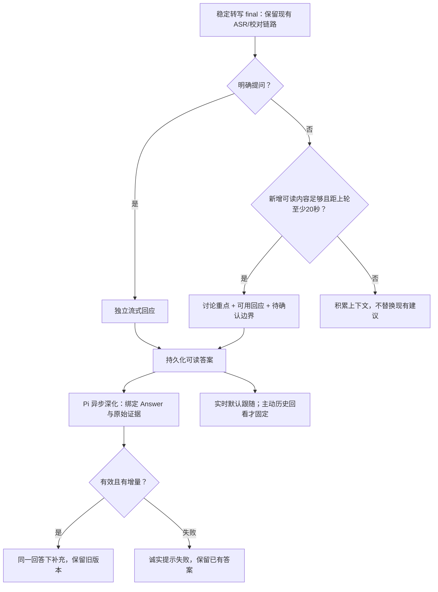

# Pi 核心产出与阅读体验整改

本轮目标：连续讨论也有实质帮助，明确提问有可口述回答，Pi 异步补充能够完成；用户直接看到新结果，主动回看时不被打断。沿用 Pi 分支，不修改 main，不 push，不外放。本文替代旧方案中“首次回答自动锁定”和“所有 Pi 补充必须八秒完成”的策略。

## 已确认的问题

- 真实会议 rec_munwf2t5_fa782b015bb6 前约一分四十秒是信息丰富的陈述，但连续四轮被问题/风险门槛拦截。
- 独立快答已生成，Pi 历史为空。一次请求仅剩约 7.24 秒，工具调用尚未完成即超时；不能把任务 bookkeeping 成功当作有效补充。
- 新语音使语义段落 revision 变化，绑定旧回答的任务被误判失效。待处理 intelligence 的合并查询还混入 answer_ready/user_request。
- 首次回答自动锁定导致后续答案不展示；操作平铺、重复复制与绿色补丁样式偏离现有蓝色体系。

## 行为与流程



连续陈述使用最近未处理的可读内容（至少100字且跨度15秒，或单段足够长），每次触发后至少20秒且有新内容才再生成。问题优先，不依赖计时轮询空跑。不推断混合麦克风中的人物身份，不编造政策、履历或数字。讨论示例：谈到财政贴息、居民购房成本与银行获益，应指出“居民实际节省与银行获益不是同一结论”，给出可以说出口的区分和需要确认的贴息范围，而不是等待问号或复述摘要。

快答优先首句给结论，后续给依据与边界；不以两句限制把有用内容全部推给 Pi。Pi 深度任务有独立30秒总预算、最多25秒 Provider 预算，界面无需等它才能使用快答。普通实时风险分析仍保留原预算。绑定回答允许后续新增语音，但原锚点内容变更必须失效；增量分析继续严格校验。深度补充与主动打断的置信度门槛分别为0.60/0.78，事实校验不放宽；未精修的转写只能支撑条件式澄清。后续若实际模型速度不稳定，应据实记录，不将预算放宽等同性能通过。

默认展示最新完成的答案；已有可读答案时新草稿不挤走它。历史入口合并，主动选择历史才固定，提供返回实时。复制保留一个入口，精修选项收进“调整建议”，证据和版本作为次级内容。错误应说明 Pi 补充失败，不伪装成模型判断无需介入。

## 验收 checklist

- [x] 持续陈述跨多个 final 能生成讨论建议；短碎片、重复内容、冷却窗口不刷屏。
- [x] 明确问题仍立即进入快答，已回归“把是否减负作为依据”等陈述不抢占问题；上下文和事实保护保持。
- [x] 新语音不能合并或取消绑定回答的 Pi 任务；原始锚点确实变动仍会拒绝。
- [x] 快答与深度补充分离预算，真实 Pi 完成终结工具调用并留下可查看记录。
- [x] 默认跟随完成结果，草稿不抢占；历史阅读固定并能返回实时。旧版自动固定的会话状态迁移为跟随实时。
- [x] 操作收敛、统一项目 tokens；失败和处理中状态可理解。证据/精修折叠，重复核心判断只展示一次。
- [x] 后端/桥接/前端回归通过；生产构建、浏览器静默检查通过。
- [x] 真实 Provider 多轮静默验证，记录实际内容、耗时与边界，区分合成输入和真实录音。

## 验证结果

2026-09-30 本轮核心整改完成。以下是实际验证，不追溯修改此前失败记录。

### 真实调用

使用已配置的 codexai.club、`gpt-6-sol`、Responses 格式、low reasoning。最终运行目录：`artifacts/tmp/pi-core-acceptance-20260930-03`；报告 `acceptance-report.json` 只在忽略目录保存，不提交凭据或会议数据库。通过实际应用启动、durable executor、流式 Provider 和 Pi sidecar，输入五段合成文字；无音频播放、无麦克风采集。输入在快答和 Pi 处理期间继续追加。

| 场景 | 结果 | 实测耗时 |
| --- | --- | --- |
| 连续陈述，无明确提问 | 生成讨论重点与回应角度并提交 | 快答首字 2230 ms |
| 明确提问，随后追加普通陈述 | 原问题保留，回答没有被后续“是否”陈述抢占 | 快答首字 2475 ms |
| 陈述对应的 Pi 自动补充 | `origin=pi`、`deep_answer`、`submit_intervention` 成功入库 | Pi 执行 9635 ms |
| 问题对应的 Pi 自动补充 | 同一 Answer 下 v1 成功入库 | Pi 执行 9923 ms |
| 手动要求更具体的追问角度 | 同一 Answer 下 v2 成功入库，v1保留 | Pi 执行 10987 ms |

实际快答摘录：“银行实际受益，前提是贴息能带来真实的新增贷款需求，而不只是把原有贷款置换过来……贷款规模增长也不等于净收益改善。”

实际 Pi v2 摘录：“先确认这里说的‘新增贷款’是银行体系的净新增，还是某些银行因跨行转贷获得了存量贷款？……如果主要是后者，单家银行放贷增加也不能说明银行体系整体受益。”

这比关键词提示/复述多出了可使用的区分和追问。第一轮验证还发现并修正了陈述里的“是否”误触发、未精修证据被当作确定事实的输出，以及深度任务遗漏一段上下文的问题。模型仍可能重复快答；该样本不足以保证所有会议内容质量。

### 回归和界面

- 后端 `test_realtime_intelligence / test_app / test_pi_coach_runtime / test_realtime_answer_copilot` 432通过；另有持久化、流水线、Answer 聚焦套件205通过，两组有重叠，不相加。最终错误状态、证据变更和读取行为的相关用例再次通过。
- Pi bridge 52通过；前端34文件373通过。后续视图状态迁移、证据折叠及重复文案精简后的相关套件再次通过。TypeScript、lint、生产构建、diff whitespace检查通过。
- 浏览器实际查看了模型结果：全部记录→讨论重点→返回实时→Pi v1/v2→展开证据均正常；390px小屏能切换教练，页面 scrollWidth=390，无横向溢出。桌面检查了首屏层级、折叠操作和蓝色主题。
- 常用8991服务已更新，继续使用原数据目录 `artifacts/tmp/web_mvp_ui_review`；实际Provider配置保持 `gpt-6-sol`。8992仅用于隔离验收结果的临时预览。

### 边界和后续

本轮修的是右侧产出和阅读链路，没有更改 ASR 算法，没有声称已提升左侧识别准确率。合成文字测试不含真实 ASR session，因此其中的 correction 任务没有音频会话可处理；不能用其“保留原文”状态评价真实麦克风校对。真实录音质量、长时间会议的主题漂移和领域内容质量仍需要独立持续评估。

触发目前仍以规则做请求节流，由大模型理解上下文；不是每个词检索网络，也没有联网事实核验。明确问题识别仍可能有边界误判。Pi补充约十秒是后台延迟，快答先可用，不能宣传为整个Agent三秒完成。生产构建仍有既存大包提示（约690KB JS）。

### 复用静默验收

在 Pi 工作树根目录运行（`--data-dir` 必须用不存在的新目录，避免覆盖用户数据）：

```bash
code/web_mvp/backend/.venv/bin/python tools/silent_coach_acceptance.py \
  --provider-config artifacts/tmp/web_mvp_ui_review/settings/provider.json \
  --data-dir artifacts/tmp/pi-core-acceptance-next
```

脚本使用真实Provider且会产生API费用，始终不播放音频；成功条件要求两条完成的回应、真实Pi补充与一次手动修订，不能用本地提示或单纯job成功冒充Pi通过。
