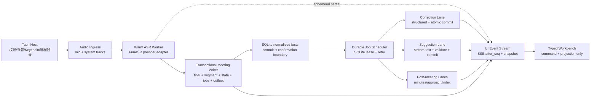

# Meeting Copilot 工程化成熟架构与执行计划

> 日期：2026-07-14
>
> 状态：实施中 / Phase 0-2 纵向主链路已通过，正式阶段出口仍有缺口
>
> 目标版本：Mac Internal Alpha -> Controlled Pilot
>
> 方法：SDD（规格驱动设计）+ TDD（测试驱动开发）+ 真实证据门禁
>
> 适用代码：`code/web_mvp`、`code/desktop_tauri`、`code/asr_runtime`

## 0. 执行摘要

### 0.1 结论

项目没有“完全没做”，但当前只能定义为：

> V2 已在未签名的本机 packaged `.app` 候选中，通过真实 browser 麦克风跑通本地中文 ASR、后台流式建议与原子校正、录音、会后复盘和历史重开；SQLite 任务、5 秒录音 journal、capture lease 与后台导出已通过真实 SIGKILL 恢复。当前已有自包含 runtime 技术候选，但尚未接入 Tauri native PCM/Keychain，也未满足 M1-M3 的统计、长会、供应链和分发出口。

当前阶段定为 `L0 功能原型`，不能再使用“全部完成”“可公开发布”等表述。下一正式目标依次是补齐 `M1 Browser Vertical Alpha` 与 `M2 Recoverable Local Runtime` 的剩余出口；之后才进入 `M3 Mac Internal Alpha` 自包含安装包。

### 0.2 重构启动时的基线问题（历史）

根因不是模型能力不足，也不只是页面样式：

1. **前端在编排业务。** 每个 final 到达后由 `workbench.js` 先请求校正，再请求建议；刷新、关闭页面或睡眠会丢失调度。
2. **LLM 完全非流式。** 后端同步等待完整 JSON，页面在请求结束前看不到任何实际内容，也无法记录真实 TTFT。
3. **模块边界失控。** `app.py` 4933 行、`workbench.js` 4571 行、`asr_stream.py` 2069 行，API、状态、调度、持久化和展示相互耦合。
4. **产品投影错误。** 页面展示大量 ASR、候选事件、门禁和 provider 状态，却没有稳定展示“当前议题、形成了什么、还缺什么、现在应该追问什么”。
5. **桌面壳不是真正产品。** 当前 Tauri 包不包含后端、ASR runtime、模型和 ffmpeg；桌面 worker 与 mic adapter 仍是 synthetic/no-op。
6. **持久化和恢复不足。** 长会不断整块重写 `record_json`；录音只在正常结束时形成最终 WAV，崩溃可能丢失整段在录内容。
7. **测试数量高估置信度。** 大量测试断言源码字符串或“不得执行”，能保护历史合同，却不能证明真实并发、崩溃恢复和安装包链路。
8. **文档失去当前真相。** 近 200 份阶段文档混合了历史 No-Go、计划、模拟证据和新结论，无法作为单一交付入口。

### 0.3 本次架构决策

- 保留 `Tauri + FastAPI/Python + SQLite + 本地 ASR sidecar`，不做语言重写。
- 采用**模块化单体 + 本地持久化任务执行器**，不引入 Kafka、Celery、Redis 或微服务。
- 浏览器/WebView 只负责命令和投影，不再负责 AI 调度。
- ASR final 到达后，`correction lane` 与 `suggestion lane` 同时派发，互不阻塞。
- 建议 lane 使用流式输出；校正 lane 原子提交，不让逐 token 修正造成文字抖动。
- LLM provider 保留 OpenAI-compatible 主协议，但增加 capability negotiation，不假设所有中转站都完整支持 streaming、usage 或 structured output。
- FunASR/Paraformer 继续作为 Mac Alpha 默认中文 ASR，不再因架构重构启动新一轮无止境 bake-off；ASR 通过 adapter 保留 sherpa-onnx 等替换入口。
- 前端创建 typed V2 工作台，旧 Workbench 只作为迁移参考和回归基线，不继续在 4571 行文件上堆功能。
- 录音、事件、任务和结构化状态改为增量表模型，禁止每个 final 整块重写整场会议。

### 0.4 2026-07-16 当前实施状态

已完成并有当前证据：

- `/workbench` V2 权威切换、typed snapshot、持续 SSE、断线 seq 去重和一个结束按钮；旧页面移动到 `/workbench-legacy`。
- final、segment、state、correction/suggestion jobs 与 outbox 同一 SQLite 事务；两个 lane 独立 lease、恢复和不可重试终态。
- OpenAI-compatible 流式 provider、`generation_id/draft_seq/checkpoint/commit barrier`；浏览器不再编排付费 AI。
- correction 新 evidence hash、CAS、保守 supersede，以及通过 meaning-preserved 校验后的显式 remap；旧 generation 不得覆盖新事实。
- v1 -> v2 备份、幂等迁移和对账；历史迁移必须 `enqueue_jobs=False`，不得创建历史付费 AI jobs。
- 5 秒录音 chunk journal、分轨 metadata、capture lease、后台 WAV export lease/heartbeat/retry、密封 journal digest、磁盘预检、日志轮转、完整文字 cursor、会后 minutes/approach/index 并行任务、历史、删除、录音播放和按文字时间定位。
- 录音 capture 在写 `.pcm` 前执行 lease fence；恢复流程会校验磁盘 journal 并补齐 fsync/SQLite crash window，补块同时对扫描时的 `capture_generation + expired lease` 做 CAS；半初始化或损坏 journal 按 recording 隔离，不能阻塞后续过期录音。`capture_generation` 区分同 epoch 多次捕获，terminal seal 严格同 journal 幂等。V2/live/generic 三类会议删除都先写 durable tombstone，再 cancel/await 活跃采集并锁定文件清理，迟到 final/chunk/seal 不得复活 legacy/V2 meeting 或 WAV。
- M1 state extractor 已实现 current topic/open question 的 evidence 合并、回答、5 分钟 carried-over、15 分钟 expired、重复问题 reopen，并保证 replay 与增量处理一致；SQLite 持久化 `version/first_seen_seq/last_updated_seq`，事实行不再因最近三项页面投影被删除。
- runtime 日志在 10 MiB x 5 轮转之前统一脱敏：structlog 与 stdlib/uvicorn 最终渲染边界都处理 meeting/session ID、路由、transcript/prompt/credential/error detail 和本地敏感路径；access query value 整段丢弃，异常只记录错误类型而不写 traceback；token 用量等非敏感运行指标保留。
- 前端 SSE/reducer 接收权威 `suggestion.superseded` 与 `suggestion.evidence.remapped`；服务端可把 committed 卡显式转为 superseded 或重映射 evidence，迟到 draft 不能回退终态。
- 真实 V2 mic 会话 `rec_mrm0iqrd_c6a2fde311e0`：首字 8065ms、首 final 13075ms、首建议 16079ms；4 个 final、1 个 revision、1 张正式建议、纪要、3 张方案卡、30.084 秒录音和历史重开通过；本地 ASR 与远程 LLM 均非 mock。
- 真实 `SIGKILL` 录音租约恢复：`RPO=4000ms <= 5000ms`、`RTO=15ms <= 30000ms`；后台自动导出崩溃前已 fsync 的 5 秒录音，两个 pending AI jobs 均恢复成功。证据：`artifacts/tmp/v2_recovery_process/2026-07-15-recording-lease/report.json`。
- 当前全量 backend `894 passed, 1 warning`；frontend `37 passed`，lint/typecheck/production build 通过；long/real-mic runner contracts `12 passed, 1 warning`；Ruff、Node syntax 与 `git diff --check` 通过。Phase 0/release/desktop 和 Rust 的历史 focused 证据继续保留，但不能替代当前未完成的发布出口。
- 历史 readiness/completion 文档已由 `docs/archive/readiness-index.md` 逻辑归档，未移动旧文件；只有 PRD、当前状态、本文、需求追踪矩阵和 decision log 是当前 authority set。
- 发布来源门禁 `tools/release_provenance_manifest.py` 已按 TDD 落地（`11 passed`），并生成 `artifacts/tmp/release_provenance/phase0-current-worktree-20260715/manifest.json`。当前开发 DMG 与其历史 evidence 的路径、run id 和 SHA-256 一致，但 evidence 明确不是公开发布包；工作树、根许可证/SBOM、模型和 FFmpeg provenance 仍使结果为 `no_go`。
- DEC-387 已补齐本机模型/FFmpeg 事实快照工具 `tools/local_supply_chain_snapshot.py` 与 TDD（`4 passed, 1 warning`），生成 `artifacts/tmp/release_provenance/local-supply-chain-snapshot-20260716.json`。快照包含四个实际模型目录的逐文件 hash 和 FFmpeg 版本/buildconf/license 输出，但不会推断不可变 revision 或再分发授权；四个模型仍为 `Revision:master`，FFmpeg 及模型 `redistribution_status` 均为 `unresolved`，所以该动作只减少事实缺口，不改变 Phase 0 No-Go。
- macOS 原生 capture spike 已完成同场至少 60 秒双轨真实采集：约 60.7 秒 microphone 与约 60.5 秒 ScreenCaptureKit system audio 均形成非空 WAV。证据：`code/desktop_tauri/spikes/macos_capture/.build/phase0-both-60s-20260716/evidence.json`。这证明当前 Mac 的 capture API/权限路径可行，不代表 native PCM 已接入产品 WebSocket。
- r7 本机可移动 runtime 已把 backend Python 3.12、FunASR Python 3.11、backend/core/frontend、worker 与 online 模型放入同一 2.107 GB 技术 bundle；移动到 `/tmp` clean env 后，三个 backend HTTP 入口均为 200，FunASR `34.752s` 真实加载模型并 ready，且没有仓库 sys.path 或外部 symlink。证据：`artifacts/tmp/macos_bundled_runtime/phase0-local-relocatable-full-20260716-r7/evidence.json`。r9 已进一步完成 Tauri resource/supervisor 与 packaged browser-mic 主链路，但仍不是 separate clean Mac 或公开发布证据。
- 2026-07-16 r9 packaged 主链路完成当前纵向业务闭环：真实 browser microphone、packaged 本地 FunASR、远程非 mock `gpt-5.5`、实时文字/建议/校正、录音、纪要、方案和历史重开均通过。首次文字 `7055ms`、首 final `14071ms`、首建议 `17078ms`、首可见校正 `30117ms`；3 段 canonical 文字全部在会后容器可视区。证据：`artifacts/tmp/packaged_mainline/packaged-r9-final-real-mic-20260716/report.json`。该结果关闭“packaged 前后端业务是否能同场运行”的问题，不关闭 native capture、延迟 SLO、中文人工价值或公开发布门禁。
- DEC-382 fresh follow-up 已修复规范化 EOS 漏判和 finalize 后浏览器断开导致的错误 `stream_interrupted`；20 秒、90 秒真实 browser microphone + 本地 FunASR + 本地 fake OpenAI-compatible gateway 均已重跑，90 秒严格 job/revision contract 为 `go`，录音 `90.488s`、会后处理 `1.522s`、RSS 增长 `7.09MB`。该证据只关闭当前 browser vertical 的结束竞态和本地协议闭环，不关闭 Phase 2 一小时、远端 provider、native capture 或发布出口。
- 一小时 follow-up 已完成一次真实 wall-clock 运行：录音/ASR/录音块/快照延迟物理门槛通过，但重复短音频触发语义质量安全门禁，minutes/approach 被抑制，完整 Phase 2 出口保持 No-Go。runner 已默认对 `MEETING_COPILOT_REQUIRE_ONE_HOUR=1` 启用完整 review gate；证据和修复后尾部验证位于 `artifacts/tmp/mainline-rerun-20260716-120637/real-mic-one-hour/phase2-gate-assessment.json`。
- DEC-383 已将 semantic-quality suppression 正确投影为会后“识别质量不足，已暂停”，不再误报 provider 生成失败；DEC-384 已增加长测输入 hash/时长/playlist/重复率资格，并压缩 correction job 累计输出和 ASR source snapshot。免费 46 秒完整 review 为 Go，82 秒远端链路已恢复 quality blocker 并生成建议、纪要和方案，但这些短证据不关闭 Phase 2。
- DEC-385 已完成 FunASR 进程级常驻 worker：模型只启动一次，会话显式 reset，单并发 fail-closed，应用退出回收。真实本地 worker 三场连续中文会话的 process cold ready 为 `3.110s`，session ready 为 `0.13/0.28/0.16ms`，首字为 `2.155/2.154/2.162s`；它解决架构性冷启动，不替代固定环境 `20 warm + 5 cold` 分布和自然多人质量验证。

仍未满足的正式出口：

- Phase 0 的干净发布 commit、根级 LICENSE/NOTICE/SBOM、四个模型与 FFmpeg provenance 实质闭环，以及 separate clean Mac 自包含 sidecar spike。ScreenCaptureKit mic/system audio 60 秒、Tauri runtime supervisor 和本机 packaged browser-mic 主链路已完成，但 native PCM 尚未接入该主链路，当前公开发布清单仍是 No-Go。
- Phase 1B 的固定环境 `20 warm + 5 cold` 延迟分布；当前只可报告单次真实链路，不能宣称 P90/P95。
- Phase 1C 的 20 个中文技术会议触发点人工价值门禁已由 DEC-381 关闭，证据位于 `artifacts/tmp/product_value_gate/phase1c-gpt55-20260716-r1/report.json`。
- DEC-390 已在 DEC-384 后版本使用语义合格、低重复中文输入完成一小时 browser vertical 主链路：物理一小时和语义 gate 均为 `go`，完整 review、录音、文字尾部、历史重开均通过。`post-run-audit.json` 保留了数据根复用、旧标签、进程树资源观测和 cost-rate 未配置等证据边界；因此 Phase 2 功能出口完成，但不升级为 clean release 或公开发布证据。
- DEC-392 已修正 release provenance 对 `.env.example/.env.sample/.env.template` 的敏感路径误报；真实 `.env`、`.env.production`、`configs/local` 和 secret-like JSON 仍 fail closed。TDD `12 passed`，复跑当前 gate 后 `tracked_sensitive_count=0`，但 dirty/untracked source、开发 evidence、模型/FFmpeg provenance 仍使 release verdict=`no_go`。
- Phase 1A 的远程 exactly-once 需要中转站兑现 idempotency key；当前 SQLite 只能保证本地任务幂等和 at-least-once provider 执行。

因此当前判断是 `M1 Browser Vertical Alpha` 与 `M2 Recoverable Local Runtime` **功能候选**；仍不是 Mac Alpha、公开安装包或 production release。

## 1. 产品北极星与边界

### 1.1 一句话产品

Meeting Copilot 是中文技术会议的实时副驾驶：持续维护当前议题、候选决策、行动项、风险和未闭环问题，并在仍来得及追问时给出一条有证据的建议；完整文字与录音用于信任、回看和会后复盘。

### 1.2 核心 JTBD

会议中，用户必须能在 3 秒内回答四个问题：

- 现在在讨论什么？
- 刚刚形成了什么候选结论？
- 还缺 owner、deadline、验证、监控、回滚中的哪一项？
- 现在最值得追问的一句话是什么？

会后，用户必须能直接得到：

- 可确认的决策、行动项、风险、未闭环问题；
- 每一项对应的文字和录音时间点；
- 可编辑、可确认、可导出的会议复盘；
- 完整连续的会议文字，而不是不断替换或重复追加的 partial 列表。

### 1.3 明确不做

- 不做微服务、云端账户系统、团队协作空间和全量知识库。
- 不做未经确认的自动建单、自动分配 owner 或技术裁决。
- 不把 speaker diarization 作为 Alpha 主链路阻塞项。
- 不接入默认收费的远程 ASR；默认本地 ASR，费用只来自用户配置的 LLM 中转站。
- 不为了“看起来实时”把未稳定 partial 直接发给远程 LLM；partial 只驱动本地 UI 和轻量状态预判。
- 不把 mock、TTS、模拟 RSS 或旧截图作为发布门禁证据。

## 2. 2026-07-14 重构启动基线（历史）

### 2.1 已经真实跑通

2026-07-14 会话 `rec_mrk6n8kk` 已证明以下受控链路：

- 浏览器真实麦克风采集；
- 本地 FunASR/Paraformer 中文实时识别；
- 10 个 partial、3 个 final；
- 录音中 1 张远程 LLM 正式建议和 1 段 AI 校正；
- 会后 3 张方案卡和 421 字纪要；
- WAV 导出与会话 SHA 一致；
- 6 次远程 LLM 调用，共 3565 tokens；
- 浏览器 console/network error 均为 0；
- 后端回归 683 passed，2 warnings。

证据：`docs/real-mic-remote-mainline-report-2026-07-14.md`。

### 2.2 不能据此声称完成

| 能力 | 当前判断 | 发布缺口 |
|---|---|---|
| 浏览器真实麦克风主链路 | 受控场景通过 | 自然多人、远场、抢话、口音尚未验收 |
| 中文实时文字 | 已有 canonical transcript | ASR 预热、final 时机和长会资源仍需工程化 |
| AI 校正 | 真实调用和原位 revision 已通过 | 与建议串行、页面驱动、不可恢复 |
| AI 建议 | 真实中转站建议已通过 | 非流式、正式卡延迟高、无反馈闭环 |
| 录音保存 | 正常结束 WAV/SHA 通过 | 无 chunk journal，崩溃恢复不达标 |
| 会后整理 | 能生成 | 当前串行、不可恢复、缺少分区进度 |
| 会话历史 | 能查询/删除 | 缺录音播放器、结构化检索和删除任务保证 |
| Mac 桌面包 | 开发壳 | 非自包含、未签名/公证、worker/采音仍为模拟 |
| Windows | 设计级兼容 | 无真机安装、采音和发布验收 |
| 系统音频 | 需求中存在 | 当前 Workbench 只有浏览器麦克风采集 |

### 2.3 发布等级

| 等级 | 定义 | 当前 |
|---|---|---|
| L0 功能原型 | 开发机可运行，受控链路有证据 | **当前** |
| L1 Mac Internal Alpha | 自包含安装；真实 mic/system audio；本地 ASR；建议；录音与崩溃恢复 | 下一目标 |
| L2 Controlled Pilot | 签名/公证；10-30 用户；4 小时 soak；故障注入和 SLO 通过 | 后续 |
| L3 Public Release | 双架构/升级回滚/许可证/支持流程/公共发布门禁 | 暂不宣称 |

## 3. 25 秒延迟的事实分解

### 3.1 实测时间线

真实录音开始：`05:00:18.596`。

| 阶段 | 观测值 | 结论 |
|---|---:|---|
| 有效声源 -> 首个 partial | 3.367s | 本地 ASR 首字仍偏慢 |
| 有效声源 -> 首个 final | 8.709s | VAD/final 是首个正式 AI 触发前置条件 |
| 录音开始 -> 首个可执行建议的 final/候选 | 约 15.1s | 当前 15 秒连续发言边界直接影响触发时机 |
| 建议 HTTP 完整响应 | 6.682s | 只能观测整次请求，无法知道 TTFT |
| 录音开始 -> 自动化首次看到卡片 | 25.136s | 其中最多约 3.3s 是 5 秒采样周期的观察误差 |

当前 `llm_service.py` 使用同步 `httpx.Client.post()`，没有 `stream=true`；因此“是否只是模型首 token 慢”目前没有指标可以回答。已知 25 秒由 ASR cold/warm 状态、稳定 final、候选调度、完整 LLM 响应和 UI 观察共同构成，不是一个模型参数问题。

### 3.2 目标延迟预算

| 指标 | Alpha 目标 | Pilot 目标 |
|---|---:|---:|
| 点击开始 -> capture ready P95 | <= 2s | <= 1.5s |
| 点击开始前 ASR 预热完成 P95 | <= 15s，且不阻塞 UI | <= 8s |
| 有效声音 -> 首个 partial P95 | <= 2.5s | <= 1.5s |
| 有效声音 -> stable final P95 | <= 5s | <= 3.5s |
| final -> AI 已开始状态 | <= 300ms | <= 200ms |
| final -> 建议草稿首 token P95 | <= 2.5s | <= 1.5s |
| final -> 正式建议 P95 | <= 8s | <= 5s |
| 有效声音 -> 首个可读 AI 草稿 P95 | <= 8s | <= 5s |
| 有效声音 -> 正式建议提交 P95 | <= 13s | <= 8.5s |

每个指标都必须在真实运行中记录 `start/end/TTFT/queue_wait/provider_duration/rendered_at`，不得再用单个“首卡 25 秒”猜测瓶颈。

### 3.3 性能证据口径

在样本量不足前不得写 P95 已达标：

- Phase 1 固定同一 Mac 型号、ASR 模型版本、公开音频、LLM 中转站和网络条件，执行至少 20 次 warm run 与 5 次 cold run；只报告 median/P90/max。
- Pilot 累计不少于 100 个真实 suggestion trigger 后，才报告 P95。
- `audio_active_at` 定义为输入 RMS 连续 300ms 超过校准阈值的第一个 frame 时间，不使用“开始播放”代替。
- `final_at` 使用包含 final 与 jobs 的 SQLite 事务 commit 时间，不使用前端收到时间。
- `first_token_at` 是解析到第一个非空 `delta.content` 的时间；role-only/空 delta 不计。
- `rendered_at` 由 UI 在对应 `generation_id/draft_seq` 实际进入 DOM 后回报诊断 trace。
- “可读 AI 草稿”必须出现完整可理解的追问片段；“正式建议”必须通过证据、版本、措辞和时效校验。
- “有用建议”不能由模型自评。Phase 1 使用人工 rubric：有具体缺口、有正确证据、会议当下仍可追问、措辞可直接说出口。

## 4. 目标运行架构



**确认边界：**内存队列和 Event Hub 都不是事实源。Partial 可以丢弃并由新 partial 重建；final 只有在同一个 SQLite 事务完成 `append final outbox event + upsert transcript segment + update minimum meeting state + enqueue correction/suggestion jobs` 后才算确认，随后才能广播给 UI。若进程在 commit 前崩溃，ASR actor 重放尚未确认的 frame/segment；若在 commit 后崩溃，durable executor 从 jobs 表接管。

### 4.1 为什么不拆微服务

这是单用户、单机、每次通常只有一场活跃会议的桌面产品。微服务会额外引入部署、认证、服务发现、跨进程追踪和升级复杂度，却不能改善首卡延迟。当前真正需要的是：

- 清晰模块边界；
- ASR 独立进程避免 CPU/模型阻塞 API；
- SQLite 单写者和 durable jobs；
- 有界队列、明确 backpressure；
- Tauri 对本地进程的生命周期监督。

因此采用一个 backend service、一个 warm ASR worker、按需 batch worker；所有业务仍在一个可版本化、可迁移的本地应用中。

### 4.2 目标进程模型

```text
Meeting Copilot.app
  Tauri host
    - single instance lock
    - macOS microphone + ScreenCaptureKit system audio adapter
    - Keychain credential access
    - child process supervisor
    - updater / app lifecycle
  backend-service sidecar
    - random loopback port + per-launch bearer token
    - REST commands + SSE event stream
    - SQLite single writer
    - durable job executor
  asr-worker sidecar
    - one warm model process
    - bounded audio queue
    - heartbeat / restart budget
  batch-worker (on demand)
    - import transcription / post-meeting rerun
    - concurrency = 1 by default
```

Mac 数据目录：

- 数据库/会议：`~/Library/Application Support/com.meetingcopilot.desktop/`
- 日志：`~/Library/Logs/Meeting Copilot/`
- 模型/cache：`~/Library/Caches/com.meetingcopilot.desktop/`

运行时禁止依赖仓库路径、`CARGO_MANIFEST_DIR`、用户 Home 下的任意 venv 或手工启动 uvicorn。

### 4.3 模块与权威边界

Backend 目标目录：

```text
meeting_copilot_web_mvp/
  api/                 # REST/SSE DTO、鉴权、错误映射
  application/         # commands、transactional handlers、job executor
  domain/              # meeting/transcript/suggestion/entity 状态与规则
  providers/           # llm/asr/audio adapter interfaces
  infrastructure/      # sqlite、filesystem、httpx、sidecar supervision
  observability/       # trace、metrics、support bundle
```

规则：

- 规范化业务表是当前事实；`meeting_events` 是与事实同事务提交的 UI/审计 outbox，不实现完整 event sourcing。
- Snapshot 从规范化表构建；不能通过重放不完整的 ephemeral partial 重建。
- Outbox event、对应事实更新和 job enqueue 必须同事务；SSE 只能读取已提交 outbox。
- API 层不能直接编辑 `record_json` 或调用 provider；provider 不能直接写数据库。
- 旧 API 通过 compatibility facade 调用 application handler，迁移期禁止两套业务实现并行演化。

## 5. 实时智能流水线

### 5.1 输入层

- native capture 产生 mic/system 两条有时间戳的 PCM stream，可选择 mic、system 或 mixed preview。
- 录音保存原始分轨；ASR 默认消费受控混音轨。
- 每 20-100ms 一个有序 audio frame，包含 `meeting_id/track/epoch/seq/captured_at/sample_rate/channels`。
- 队列满时不得静默丢帧；写入 `capture.backpressure` 并在 UI 显示。

### 5.2 ASR 与 canonical transcript

- ASR 模型在用户进入会前检查时预热，不等点击“开始会议”后才启动。
- partial 只更新一个活动尾部，不持久化为无限行，不调用远程 LLM。
- final 进入 append-only event log，并更新对应 `transcript_segments`。
- revision 以 `revision_of + version` 原子替换投影，原文永久可回看。
- 自然静音 endpoint 和最大 segment 时间同时存在；最大 segment 从固定 15 秒改为可观测、可调但有上下界的策略。
- 建议触发不要求“整段语法完美”，要求稳定 final + 最小语义证据；校正不能成为建议前置依赖。

### 5.3 三条并行 lane

收到 `transcript.segment.finalized` 后，在同一事务中写入两个幂等任务：

```text
correction:{meeting_id}:{segment_version}
suggestion:{meeting_id}:{state_version}:{gap_rule_id}
```

随后并行执行：

1. **Correction lane**
   - 输入：最近若干 final + 项目词库 + 已有 correction context；
   - 输出：严格的 segment mapping；
   - 不逐 token 改写正文；
   - 完整结果通过语义保持、长度、映射和 evidence 校验后发送 `transcript.segment.revised`；
   - 失败时保留原文，不影响 suggestion lane。

2. **Suggestion lane**
   - 输入：本地 state extractor 生成的 gap candidate、最近 evidence 和用户反馈；
   - 模型只负责生成一条可说出口的追问文本；evidence、gap rule、过期时间和目标实体由后端确定；
   - 使用 `stream=true`；首个 token 立即发送草稿 delta；
   - 完整文本经过长度、禁用措辞、证据存在、时效性和 schema 校验后才成为正式卡片；
   - 每个 job 固定保存 `input_transcript_seq/state_revision/evidence_hash/generation_id`；正式提交必须 CAS 校验输入仍是当前版本；
   - 如果 correction 在建议提交前改变证据版本，旧 generation 标记 `superseded` 并合并重排，不能提交过期卡；
   - 如果安全 correction 在建议提交后到达，revision validator 已保证 `meaning_preserved=true` 时只更新 evidence quote/version；目标 segment 被删除、合并失败或意义保持无法证明时撤回并重排。

3. **Local state lane**
   - 不等待远程 LLM；
   - M1 只承诺两个可验收实体：`current_topic` 与 `open_question`，避免一次做出五个空洞面板；
   - 输入为最近 30 个 final 或最近 5 分钟窗口；每个实体必须有 `status/evidence_segment_ids/first_seen_seq/last_updated_seq/version`；
   - 新证据相同则合并，明确回答后变为 `answered`，议题切换后旧问题变为 `carried_over/expired`；
   - 候选决策、行动项和风险沿用已有抽取但默认不作为 M1 完成声明，只有通过中文人工样本门槛后才在 1C 启用；
   - 可以立即显示“缺 owner/缺 deadline”等本地规则提醒，但必须与“AI 建议”标明来源，不能把关键词命中当作正式状态。

`evidence_hash` 定义为有序的 `segment_id + segment_version + normalized_text_sha256` 哈希。Suggestion commit 使用该哈希做严格 CAS；校正若只改变安全允许的标点、数字格式或术语拼写，由 correction validator 产生新的 evidence mapping 和 `meaning_preserved=true`，不能由 suggestion worker自行猜测语义是否相同。

### 5.4 流式输出的两阶段提交

不能把未完成 JSON 或未校验 token 当成正式产品状态。协议为：

```text
job.started
suggestion.draft.started
suggestion.draft.delta*       # 临时、可撤销
suggestion.draft.completed
suggestion.validating
suggestion.committed          # durable，正式卡片
or suggestion.rejected        # 撤回草稿并说明可理解原因
```

推荐简化 suggestion provider contract：模型只流式返回短文本，后端持有结构化字段并执行校验，避免边解析任意 JSON 边展示大括号。若 provider 只支持非流式，则 adapter 降级到 `suggestion.running -> suggestion.committed`，但必须在 capability 中公开，不能伪装流式。

断线/迟到 delta 合同：

- 每个 delta 携带 `generation_id` 与单调递增 `draft_seq`；
- `jobs.output_draft` 每 250ms 或每新增 64 字符 checkpoint 一次，二者先到者触发；
- `suggestion.committed` 携带 `generation_id/final_draft_seq/evidence_hash`，形成 commit barrier；
- UI 收到 commit/rejected/superseded 后，永久拒绝同 generation 的所有迟到 delta；
- 重连顺序固定为 `GET snapshot -> 记录 snapshot.last_seq -> SSE after_seq=last_seq`；snapshot 包含当前 generation、最后 draft_seq 和 output_draft；
- draft checkpoint 只用于恢复体验，正式卡片只来自 committed suggestion 表和 durable outbox event。

Minutes 可以流式 Markdown，但最终导出只读取 `minutes.completed` 的完整版本。Correction 只流式状态，不流式替换文字。

### 5.5 时效、去重和成本

- 每个建议带 `evidence_version` 和 `expires_at`；超过可追问窗口则进入会后待确认，不再弹到“现在”。
- 相同 `gap_rule_id + target_id + evidence_version` 唯一，重试不得生成新卡。
- 默认每场正式建议 3-8 条；本地状态更新不计远程调用。
- 对连续 final 采用 300-800ms debounce 和 state-version coalescing，不对每个 final 单独付费。
- correction 与 suggestion 分开预算；建议优先级高于实时校正，会议进行中不得因批量 correction 耗尽建议预算。
- 429/5xx/网络错误指数退避+jitter；schema/预算/内容校验错误不重试。
- Provider 默认采用静态最小能力，不在应用启动时发付费 probe。只有用户点击“测试连接”才执行最小探测并明确提示会产生一次 LLM 请求；运行中发现不兼容时缓存失败能力并走可见降级。
- Alpha 默认每场硬上限：正式 suggestion 8 次、correction batch 6 次、会后生成 2 次、总远程请求 16 次；同时设置可配置 token 上限。到达任一上限即停止新付费任务并提示用户，不用未知 usage 冒充 0。
- 每次会前显示本场预算模式；设置页允许关闭实时 correction 或会后方案分析，ASR、录音和本地状态不受影响。

## 6. 事件与 API 契约

### 6.1 统一事件 envelope

```json
{
  "schema_version": "meeting-event.v2",
  "event_id": "evt_01...",
  "meeting_id": "mtg_01...",
  "seq": 182,
  "type": "suggestion.committed",
  "occurred_at": "2026-07-14T05:00:40.390Z",
  "correlation_id": "run_01...",
  "causation_id": "evt_01...",
  "payload": {}
}
```

规则：

- `seq` 在单个 meeting 内严格递增；
- durable 事件具有唯一 `idempotency_key`；
- UI reducer 只按 `seq` 应用，重复事件无副作用；
- token delta 可为 ephemeral，不逐 token 写事件表；断线重连通过 snapshot 中的 `job.output_draft` 恢复当前草稿；
- `suggestion.committed`、revision、meeting state、录音 chunk 和 job terminal state 必须 durable。

### 6.2 V2 API

| 方法 | 路径 | 作用 |
|---|---|---|
| POST | `/v2/meetings` | 创建会议，返回 meeting 与 preflight 状态 |
| POST | `/v2/meetings/{id}/commands/start` | 幂等开始 |
| POST | `/v2/meetings/{id}/commands/pause` | 暂停采集 |
| POST | `/v2/meetings/{id}/commands/resume` | 恢复新 epoch |
| POST | `/v2/meetings/{id}/commands/finish` | 结束采集并自动创建会后任务 |
| GET | `/v2/meetings/{id}/snapshot` | 当前权威投影 |
| GET | `/v2/meetings/{id}/events?after_seq=N` | SSE 增量事件与 heartbeat |
| GET | `/v2/meetings/{id}/transcript?cursor=` | 长会分页 |
| PATCH | `/v2/meetings/{id}/suggestions/{sid}` | 保留/忽略/误报/太晚/复制记录 |
| PATCH | `/v2/meetings/{id}/entities/{eid}` | 确认或编辑决策/待办/风险/问题 |
| GET | `/v2/meetings/{id}/audio` | 录音 metadata 与可定位播放源 |
| POST | `/v2/meetings/{id}/review/regenerate` | 显式重生成会后复盘 |
| DELETE | `/v2/meetings/{id}` | 创建可追踪删除任务 |
| GET/PATCH | `/v2/settings` | 非 secret 设置 |
| GET | `/v2/runtime/capabilities` | ASR/采音/streaming/provider 能力 |

所有本地接口绑定随机 loopback 端口，并要求 Tauri 每次启动生成的 token；WebSocket/SSE 校验 Origin。远程 provider 只允许 HTTPS，localhost fake gateway 仅在显式 development mode 开放。

### 6.3 Provider adapter

```python
class LlmProvider(Protocol):
    async def capabilities(self) -> ProviderCapabilities: ...
    async def stream_suggestion(self, request) -> AsyncIterator[TextDelta]: ...
    async def correct_transcript(self, request) -> CorrectionResult: ...
    async def stream_minutes(self, request) -> AsyncIterator[TextDelta]: ...
```

`ProviderCapabilities` 至少包含：

- `chat_completions`
- `streaming`
- `stream_usage`
- `structured_output`
- `reasoning_effort`
- `max_output_tokens_parameter`

OpenAI-compatible 是线协议，不代表行为完全一致。启动 probe 只验证最小请求；每个 capability 都要单独探测并缓存，缺失时选择明确降级路径。

## 7. 数据模型与恢复

### 7.1 SQLite v2 表

| 表 | 关键字段 | 目的 |
|---|---|---|
| `schema_migrations` | version/checksum/applied_at | 可审计迁移 |
| `meetings` | id/state/title/start/end/latest_seq/revision | 小型聚合头，不存整场 blob |
| `meeting_events` | meeting_id/seq/type/payload/idempotency_key | append-only durable 事件 |
| `transcript_segments` | id/ordinal/state/raw/normalized/corrected/version/time | canonical 文字 |
| `meeting_entities` | kind/status/text/owner/due/evidence/version | topic/decision/action/risk/question |
| `suggestions` | status/draft/final/evidence/expires/provider_trace | 建议生命周期 |
| `minutes` | version/status/markdown/structured_json | 会后复盘版本 |
| `audio_chunks` | track/epoch/seq/path/sha/duration/status | 可恢复录音 |
| `jobs` | kind/status/attempt/lease/input_version/idempotency | durable executor |
| `llm_usage_ledger` | purpose/provider/model/tokens/duration/ttft/cost_estimate | 成本与性能 |
| `deletion_jobs` | state/paths/attempts/completed_at | 可追踪删除 |
| `app_settings` | key/value/version | 非 secret 设置 |

事实和 outbox 约束：

- `transcript_segments/suggestions/meeting_entities/minutes/audio_chunks` 是业务事实表；`meeting_events` 只作为已提交事实的 UI/审计 outbox。
- 每个事实更新与对应 outbox event 在同一事务；outbox 不能反向覆盖事实。
- `meeting_events UNIQUE(meeting_id, seq)`，所有任务 `UNIQUE(idempotency_key)`，suggestion `UNIQUE(meeting_id, generation_id)`。
- 子表外键指向 `meetings(id)`；用户确认删除时由 `deletion_jobs` 先冻结 meeting，再按受控顺序清理文件和行，不能依赖裸 `ON DELETE CASCADE` 提前丢失文件清单。
- Snapshot 只从规范化事实表和当前 job draft 构建；旧 `record_json` 在 shadow 阶段只用于对账，不是 V2 写入目标。

### 7.2 Durable job 状态

```text
pending -> running -> succeeded
                   -> retry_wait -> running
                   -> failed
pending/running/retry_wait -> cancelled
```

必要字段：

```text
id, meeting_id, kind, status, priority,
input_version, idempotency_key,
attempts, max_attempts,
lease_owner, lease_until,
next_attempt_at, deadline_at,
output_draft, output_json,
error_class, created_at, updated_at
```

启动时回收过期 lease。不同 worker 通过 SQLite compare-and-swap claim，不能依赖 `threading.Lock`。Alpha 保持单 backend worker；即使后续多进程，幂等也由数据库保证。

### 7.3 录音 journal

- 每 5 秒写一个 PCM/CAF chunk：`.tmp -> fsync -> rename -> audio_chunks commit`。
- 采集开始前先写 `meeting.state=recording` 与 recording lease。
- 正常结束后后台生成连续播放索引和可选 WAV/M4A 导出，不阻塞结束按钮。
- 启动时扫描过期 lease，校验最后完整帧，会议标记 `interrupted_recoverable`。
- 用户可以“继续录制新 epoch”或“结束并整理已保存内容”。
- Alpha 恢复目标：`RPO <= 5s`、`RTO <= 30s`，silent data loss 必须为 0。

### 7.4 v1 -> v2 迁移

1. 检查磁盘余量；
2. WAL checkpoint；
3. 复制数据库备份；
4. `integrity_check`；
5. 事务内建 v2 表；
6. 按 deterministic ID 拆解 `record_json`；
7. 行数、事件序号、文字哈希和音频引用对账；
8. shadow read 比较 v1/v2 snapshot；
9. 写 migration marker；
10. 保留最近一次可恢复备份。

必须覆盖 v0、v1、未来版本、损坏 DB、迁移中断、磁盘满和重复迁移。

### 7.5 保留、配额与删除

- 默认不静默自动删除录音。会议数据保留到用户删除；用户可显式选择 7/30/90 天自动清理策略。
- 开会前若按预估时长无法保留 2GB 系统余量，则阻止开始并给出清理入口；运行中空间告急时先停止新 AI/cache，再安全结束录音，绝不通过删除旧会议偷偷腾空间。
- 删除覆盖 managed data 中的 DB facts、audio chunks、自动生成导出、迁移备份引用、搜索索引和待执行 job；日志只保留不可反查内容的 meeting hash，并按轮转自然清除。
- 用户手工导出到产品目录外的文件不受应用控制，删除确认必须明确告知。
- 最近一次迁移备份在新 schema 连续成功启动两次且用户数据通过对账后才清理；删除某场会议时同步清理备份中的可定位副本，或在迁移设计中采用整库备份过期策略并明确最长残留期。
- 卸载提供“保留本地会议数据”和“完全删除数据”两个明确选项；模型 cache 与用户会议数据分开清理。

## 8. 前端产品与工程方案

### 8.1 会中信息架构

```text
┌ 会议标题 | 录音中 00:18 | 输入电平 | 暂停 | 结束并整理 ┐
├──────────────────────────────┬────────────────────┤
│ 会议文字                      │ 现在                │
│                               │ 当前议题            │
│ 完整已确认正文                │                     │
│ AI 校正原位标记               │ 建议现在追问        │
│                               │ AI 草稿 -> 正式建议 │
│ 正在识别：唯一活动尾部        │                     │
│                               │ 未闭环              │
│                               │ 决策/待办/风险/问题 │
└──────────────────────────────┴────────────────────┘
```

规则：

- 一个固定在首屏的“结束并整理”按钮，不再出现第二个结束按钮。
- 顶部只显示录音、输入和 AI 在线状态；详细 ASR/provider/门禁进入“运行状态”抽屉。
- transcript 是连续证据正文，只保留一个活动尾部；final/revision 原位更新。
- “实时提醒”和“AI 建议”合并为“现在要确认”，用来源徽标区分本地规则与 AI。
- 右栏每类最多 3 条，按时效原位更新，不随会议无限追加。
- 当前议题、决策、待办、风险、问题显示实际内容，不只显示计数。

### 8.2 会后信息架构

结束后自动进入：

```text
文字已确认 | 录音已保存 | 决策整理中 | 纪要生成中
```

完成后只保留四个 tab：

- `复盘`
- `决策与待办`
- `会议文字`
- `录音`

方案取舍、风险和未闭环问题是复盘章节，不再作为全局重复面板。导出、重新生成和删除进入顶部菜单。录音播放器支持点击证据后从对应时间播放。

### 8.3 删除/合并的概念

- “文字记录/实时文字”统一为“会议文字”。
- “整理会议/会后复盘/会议纪要”统一为“结束并整理 -> 会议复盘”。
- “AI 文字修正”不占独立大面板，只在标题显示状态，并在段落显示 `AI 已校正`。
- `mock/demo/L2/L3/provider_mode/acceptance_gate/batch_gate_closed` 不进入普通用户界面。
- 左侧历史长列从 live 工作台移除，改为独立历史入口或可收起窄栏。
- 录音中隐藏“方案分析”；只在会后复盘中展示。

### 8.4 前端技术路线

新建 V2 前端，不在旧 `workbench.js` 上继续堆叠：

```text
frontend_v2/
  src/app/
  src/api/
  src/domain/events.ts
  src/domain/reducer.ts
  src/features/live-meeting/
  src/features/review/
  src/features/history/
  src/components/
  src/test/
```

建议使用 TypeScript + Vite + React，状态以一个 typed reducer 为权威，不引入额外全局状态库。理由不是追求框架，而是当前大量手写 DOM、全局变量和字符串状态已经无法可靠维护。旧页面保留到 V2 纵向主链路通过，再移除。

组件级要求：

- 长 transcript 使用窗口化或分页，内存只保留最近 300-500 段；
- 交互控件使用 Lucide 图标和清晰 tooltip；
- 1280x720 首屏始终看到 transcript、当前议题、建议和结束按钮；
- 375、768、1024、1440 宽度无文本溢出和重叠；
- `prefers-reduced-motion`、键盘焦点、4.5:1 对比度；
- 建议卡支持保留、忽略、复制追问、误报、太晚，并持久化；
- 不采用主导紫色渐变、装饰性大卡片和嵌套卡片。

## 9. 桌面、跨平台与安全

### 9.1 一套主代码，多套平台 adapter

共享：

- React/TypeScript UI；
- FastAPI application/domain；
- SQLite schema；
- LLM/ASR provider contract；
- Tauri commands 和更新协议。

平台差异：

- macOS：AVAudioEngine/CoreAudio microphone、ScreenCaptureKit system audio、Keychain、Developer ID/notary；
- Windows：WASAPI input/loopback、Credential Manager、MSIX/NSIS signing；
- 权限、设备切换、系统休眠和安装签名必须分别真机验收，不能认为“一次构建自动完美兼容”。

### 9.2 Mac Alpha 打包

- Tauri `externalBin/resources` 包含 backend sidecar、ASR worker、模型和必要媒体工具；
- Python 依赖使用 `uv.lock` 固定，构建 backend onedir sidecar；
- Rust 使用已提交 `Cargo.lock`；
- 模型和 ffmpeg 许可证进入 NOTICE/SBOM；
- `.app` 不访问仓库、开发 venv 或用户 shell；
- Tauri 负责 TERM -> timeout -> KILL、进程组回收、heartbeat、异常退出预算和退避；
- API key 存 Keychain，不存 SQLite、`.env`、JSON、日志或截图；
- loopback API 使用随机端口、启动 token、CSP 和 Origin 校验；
- 远程 LLM 只允许 HTTPS。

### 9.3 发布前安全要求

- root LICENSE、第三方 NOTICE、SBOM、依赖漏洞扫描；
- hardened runtime、entitlements、Developer ID sign、notarize、staple；
- `codesign --verify --deep --strict` 与 `spctl --assess` 真实通过；
- clean Mac 安装、升级、回滚、卸载和数据保留语义验证；
- release evidence 绑定 source tree hash、artifact hash、app version 和真实运行 id，禁止按 mtime 复用旧证据。

## 10. 可观测性与资源治理

### 10.1 指标

必须记录：

- `capture_ready_ms`、丢帧率、队列深度、设备切换；
- `asr_ready_ms`、partial latency、final latency、RTF；
- 每个 job 的 queue wait、TTFT、provider duration、validation duration、render latency；
- 每个 provider/model/purpose 的调用次数、token 和估算费用；
- SQLite commit、WAL 大小、migration 和 recovery；
- RSS、CPU、磁盘剩余、录音增长率；
- meeting crash-free、recovered、silent data loss。

### 10.2 日志

字段：

```text
run_id, component, meeting_id_hash, job_id, event,
status, error_class, duration_ms, queue_depth,
rss_mb, disk_free_mb, app_version, model_version
```

禁止记录 transcript、原始音频、API key 和完整 session ID。日志轮转 `10MB x 5`，提供一键导出脱敏诊断包；远程遥测默认关闭。

### 10.3 长会资源边界

- 16kHz mono PCM16 约 115.2MB/小时，4 小时约 461MB/轨；双轨按约 922MB 预算。
- 开会前按预计时长预检磁盘，始终保留 2GB 系统余量。
- 产品数据软上限 10GB 且不超过可用空间 20%。
- 音频内存 ring buffer <= 30 秒；ASR 和 job queue 全部 bounded。
- 每 500 个事件写 snapshot；空闲 checkpoint WAL。
- 文件上传流式落盘，不允许一次 `await file.read()` 读取 500MB。
- 哈希分块计算，不允许结束时整文件 `read_bytes()`。

## 11. SDD 与 TDD 执行规则

### 11.1 规格层级

每个纵向切片只维护**一份 living spec**，在同一文件中包含：

1. 用户行为和失败语义；
2. API/OpenAPI 或事件 schema；
3. 数据迁移和回滚；
4. 性能预算；
5. 隐私/成本边界；
6. RED 测试列表；
7. 真实 E2E 验收脚本和 evidence manifest。

ADR 只用于不可逆或跨模块的架构决策，例如数据权威、provider contract、打包 runtime；普通实现细节更新 living spec，不再新建 readiness/preview/dry-run 文档。每个 Phase 只产生一份 evidence manifest 和一份验收报告，不要求每个开发任务分别堆截图和报告。

### 11.2 测试金字塔

| 层 | 使用范围 | 能否作为发布证据 |
|---|---|---|
| 单元测试 | reducer、规则、schema、重试、迁移函数 | 否，基础门禁 |
| 合同测试 | event/API/provider adapter | 否，接口门禁 |
| 集成测试 | 真实 SQLite、job lease、sidecar crash、HTTP/SSE | 部分 |
| 浏览器 E2E | 真实 backend + fake LLM 或公开音频 | 功能回归，不代表生产 provider |
| 真实链路 E2E | packaged app + real capture + local ASR + configured LLM | 是 |
| soak/故障注入 | wall-clock、kill -9、磁盘满、断网、睡眠、切设备 | 是 |

mock 只证明调用方逻辑。源码字符串断言和 no-op policy 测试降为辅助，不再计入“功能完成率”。

### 11.3 Definition of Done

一个任务只有同时满足以下条件才能勾选：

- spec 和 ADR 已更新；
- RED 测试先失败，GREEN 后通过；
- error/degradation/重试状态有测试；
- 指标和日志已接入；
- 刷新/重启/重复命令幂等；
- 真实 UI 截图、事件 trace 和 artifact hash 可追溯；
- 未引入 secret、未新增隐形收费、未使用 mock 冒充真实能力；
- 当前能力矩阵与发布等级同步更新。
- RED/GREEN 必须验证可观察行为；读取源码并断言字符串存在的测试不能计入 DoD 或发布完成率。

## 12. 实施路线

### 里程碑命名

- `M1 Browser Vertical Alpha`：后台可靠执行、流式建议和单屏 V2 体验完成，但仍是浏览器/开发运行时。
- `M2 Recoverable Local Runtime`：数据库、录音、任务和长会可恢复，仍不等于可安装产品。
- `M3 Mac Internal Alpha`：自包含 Mac 安装包完成。
- `M4 Controlled Pilot`：签名、公证、故障和用户试用完成。

任何阶段只能使用对应里程碑名称。M1/M2 完成后禁止写“Mac Alpha、可安装、可发布”。

### Phase 0：冻结假完成，建立基线与高风险 spike（3-5 工程日）

- [ ] 新建发布分支/干净 commit，归档当前大工作树；禁止证据跨 commit 复用。
- [x] 将历史 readiness 计划纳入 `docs/archive/readiness-index.md`，保留本文、PRD、当前状态、能力矩阵和 decision log 为主入口；旧文件原位保留以免破坏证据链接。
- [ ] backend working tree 已使用 uv 且 CI/本地命令统一，但 `uv.lock` 尚未纳入干净 release commit。
- [x] 指标加入 final、queue、TTFT、provider、render 五段时间戳。
- [x] 新增 fail-closed release provenance gate，绑定 Git commit/tree、实际 source hash、artifact path/size/hash、evidence run id/path/hash 和 app metadata；当前真实清单为 No-Go，不按 mtime 自动复用旧证据。
- [x] 建立机器可读 `configs/release-provenance.json`，显式列出实时 online、会后 offline、VAD、标点四个实际运行模型和 FFmpeg 的未解决 revision/hash/redistribution 状态；工具不会把 `null/unresolved` 视为完成。
- [ ] 补齐 root LICENSE、NOTICE、有效 SBOM、依赖许可证清单，以及模型/FFmpeg 的不可变 revision、完整制品哈希和可再分发证据；完成前安装包始终 No-Go。
- [x] Time-box 1A：独立 Swift 原生 mic 产生至少 60 秒非空 WAV；当前 evidence 为 63.8 秒、SHA-256 `8fa6a8954d161500c6ca65fe6c6ef6d865d10808edfd64d807e35ca5034eab82`。
- [x] Time-box 1B：ScreenCaptureKit system audio 在授权宿主中产生至少 60 秒非空 WAV；同次证据包含约 60.7 秒 microphone 与约 60.5 秒 system audio 双轨时间戳。正式产品 capture adapter 接入仍在 Phase 3。
- [x] Time-box 2A：backend + FunASR sidecar + online 模型组成可移动本机技术 bundle，在仓库外 clean env 启动 HTTP 与 model-ready；不依赖开发仓库路径或用户模型 cache。
- [ ] Time-box 2B：runtime 已接入 Tauri resource/supervisor，并在当前 Mac 通过启动、动态端口、HTTP、TERM 后 parent-watchdog 回收和 packaged browser-mic -> ASR -> LLM 同场主链路；仍缺 separate clean Mac 与 packaged native capture -> ASR -> LLM，因此本项保持未完成。详见 DEC-378/379。
- [x] 建立最小 `frontend_v2` TypeScript/Vite 壳和 typed event schema，只做到能显示 compatibility snapshot，不开始重写全部页面。

**出口：** clean checkout 可重复安装测试依赖；当前 L0 真实基线可重跑；native capture 与 bundled sidecar 的最高风险已被 60 秒 spike 证实或明确 No-Go；文档不再互相宣称不同完成状态。

### Phase 1A：后台可靠执行（3-4 工程日）

- [x] 以 additive migration 新增最小 `meeting_events/jobs/transcript_segments/suggestions` 表并 shadow-write；旧 `record_json` 暂时作为兼容读模型。
- [x] 建立 transactional meeting writer 与 durable executor；final 确认、segment、最小 state、jobs 和 outbox 同事务。
- [x] final 事务内同时 enqueue correction/suggestion。
- [x] correction/suggestion 两个 lane 使用数据库 lease/CAS，先沿用非流式 provider；现有页面通过 compatibility bridge 读取结果。
- [x] backend 启动后自动接管 pending/retry/expired lease；页面关闭不影响执行。
- [x] 覆盖重复 final、backend restart/expired lease、429/5xx、单 lane 失败与幂等远程调用；durable job key 以 SHA-256 摘要写入 `Idempotency-Key`，stream fallback 和同步 retry 复用同一值。中转站服务端是否兑现 exactly-once 仍是外部合同，不由客户端伪造保证。

**出口：** 用同一真实/受控会话完成 `audio -> final commit -> durable job -> AI -> compatibility UI`；刷新/关闭页面不丢任务；两条 lane 互不阻塞；新旧投影一致；远程调用幂等次数为 1。此时只称 `M1A`，不称 V2 UI 完成。

### Phase 1B：流式建议与持续事件（3-4 工程日）

- [x] 实现进程级 `httpx.AsyncClient`、连接复用、stream parser、timeout/retry 和运行时 capability fallback。
- [x] suggestion 实现 `generation_id/draft_seq/checkpoint/commit barrier` 两阶段协议。
- [x] correction 保持原子 revision；实现 evidence hash CAS、superseded 和安全 evidence remap。
- [x] 建立 `/v2/meetings/{id}/snapshot` 与真正持续的 `/events?after_seq=N` SSE，包含 heartbeat、断线续传和 seq 去重。
- [x] compatibility UI 先显示流式草稿，验证旧 delta 不能覆盖 committed/rejected 状态。
- [x] FunASR 改为进程级常驻 worker，显式 session reset、单并发 fail-closed、崩溃重建和 app shutdown reap；保留 raw PCM 兼容模式。真实 worker proof 已记录于 `artifacts/tmp/funasr-resident-warm-proof-20260716/report.json`。

**出口：** 同一真实/受控会话完成 `final -> streamed draft -> validated commit -> refresh/reconnect recovery`；常驻 worker 架构项已完成，但 Phase 1 固定环境 20 warm/5 cold 运行报告 median/P90/max 仍未完成，不提前宣称 P95。

### Phase 1C：单屏 V2 产品体验（4-5 工程日）

- [x] V2 live 页面只显示完整 transcript、当前议题、现在要确认、录音/输入/AI 状态和一个结束按钮。
- [x] M1 state extractor 完成 `current_topic/open_question` 的 evidence、合并、回答和过期状态。
- [x] 建议支持保留、忽略、复制追问、误报、太晚，并在刷新后保持。
- [x] evidence clickback 和 AI 校正原位标记可用；内部 gate/provider/mock 名词只在诊断抽屉。
- [x] 20 个中文技术会议触发点人工验收：真实 `gpt-5.5` 结果为正确 evidence `20/20`、可直接追问且调用耗时 <=20s `20/20`、重复正式卡 `0/20`、无证据正式卡 `0`、虚构事实 `0`。证据：`artifacts/tmp/product_value_gate/phase1c-gpt55-20260716-r1/report.json`；逐条结果和人工语义标注同目录保存。
- [x] 候选决策、行动项和风险只有达到同一 evidence/可用性门槛才启用，否则不在 M1 页面放空面板或虚假计数。

**出口：** 同一会话完成 `audio/final/job/AI/V2 UI/feedback`；1280x720 首屏通过；正式卡同时通过延迟预算和人工价值门槛。至此里程碑为 `M1 Browser Vertical Alpha`。

### Phase 2：长会数据、录音和恢复（5-7 工程日）

- [x] 扩展完整 SQLite v2 表，执行 v1 shadow migration 和对账；通过后再切换权威读模型。
- [x] 录音改为 chunk journal、分轨 metadata 和后台导出。
- [x] 过期 recording/job lease 自动恢复。
- [x] chunk 写盘前 lease fence、fsync journal -> SQLite 对账、capture generation 与 terminal seal 幂等。
- [x] durable deletion tombstone、活跃采集取消和删除后 late-write/WAV resurrection fence。
- [x] transcript 分页/窗口化；增量 state extractor 不重算整场。
- [x] 流式上传、分块哈希、磁盘配额和日志轮转。
- [x] 会后 minutes/approach/index 并行 jobs，分区显示进度。
- [x] 活动会议 WebSocket 的服务退出有界化：Uvicorn graceful shutdown 上限 `8s`，启动器 stop 等待 `12s`；真实活动连接退出后已验证录音块保留、会议标记 `interrupted`、FunASR worker 回收。详见 `docs/decision-log.md` 的 DEC-386。

DEC-382 已完成 90 秒真实 browser microphone 稳定性 smoke，并证明录音时长、会后处理、严格 correction/suggestion/review job 和 revision projection 同时通过；它是启动一小时门禁的前置证据。DEC-384 已增加输入语义资格、修复主要累计持久化，并以 46/82 秒多样中文输入验证短链路。DEC-390 随后在语义合格、低重复中文输入上完成一小时运行，物理和语义门禁、完整 review、录音导出、文字尾部和历史重开均通过，Phase 2 功能出口不再保持 No-Go；发布仍受 Phase 0/3/4 出口约束。

**出口：** kill -9 后 RPO <= 5s、RTO <= 30s；1 小时真实会议无 O(n²) 明显退化；刷新/重启后任务继续；录音可按证据时间播放。里程碑为 `M2 Recoverable Local Runtime`。

### Phase 3：自包含 Mac Internal Alpha（8-12 工程日）

- [ ] 实现 native mic + ScreenCaptureKit system audio 双轨 adapter。
- [ ] Tauri supervisor 启动 backend 与 warm ASR sidecar。
- [ ] backend/ASR/model/ffmpeg 进入 app bundle，不依赖仓库/venv。
- [ ] Keychain、随机端口 token、CSP、Origin 和 HTTPS-only。
- [ ] App Support/Logs/Caches 路径与删除语义。
- [ ] arm64 clean Mac 安装、启动、会议、退出、重启、卸载 E2E。
- [ ] 本阶段固定当前 FunASR runtime，不同时切换 sherpa-onnx；只有 Phase 0/3 证明 FunASR 在包体、启动或资源上硬性 No-Go，才另开 Runtime Optimization ADR。

**出口：** 单个安装包可在干净 Mac 独立完成 mic/system audio -> ASR -> 建议 -> 录音 -> 复盘；允许内部未公证，但明确标记 `M3 Mac Internal Alpha`。

### Phase 4：Controlled Pilot（7-10 工程日）

- [ ] 真实 1 小时与 4 小时 wall-clock soak。
- [ ] 断网、429/5xx、kill -9、磁盘满、睡眠唤醒、设备切换、权限拒绝、重复启动。
- [ ] Developer ID、hardened runtime、notary、staple、Gatekeeper。
- [ ] SBOM、NOTICE、隐私、诊断包、升级/回滚。
- [ ] 10-30 名用户试用与建议误报/太晚/打扰反馈。
- [ ] 累计至少 50 场、100 meeting-hours；逐场记录 crash/recovery/audio loss，不用小样本宣称 99.5% 已统计成立。
- [ ] 至少 30 个真实删除任务全部完成受控文件/数据库清理；silent data loss 保持硬门禁 0。

**出口：** 确定性 Pilot 门禁全部通过，才允许受控对外分发；`crash-free >=99.5%` 作为持续运营目标跟踪，不作为 50 场小样本的伪精确二元开关。Windows 真机是独立后续里程碑。

### 12.1 总体预估

单一资深工程主线、不计算自然多人试用等待时间，约 `33-47 工程日` 到 Controlled Pilot。其中 `M1 Browser Vertical Alpha` 约 13-18 工程日，`M3 Mac Internal Alpha` 约 26-37 工程日。AI 可以缩短实现和测试编写时间，但不能替代签名、公证、真机、长会和用户试用的 wall-clock 证据。

## 13. 硬性发布门禁

### 13.1 Alpha 必须全部通过

- [ ] 安装包内链路不依赖手工 uvicorn、仓库路径或用户 venv。
- [ ] 真实 mic 和 system audio 均有非空帧、可听录音和明确设备状态。
- [ ] local ASR `provider_mode=real`、`is_mock=false`。
- [ ] 完整 transcript 只存在一个 active tail，无重复 final/revision。
- [ ] 实时建议草稿和正式卡达到延迟 SLO，且带 evidence。
- [ ] 建议/校正任一 provider 失败不影响录音和文字。
- [ ] 结束后自动复盘；录音、文字、状态和 usage 可恢复。
- [ ] kill -9 恢复达到 RPO/RTO。
- [ ] API key 只在 Keychain；本地 API 有 token/Origin/CSP。

### 13.2 Pilot 额外要求

- [ ] 4 小时 RSS 增长 < 256MB，音频丢帧 < 0.1%。
- [ ] 至少 50 场、100 meeting-hours 有完整 run manifest；验收期间未恢复录音丢失 = 0，silent data loss = 0。
- [ ] 至少 30 个真实删除任务全部完成；每个任务在 60 秒内完成或给出可重试的明确失败，不允许静默残留 managed data。
- [ ] `crash-free meeting >= 99.5%` 进入持续运营 SLI；Pilot 小样本只报告场次、小时、崩溃和恢复原始计数，不伪装统计显著性。
- [ ] 签名、公证、staple、Gatekeeper 真实通过。
- [ ] evidence 与 commit、source hash、artifact hash 一致。
- [ ] 许可证、SBOM、隐私、升级和回滚齐全。

### 13.3 自动 No-Go

以下任一情况禁止宣称完成或发布：

- 用 mock/synthetic/no-op 代替安装包真实采音、ASR 或远程 provider；
- 页面仍负责触发后台 AI 主流程；
- 任务刷新/重启后丢失；
- 录音崩溃后无法恢复且未明确告知；
- SLO 来自注入假指标；
- `.app` 缺 backend/ASR/model 仍依赖外置服务；
- Gatekeeper 拒绝；
- 历史 evidence 与当前 commit/hash 不一致；
- 页面隐藏错误、把降级写成成功或把候选内容写成正式结论。

## 14. 停止事项

从本决策生效起，停止：

- 为每个小边界继续创建单独 readiness 文档；
- 在旧 4571 行 Workbench 上增加更多状态栏和同义按钮；
- 以测试数量、截图数量或 fake soak 代表产品完成度；
- 在主链路未迁移前继续扩展 Windows、移动端或新 ASR provider；
- 重复下载音频或重复 bake-off，而没有明确决策门槛；
- 把 correction、suggestion、approach、minutes 串成一个长同步请求链；
- 让前端 setTimeout、内存 flag 或页面生命周期承担后台可靠性。

允许继续的评测只有两类：

1. 为当前 SLO 定位瓶颈的真实 trace；
2. 为 Alpha/Pilot 发布门禁服务的真实链路、恢复和长会测试。

## 15. 开源复用决策

### 15.1 外部项目对比

Stars 使用 GitHub REST API 于 2026-07-14 查询；数值会持续变化。模型权重许可证与代码许可证必须分别审查。

| 项目 | Stars | 代码许可证 | 中文实时/平台 | 可复用范围 | 决策 |
|---|---:|---|---|---|---|
| [FunASR](https://github.com/modelscope/FunASR) | 19,220 | MIT | Paraformer 原生流式；中英；Python/ONNX/C++/WS | Paraformer、FSMN-VAD、标点、热词 | **当前中文默认**；P0 不更换 |
| [sherpa-onnx](https://github.com/k2-fsa/sherpa-onnx) | 13,552 | Apache-2.0 | Online Paraformer/Zipformer；Mac/Windows/iOS/Android；C++/Rust/Swift | 轻量无 Python runtime、跨平台打包、endpoint/hotword | **Post-Alpha runtime 候选**；不与 Mac 打包同时切换 |
| [whisper.cpp](https://github.com/ggml-org/whisper.cpp) | 51,779 | MIT | 多语言含中文；Mac/Windows；Metal/Core ML/CUDA/Vulkan | 低依赖离线文件和多语言 fallback | **只作 fallback**；naive sliding-window stream 不作中文默认 |
| [WhisperLiveKit](https://github.com/QuentinFuxa/WhisperLiveKit) | 10,533 | Apache-2.0 | Whisper streaming；WS、LocalAgreement、VAD；Mac/Windows | stable-prefix、LocalAgreement、diff/backpressure 协议 | **借鉴算法/协议**，不整体引入重型 Python/Torch 栈 |
| [Meetily](https://github.com/Zackriya-Solutions/meetily) | 24,355 | MIT | 本地实时转写；Mac Apple Silicon、Windows x64；Tauri/Rust | CoreAudio、混音、FFmpeg sidecar、checkpoint、崩溃恢复、SQLite migration、模型/更新器 | **最重要桌面工程参考**，逐模块审查后选择性移植 |
| [screenpipe](https://github.com/screenpipe/screenpipe) | 19,825 | GitHub API 未声明 SPDX；仓库为商业许可证 | Mac/Windows；mic+system audio；本地 Whisper | chunk、设备恢复、FTS、长时资源和真实音频测试思想 | **当前代码禁止直接集成**；商业/竞争性使用需授权 |

### 15.2 Build vs Adopt 结论

不存在适合整体替换 Meeting Copilot 的完整开源基座。最接近桌面产品基座的是 Meetily，但核心仍是“录音 + 转写 + 会后摘要”，没有本产品的实时会议状态、工程缺口、时效性建议、证据闭环和中转站兼容层。

因此选择：

1. 保留 Meeting Copilot 的产品/domain 层，不把现有代码扔掉重做通用转写工具。
2. P0 保留已跑通的 FunASR，先解决事件编排、流式 LLM、持久化任务和 UI；不把 ASR 替换混入同一次重构。
3. Mac Internal Alpha 固定 FunASR。Alpha 后才允许单独新增 sherpa-onnx adapter；只有 FunASR 在包体、启动或资源上形成书面 No-Go，且 sherpa 在同一中文技术会议集的 CER/术语召回、final 延迟、4 小时稳定性和安装包体积同时达标，才替代默认 runtime。
4. Meetily 只作为 MIT 工程参考/代码捐赠源；每个拟移植模块必须记录 commit、原始文件、许可证和改造边界。
5. WhisperLiveKit 只借鉴 stable-prefix 和 diff 协议；其 full-state snapshot 不能直接 append 到 transcript，否则会复现页面重复。
6. whisper.cpp 用于多语言、离线导入或默认 ASR 不可用时的 fallback。
7. screenpipe 只研究架构思想，当前许可证下不复制或链接代码。

### 15.3 OpenAI-compatible streaming 约束

当前环境无法使用 OpenAI Developer Docs MCP，官方文档页面访问也未稳定返回；本节交叉核对 OpenAI 官方 Python SDK 的[请求参数类型](https://github.com/openai/openai-python/blob/main/src/openai/types/chat/completion_create_params.py)、[stream options](https://github.com/openai/openai-python/blob/main/src/openai/types/chat/chat_completion_stream_options_param.py)、[chunk 类型](https://github.com/openai/openai-python/blob/main/src/openai/types/chat/chat_completion_chunk.py)和[streaming 示例](https://github.com/openai/openai-python#streaming-responses)。实现时仍应把中转站实测 capability 作为最终依据。

最小兼容规则：

- `POST /v1/chat/completions` 设置 `stream: true`，响应为 SSE；
- 数据通常位于 `data: {JSON}\n\n`，以 `data: [DONE]` 结束；
- 流式文字在 `choices[i].delta.content`，不是 `message.content`；
- 首 chunk 可能只有 role，空 content 不是错误；
- `finish_reason` 通常只在末尾出现；
- `stream_options.include_usage=true` 可能增加 `choices=[]` 的 usage chunk，但中断时可能没有总 usage；
- `tool_calls.function.arguments` 和 structured JSON 都是分片文本，未拼接、parse、schema validate 前不得执行或提交；
- 国内模型和中转站通常只兼容核心 Chat Completions，不应默认支持 `include_usage/json_schema/tools/reasoning_effort`。

实时热路径不强依赖 `response_format=json_schema`。Suggestion lane 推荐让模型只流式输出短建议文本，结构、证据和状态由后端管理；会后 minutes/approach 可以在 capability 支持时使用严格 schema。

## 16. 本轮实施顺序锁定

下一轮代码实施只做 Phase 0，然后按 1A -> 1B -> 1C 顺序推进，不再同时展开包装、Windows、移动端和更多测评：

1. Phase 0 先完成 clean baseline、真实延迟 trace、许可证 manifest、native capture 和 bundled sidecar 两个 time-boxed spike；
2. Phase 1A 只把后台调度从页面迁到 durable pipeline，继续用兼容页面完成一次真实纵向验收；
3. Phase 1B 只增加 streaming、commit barrier、snapshot/SSE 和断线恢复，再完成一次真实纵向验收；
4. Phase 1C 才切 V2 单屏 UI、两个最小 state 实体和建议反馈，并做 20 个中文触发点人工价值验收；
5. M1 通过后才进入录音恢复，M2 通过后才进入正式 Mac 打包。

这条顺序保证每一周都形成一条可见、可运行、可验收的纵向产品能力，而不是继续横向铺大量 policy、preview、dry-run 和边界清单。

## 17. 2026-07-16 热路径实施状态

Phase 2 浏览器纵向主流程已经有一小时 `go` 证据；本轮针对 DEC-393 的第一项生产化 backlog 完成了最小工程化实现：实时 WebSocket 每个 meeting 使用一个 session-scoped、`max_workers=1` 的 executor，按序执行音频 chunk 写入、ASR、live projection persistence、final commit 和录音 seal。事件循环保留网络收发和 UI 事件发送，因此不会为了降低阻塞而牺牲 final 事务确认边界。

同时修复了 recording export 从 session worker 线程唤醒 asyncio worker 的线程安全问题，并在 legacy session events 接口读取 V2 已完成导出元数据，消除历史页的短暂“录音未组装”投影滞后。

验证结果：`57 passed` focused backend integration tests，包含 slow ASR/slow final callback 的 event-loop heartbeat 回归。该改动仍不等于完整生产发布：session executor 的底层同步任务取消、live projection 增量化、SSE pagination、checkpoint-aware retry、native capture/Keychain、clean Mac release 和 Phase 0 provenance 仍按 backlog 执行。

修复后 60 秒浏览器中文主链路使用本地 FunASR 与本地 fake OpenAI-compatible gateway 得到 `go`：首文字 `5.004s`、首 final/建议 `20.005s`，4 段文字、1 条正式建议、录音、三类会后任务和历史重开全部完成，RSS 增长约 `2.67MB`，浏览器/网络/5xx 为 0。该证据只关闭本次热路径变更的功能回归风险；无 visible correction 的干净输入、local gateway 和 60 秒时长都不能替代独立 correction、远端 relay 或一小时发布门禁。

该阶段当时的代码验证为 backend `895 passed, 2 warnings`；后续 bounded-state 收口后的最新结果与 Phase 0 manifest 见下方 17.1。

### 17.1 DEC-393 bounded-state backlog 收口

本轮继续只处理主链路工程化，不增加 provider 横评。V2 outbox 查询已改为默认 200、最大 1000 的 cursor pagination，HTTP page 返回 `has_more/next_after_seq`，SSE 与前端 polling 都按页推进，不再一次 materialize 全场事件。legacy live projection 固定 recent window：512 finals、32 partials、128 external revisions；完整文字、修订和历史仍由 V2 normalized tables 提供，并在 legacy record 中显式写入 policy 与 dropped count。

Streaming suggestion 增加 durable lease fencing：草稿 checkpoint 和最终 commit 在 SQLite transaction 内验证 running job、lease owner 和 expiry；lease 丢失后不允许继续产生副作用。provider retry 从同 suggestion 的持久化 `draft_seq` 继续，不会从 1 重放或提交旧草稿。

验证更新为 backend `901 passed, 2 warnings`，frontend `40 passed`，typecheck/lint/build、compile、Node syntax 和 `git diff --check` 通过。修正后的 25 秒 browser mic 短链路为 `go`，首文字约 `5.0s`、首 final/建议约 `20.0s`，录音、文字、建议、minutes/approach/index 和历史重开闭环；本地 fake gateway 不计真实 relay 证据，干净输入无 visible correction 也不冒充修正通过。

长会 runner 同时改为 fail-closed 检查 network failure：只允许明确的 SSE/媒体卸载取消，其余网络错误进入 blocker。Phase 0 最新 `phase0-current-worktree-20260716-r4/manifest.json` 仍为 `no_go`，原因保持为 dirty/untracked source、非 release evidence、模型与 FFmpeg provenance/再分发未解决。下一主线不再重复 Browser Vertical 功能评测，转入 Phase 0 clean baseline 与 Phase 3 native desktop/Keychain/clean Mac 出口。
