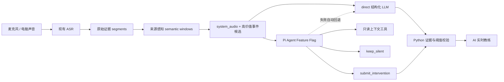

# Talktrace 实时私人教练：Pi SDK Spike 实施与决策报告

> 日期：2026-08-16
> 代码基线：`3bf287a` 及后续评测提交
> 结论状态：工程 Go，产品效果待 A/B；生产打包 No-Go

## 1. 本轮目标与结论

本轮目标不是改造收音，也不是增加会后总结，而是让 Talktrace 在持续监听麦克风和电脑声音时，为软件使用者提供少量、及时、可说出口的私人建议。

已经完成两层改造：

1. 先修复现有 LLM 输入：保留 `source_track`、粗粒度角色、speaker confidence、原始证据 ID，并把已有 semantic paragraphs 投影为语义窗口。
2. 再把 Pi 作为可选 Agent runtime 接到独立教练 lane，默认仍走 direct，使用环境变量切换，Pi 失败自动回退 direct。

当前可以确认：

- Pi SDK 的真实 `Agent`、tool loop、会话状态和终止动作已经跑通，不是模拟出的自研 Agent。
- 腾讯会议等应用的远端声音只要进入 Windows 播放设备，就能沿现有 `system_audio` 链路触发教练；本轮 AI 测试不需要扬声器外放。
- Pi 不会自动提高 ASR、分段或模型智力。没有真实标注数据和 Provider 配置前，不能声称 Pi 已经提升命中率。
- 现在适合保留 Feature Flag 做真实 A/B，不适合立刻把 Node runtime 打入正式安装包。

## 2. 原有卡片效果差的主要原因

静态检查和输入投影测试发现，原链路把几个不同层次混在了一起：

| 问题 | 对主题/待办/教练的影响 | 本轮处理 |
| --- | --- | --- |
| ASR final 是声学停顿，不是完整语义 | 承诺、条件、owner 被切散 | 向模型增加 semantic windows |
| `system_audio` / `microphone` 在 LLM 输入中丢失 | 无法粗略区分对方与本机环境 | 加入 source track 和 role hint |
| 原始 8+3 segment 同时承担理解和证据 | 上下文不完整，扩大窗口又容易破坏引用 | 理解用语义窗口，取证仍用原 segment ID |
| 一个 Prompt 同时做多种抽取 | 单字段错误触发整包失败 | 教练拆成独立 lane，失败不拖垮事实抽取 |
| 所有提示都像“建议追问” | 用户不知道为何现在需要介入 | 增加问题、承诺、目标、矛盾四类实时事件 |
| 缺少强静默门槛 | 模型为了显得有用而制造卡片 | 置信度低于 0.78 自动静默 |

所以正确顺序是先修输入，再比较 Agent。把旧分片原样放进 Pi，不会变好。

## 3. Pi 相比直接 LLM 到底多了什么

### 3.1 direct 已经足够的能力

单次结构化 LLM 已经适合：

- 总结一段转写；
- 抽取明确待办、决定和主题；
- 回答用户主动提出的问题；
- 根据完整上下文生成一条固定类型建议。

这些能力不因为套一层 Pi 就变得更强。

### 3.2 Pi 的实际增量

本次实现只把 Pi 用在 direct 需要自建控制循环的部分：

- **跨事件短期状态**：同一会话最多保留最近 4 个教练回合，可在后续发言中修正之前判断。
- **按需取证**：模型先看新事件，只在必要时读取语义窗口、rolling state 或用户目标，不必每轮塞入所有上下文。
- **显式工具循环**：一次判断最多 4 个 Agent turn、8 次工具调用，能够先查目标再决定是否介入。
- **沉默也是正式动作**：模型必须调用 `submit_intervention` 或 `keep_silent`，普通文本不能进入产品。
- **运行时生命周期**：Pi 负责消息、tool result、下一轮推理和 session 复用，Talktrace 不再手写通用 tool-calling loop。
- **后续可用 steer/followUp**：高优先级新语音到来时可修正正在进行的判断，但本次尚未启用。

真正新增的产品能力不是“又生成一张卡”，而是连续守住用户目标、在必要时动态找前文、知道何时不打扰，并能随新发言修正。

## 4. 已实现的实时业务能力

首版只允许四类高价值介入：

| 能力 | 触发时刻 | 示例价值 | direct / Pi 差异 |
| --- | --- | --- | --- |
| Question Radar | 对方直接提问，用户尚未完整回答 | 给出一句限定条件后的答法 | direct 可处理当前问题；Pi 可按需查旧立场和目标 |
| Commitment Firewall | 正在形成时间、范围或结果承诺 | 在承诺落地前补前提、验收或退出条件 | Pi 可跨多轮维护承诺状态 |
| Goal Guardian | 议题即将离开但关键目标未覆盖 | 在仍来得及追问时提醒 | Pi 可持续追踪目标是否已回答 |
| Contradiction Radar | 新说法与前文关键事实冲突 | 防止测试目标被说成已验证能力 | Pi 可搜索和修正较早证据 |

UI 一次仍只展示一张卡。首版只由新 `system_audio` 片段触发，因为它最保守地代表电脑中的对方声音；麦克风可能同时包含用户和现场其他人，不能轻率做个人归因。

## 5. 运行架构



边界设计：

- Pi 没有 Bash、文件、动态插件或任意网络工具。
- Provider 网络只能由 Pi SDK 的配置模型调用。
- API Key 通过本地 stdio 请求驻留内存，不写入 Agent message、结果、日志或 ID。
- Pi 的介入还要经过 Python 已有的 schema、逐字证据和 0.78 阈值校验。
- 单进程最多保存 8 个会话，每会话最多 4 个用户回合；失败会话立即丢弃。

## 6. Pi 与 DeepSeek Harness 比较

| 维度 | Pi `pi-agent-core 0.84.2` | `deepseek-harness-sdk 0.1.0rc6` | Talktrace 选择 |
| --- | --- | --- | --- |
| 可嵌入 API | 明确的 TypeScript `Agent` API | Python SDK 实际启动打包 runtime，通过 stdio JSON-RPC | Pi 更直接 |
| 成熟度 | 已发布 npm 正式版本，仍需锁版本 | Developer Preview、pre-release，兼容性可能破坏 | Pi 风险较低 |
| 默认定位 | 通用 Agent loop | Coding / harness 组合与插件运行 | Pi 更贴合小型只读教练 |
| 工具最小化 | 可只传显式工具表 | 默认 composition 含 session、adapter、local bash 等能力 | Pi 更容易做最小权限 |
| Python 项目接入 | 需要 Node sidecar | 名义 Python SDK，但仍带独立 runtime | 两者都不是纯 Python |
| 多轮状态/工具 | Agent state、events、transformContext、steer/followUp | harness session、composition、插件生态更强 | 当前只需要 Pi 的小核心 |
| 部署风险 | Node >= 22.19 + npm 依赖 | 预览 runtime + SDK + composition | 当前 Pi 更可控 |

DeepSeek Harness 不是能力不足，而是现阶段的默认运行面和版本风险都明显大于 Talktrace 的只读实时教练需求。它更适合未来需要可插拔业务 Agent、复杂 composition 或统一 harness 治理时重新评估。

## 7. Feature Flag 与运行方式

默认：

```text
MEETING_COPILOT_REALTIME_COACH_ENABLED=1
MEETING_COPILOT_REALTIME_COACH_RUNTIME=direct
```

开发态启用 Pi：

```powershell
cd code/agent_runtime/pi_coach_bridge
npm ci --ignore-scripts --no-audit --no-fund
$env:MEETING_COPILOT_REALTIME_COACH_RUNTIME = "pi"
```

如 Node、依赖、Pi 进程、Provider 或协议失败，返回结果会记录：

- `runtime_requested=pi`
- `runtime_used=direct`
- `fallback_error_code`

实时事实抽取和 UI 主链路继续工作。

## 8. 部署成本实测

当前开发机实测：

- Node 要求：`>=22.19.0`，本机 `v24.18.0`。
- Pi 直接依赖：2 个固定版本包。
- npm 安装树：94 个包，约 62.36 MB。
- lockfile：约 47 KB。
- 运行形态：一个懒启动、本地长驻 Node 进程，无新增服务器或数据库。
- 模型成本：direct 通常 1 次调用；Pi 为 1-4 个 turn，只有困难事件才值得启用。

尚未完成：

- Windows/macOS 正式安装包还没有捆绑 Node runtime 和 Pi 依赖。
- 当前发布流水线只打包 Python backend、前端和 ASR runtime。
- 若直接附带完整 Node runtime，安装体积会进一步增加；需要先做 tree-shaking/单文件 bundle 或独立 helper 可执行文件评估。
- SBOM、许可证归档、离线安装和签名还没有覆盖 Pi runtime。

因此部署结论是：开发集成成本低到中等，生产桌面部署成本中等；在 A/B 证明价值前不应增加正式安装包负担。

## 9. 验证结果

已完成：

- 后端来源投影、教练 schema、Pi 路由与回退聚焦测试：36 passed。
- Pi 官方 faux provider：5 个测试全部通过。
- Pi smoke：两轮 Agent，先读取目标，再提交 evidence-bound intervention。
- 跨语言进程：Python 成功启动 Node sidecar、完成 ready 握手并拒绝无效请求。
- 前端类型检查、reducer 测试和 ESLint 在上一阶段通过。
- 5 个固定 transcript 场景均能还原为 `system_audio` 请求，无需扬声器外放。

未完成：

- 本机当前没有 `LLM_GATEWAY_*` Provider 配置，因此没有运行真实模型 direct/Pi A/B。
- 没有用户真实录音和人工标签，不能计算有效采纳率、真实误报和最晚提示时间。
- faux 测试只证明 SDK、工具与协议正确，不证明 Pi 比 direct 更聪明。

## 10. A/B 方法和 Go / No-Go

评测入口：`tools/realtime_coach_eval/replay.py`。

它固定同一 transcript、source role、模型和期望结果，分别运行 direct/Pi，输出：

- intervention precision/recall；
- silent accuracy；
- required-evidence accuracy；
- deadline pass rate；
- P50/P95 延迟；
- Agent turn/tool call；
- Pi fallback 和 Provider error。

Pi 进入正式安装包至少需要满足：

1. 困难子集 F1 相对 direct/确定性检索提升至少 8 个百分点，或有效提示采纳率提升至少 10%。
2. 误报、错归因和太晚提示不恶化。
3. P95 仍落在用户能开口使用的时间窗口内。
4. 至少 20% 真实会话出现 direct 无法完成而 Pi 多步取证成功的流程。
5. 额外模型轮次和安装体积有明确用户价值支撑。

如果 Pi 主要只调用一次上下文工具，或 direct + 确定性检索达到同样效果，应保持 direct，不为技术形式增加复杂度。

## 11. 下一步

按优先级：

1. 从用户反馈差的 10-20 段真实对话建立去隐私标注集，标注“应介入/应静默、事件类型、证据、最晚有效时间”。
2. 在同一 Provider 和模型上运行 direct/Pi 回放，先得到可信差值。
3. 若 Pi 的困难子集有增量，再增加 `search_prior_evidence` 和用户介入反馈；否则保持现在的 direct lane。
4. 只有通过 Go 门槛后，才做 Node bundle、安装包、SBOM、签名和自动更新。
5. 后续产品创新优先扩展目标守护、承诺修正和立场一致性，不扩展飞书、邮件或自动执行连接器。
