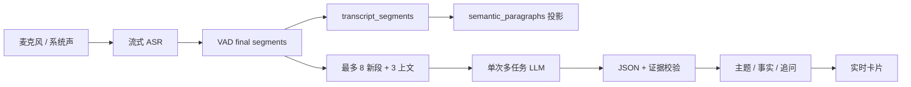
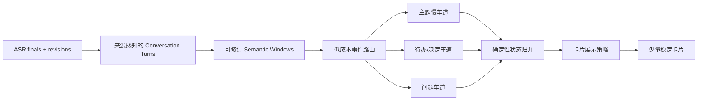
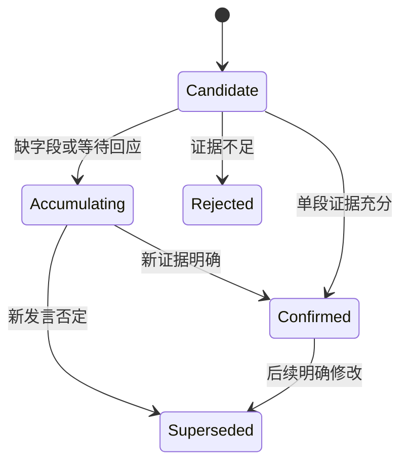

# Talktrace 实时智能质量提升与 Agent 决策方案

> 状态：实施中；来源感知输入、独立教练 lane、Pi Feature Flag 和 A/B 回放工具已完成，真实模型质量对照待运行
> 日期：2026-08-13
> 适用范围：Talktrace Windows 桌面端实时主题、待办、问题、风险及教练卡
> 决策原则：先证明质量瓶颈，再决定是否引入 Pi Agent

## 1. 决策摘要

当前不直接集成 Pi。

主题、待办等实时卡片效果差，首先是一个端到端语义质量问题，而不是 Agent runtime 缺失问题。静态代码核查已经发现几项高概率影响因素：

1. ASR 在静音约 900ms 或连续语音 15 秒时提交 final；这是声学边界，不等于完整语义边界。
2. 系统已经构建 semantic paragraphs，但实时 LLM handler 仍按原始 transcript segments 组织输入。
3. 实时请求最多包含 8 个新 segment 和 3 个前文 segment，跨片段语义可能不完整。
4. 底层保存了 `source_track`，实时 LLM 输入对象却没有该字段，双音轨的“本机/电脑声音”信息没有稳定传到模型。
5. 一个 LLM 请求同时负责主题、决策、待办、风险、未决问题和追问，并受严格证据及 JSON 合约约束。
6. 实时链路可以配置比主模型更弱的 `realtime_model`。
7. 转写修订、语义理解和卡片展示异步发生，可能出现基于旧文本生成或已经失去时效的卡片。

Pi 不会修复这些问题。把相同分片、相同上下文和相同模型放入 Pi，只会把一次不可靠调用变成多轮不可靠调用。

本方案先完成四件事：

- 建立真实录音和人工标注的质量基线。
- 将声学分片、说话轮次、语义窗口三个概念彻底分开。
- 把来源角色带入理解链路，并将多任务大 Prompt 拆成不同节奏的语义任务。
- 用消融实验测量 Pi 相对普通 LLM 的独立增量。

只有当“动态检索历史、跨时段状态修正、多步推演”成为剩余瓶颈，且 Pi 对困难样本产生显著提升时，才进入生产集成。

## 2. 产品目标

### 2.1 目标不是生成更多卡片

实时智能的核心结果应是：

> 在正确时间，以正确人物归因，展示少量可以核验和采取行动的信息。

优先级从高到低：

1. 不误导用户。
2. 不把不完整讨论过早定性为待办或决定。
3. 不遗漏明确承诺、明确问题和关键行动。
4. 在仍可行动的时间窗口内出现。
5. 主题和状态稳定，不随每个 ASR final 抖动。

### 2.2 首批质量对象

| 对象 | 需要回答的问题 | 错误成本 |
| --- | --- | --- |
| 当前主题 | 现在主要在讨论什么，是否真的切换了主题 | 中 |
| 待办 | 谁在什么条件下，要做什么，是否明确承诺 | 高 |
| 决定 | 是提议、倾向还是已经确认 | 高 |
| 未决问题 | 问题是否已经被回答，是否仍值得追问 | 中高 |
| 风险 | 是事实风险、假设风险还是一般担忧 | 中 |
| 教练提示 | 是否与用户当前目标相关，现在是否仍来得及使用 | 很高 |

首轮改造优先处理主题、待办和未决问题。教练卡建立在这三类状态可靠之后。

### 2.3 非目标

本阶段不做：

- Pi Node Sidecar 和 Agent session。
- 飞书、邮件、Jira、日历等连接器。
- 跨会议长期记忆。
- 自动替用户发言或执行外部动作。
- 为提高召回率而降低证据要求。
- 用 Prompt 调优掩盖 ASR 或分片问题。

## 3. 当前链路与高风险点

### 3.1 当前链路



当前实现同时具备原始 segment 和 semantic paragraph，但理解输入主要沿着 `Final -> Batch` 路径，而不是以稳定语义段落为核心。

### 3.2 风险 H1：ASR final 被误当成语义单元

当前 VAD 条件：

- 静音约 900ms 关闭当前 segment。
- 连续语音达到 15 秒强制关闭。

这保证了实时性，却会把一个完整任务拆成多个 final，或者把 15 秒内多个句子放在同一个 final。待办、决定和问题通常需要跨说话轮次才能确认。

典型例子：

```text
远端：支付回调现在还不稳定。
本机：那先不要发布。
远端：小李明天下午之前补一下压测数据。
本机：数据达标后我们再决定窗口。
```

完整理解是：

- 候选待办：小李补压测数据。
- 截止时间：明天下午之前。
- 条件：结果用于决定发布窗口。
- 当前没有形成发布决定。

逐 segment 抽取很容易提前生成“不要发布”的决定，或者丢失待办条件。

### 3.3 风险 H2：语义段落已存在但没有成为模型输入

`semantic_paragraphs` 已经按间隔、时长、句子数和双音轨变化聚合 ASR checkpoints。当前规则包括：

- 3.5 秒间隔边界。
- 最短可读时长约 15 秒。
- 目标时长约 45 秒，硬上限 60 秒。
- 双音轨来源变化时强制分段。

但是 `_v2_intelligence_batch_segments()` 返回的是完整 transcript 中的原始 segments。intelligence job 虽然与 semantic paragraph revision 绑定，实际 Prompt 输入与这一语义投影没有对齐。

这是第一优先级验证项。

### 3.4 风险 H3：双音轨来源在 LLM 输入层丢失

转写表中已有：

- `source_track=microphone`
- `source_track=system_audio`
- speaker ID、label 和 confidence

但 `IntelligenceParagraph` 当前只传入：

- `id`
- `text`
- `revision`
- `start_ms/end_ms`
- `speaker`

缺少 `source_track` 和稳定的 `role_hint`。当 speaker diarization 尚未完成或不确定时，模型无法判断一句承诺更可能来自本机用户还是电脑中的其他参会人。

### 3.5 风险 H4：单次请求任务过载

当前一个输出对象同时包含：

- `topic_update`
- `state_changes`：decision/action_item/risk/open_question
- `follow_up`
- 严格 evidence IDs 和逐字 quote

这同时要求模型完成分类、抽取、状态归并、证据引用和结构化输出。一个字段失败可能触发整包 repair；repair 仍失败时，本轮所有正确子结果也会丢失。

### 3.6 风险 H5：实时模型能力不足

实时链路可以使用独立 `realtime_model`。如果它为了低延迟使用了较弱模型，则以下任务会首先下降：

- 提议与决定的区分。
- 跨句 owner/deadline 组合。
- 问题是否已回答。
- 证据 quote 与 ID 的严格复制。

模型能力和输入质量必须分开测量，不能同时更换后直接归因。

### 3.7 风险 H6：理解时序早于文本稳定

转写 correction lane 与 intelligence lane 独立运行。即使有 evidence revision 校验，仍可能存在：

- 基于初始 final 启动理解，随后文本被修订。
- 卡片生成完成时话题已继续推进。
- 同一语义段落仍在增长，旧 job 已经开始运行。

实时系统需要“可生成候选”和“可以展示”两个独立稳定门槛。

### 3.8 风险 H7：有反馈接口，但没有形成质量闭环

系统已支持：

- suggestion：`kept/ignored/false_positive/too_late`
- entity：`confirmed/dismissed`

但这些反馈还需要转成按版本、模型、场景和原因分组的离线质量报表，否则只能知道用户点了什么，无法知道问题发生在 ASR、分段、抽取还是展示策略。

## 4. 目标架构

### 4.1 三层文本单元

必须保留三种不同用途的数据对象：

| 层级 | 产生方式 | 作用 | 是否直接生成正式卡片 |
| --- | --- | --- | --- |
| Acoustic Segment | VAD/ASR endpoint | 实时转写、修订和音频定位 | 否 |
| Conversation Turn | 来源/说话人/时间重叠 | 表达“谁说了一轮什么” | 仅作输入 |
| Semantic Window | 语义完整性和任务状态 | 主题、待办、问题和教练理解 | 是 |

不能通过改变 ASR final 边界来强行解决所有语义问题。ASR 保持低延迟，理解层在其上建立可修订的窗口。

### 4.2 新链路



### 4.3 `ConversationTurn` 建议契约

```json
{
  "turn_id": "turn_123",
  "meeting_id": "meeting_123",
  "source_track": "system_audio",
  "role_hint": "remote_mix",
  "speaker_id": null,
  "speaker_confidence": null,
  "text": "小李明天下午之前补一下压测数据。",
  "segment_refs": ["system_audio:seg_18", "system_audio:seg_19"],
  "started_at_ms": 42000,
  "ended_at_ms": 48700,
  "stability": "final",
  "revision": 2
}
```

`role_hint` 只表达粗粒度来源：

- `self`：耳机/设备条件下高置信度本机麦克风。
- `remote_mix`：系统音轨中的远端混音。
- `room`：线下环境麦克风，不能默认等于用户。
- `unknown`：来源不足以归因。

### 4.4 `SemanticWindow` 建议契约

```json
{
  "window_id": "window_42",
  "revision": 4,
  "status": "stable",
  "turn_refs": ["turn_120", "turn_121", "turn_122"],
  "started_at_ms": 35000,
  "ended_at_ms": 52000,
  "boundary_reason": "speaker_exchange_and_sentence_closure",
  "text": "远端：支付回调不稳定。\n本机：先不要发布。\n远端：小李明天下午前补压测数据。",
  "source_roles": ["remote_mix", "self"],
  "supersedes_window_id": null
}
```

窗口允许随新 turn 修订。只有达到任务对应的稳定条件，才触发抽取。

## 5. 分段策略

### 5.1 不改变原始转写证据

原始 ASR segments 继续作为证据和音频定位真相。Conversation Turn 和 Semantic Window 都是可重建的派生投影。

这样可以：

- 调整分段算法而不修改用户转写。
- 对同一录音离线重放不同策略。
- 保持 evidence refs 可定位。
- 对比新旧分段版本的真实效果。

### 5.2 Turn 合并规则

初始版本采用确定性规则：

1. 相同 `source_track`、相同 speaker、间隔小于阈值时合并。
2. 双音轨时间重叠但文本不同，保留为两个 turn。
3. 跨音轨高相似文本先做回声/重复判定，不形成双方对话。
4. speaker 未知时，至少按 `source_track` 分开。
5. transcript revision 到来后重建受影响 turn 和 window。

### 5.3 Window 稳定规则

不同任务使用不同窗口，不再用一个万能窗口：

- 主题窗口：最近 30-90 秒，允许多个 turn，低频更新。
- 待办/决定窗口：从承诺或提议起点向前后扩展，等待回应或 2-4 秒 settle time。
- 问题窗口：从问句开始，包含随后一到数个回答 turn。
- 教练窗口：当前事件 + 目标状态 + 最近相关证据，严格时限。

### 5.4 语义窗口不是无限上下文

每次任务输入由三部分组成：

1. 当前稳定窗口原文。
2. 小型 rolling state，例如当前主题、未闭环问题和候选承诺。
3. 确定性检索得到的少量相关历史证据。

普通 LLM 即可使用这种上下文，不需要 Agent 自主决定读取全部会议。

## 6. 任务拆分

### 6.1 主题车道

触发频率：每 20-30 秒评估一次，或检测到明显语义漂移。

输入：

- 最近 60-90 秒 semantic windows。
- 当前主题及其证据。
- 会议目标，仅作为背景，不强迫所有内容归入目标。

输出只包含：

```json
{
  "operation": "keep|shift",
  "title": "string|null",
  "summary": "string|null",
  "evidence_refs": [],
  "confidence": 0.0
}
```

展示规则：

- `shift` 连续两次成立，或一次高置信度且持续超过阈值，才切换主题。
- 同义标题归一化，不因措辞变化更新 UI。
- 主题卡只显示当前状态，不堆叠历史卡。

### 6.2 待办与决定车道

触发条件：检测到承诺、指派、时间、确认、否决、选择方案等候选事件。

第一步只抽取候选：

```json
{
  "candidate_type": "action_item|decision",
  "maturity": "mention|proposal|tentative|confirmed",
  "actor": null,
  "action": "string",
  "deadline": null,
  "conditions": [],
  "evidence_refs": [],
  "missing_fields": []
}
```

第二步由确定性 reducer 处理：

- 同一事项跨窗口补全 owner、deadline 和条件。
- `proposal/tentative` 不展示为已确认决定。
- owner 不确定时显示“负责人待确认”，不能猜名字。
- 新证据否定旧候选时标记 `superseded`，不生成重复卡。

### 6.3 未决问题车道

维护问题状态机：

```text
asked -> partially_answered -> answered
  |              |
  +-> deferred <-+
  +-> abandoned
```

问题是否已回答必须结合后续 turn，不能在检测到问号时立即生成永久卡。

### 6.4 风险车道

风险属于低频任务，首版可以放到 30-60 秒慢车道或会后处理。只有明确影响当前决定、承诺或用户目标的风险才进入实时 UI。

### 6.5 教练车道

教练卡不直接复用待办 Prompt。它消费已经稳定的：

- 当前问题状态。
- 候选承诺及其条件。
- 用户目标和边界。
- 来源角色。

首批只支持：

- 对方问题尚未完整回答。
- 用户可能形成无条件承诺。
- 必问目标即将被跳过。

## 7. LLM 调用策略

### 7.1 一次调用只承担一个主要判断

不再要求一个请求同时完成六类任务。每个任务使用小型 schema，并允许单项失败不影响其他状态。

### 7.2 两阶段输出

模型只生成 candidate，业务 reducer 决定如何更新状态。模型不能直接覆盖正式事实。



### 7.3 结构化输出失败要局部降级

- 主题 schema 失败只影响主题车道。
- 待办中 deadline 非法时保留 action candidate，deadline 置空并标注缺失。
- evidence quote 校验失败时不展示该候选，但保留失败原因用于评测。
- repair 只修复当前小 schema，不重跑所有任务。

### 7.4 模型策略

实验阶段至少比较：

- 当前 realtime model。
- 当前主模型。
- 一个能力更强但延迟更高的对照模型。

模型选择基于任务级质量/延迟曲线，而不是统一指定一个“最快模型”。主题慢车道可以使用稍强模型，问题教练车道才严格追求低延迟。

### 7.5 成本控制

- 规则或轻量分类器只负责触发候选，不生成事实。
- 主题低频运行。
- 没有候选事件时不调用待办/问题 LLM。
- rolling state 使用结构化小对象，不重复发送整场 transcript。
- 对相同 window revision 和任务使用幂等缓存。

## 8. 质量评测与消融实验

### 8.1 先建立评测集

建议首批收集 30-50 段真实脱敏或角色扮演录音，总时长不少于 8 小时，覆盖：

- 腾讯会议耳机双轨。
- 腾讯会议外放和回声。
- 技术评审。
- 项目同步。
- 面试问答。
- 客户沟通。
- 线下多人环境。
- 中英混合、术语和人名。

每段保留：

- 原始双轨音频。
- 实际 ASR finals/revisions。
- 人工校正全文。
- 当前系统 Prompt 输入和原始输出。
- 模型、耗时、token、校验和展示记录。

### 8.2 人工标注

标注对象：

- 语义 turn 边界和来源角色。
- 主题区间及主题切换点。
- 待办、owner、deadline、conditions、成熟度。
- 决定及 `proposal/tentative/confirmed`。
- 问题与回答关系。
- 哪些时间区间不应该展示卡片。
- 教练提示的最晚有效时间。

至少 20% 样本由两人独立标注，计算一致性。标注者意见无法一致的样本不能作为强制金标准。

### 8.3 消融矩阵

| 组别 | 转写 | 分段/来源 | 推理 | 目的 |
| --- | --- | --- | --- | --- |
| A0 | 实际 ASR | 当前 8+3 segments | 当前多任务 Prompt | 现状基线 |
| A1 | 人工全文 | 当前 segments | 当前 Prompt | 测 ASR 文本损失 |
| A2 | 实际 ASR | semantic windows + source role | 当前模型 | 测分段与来源增益 |
| A3 | 实际 ASR | semantic windows + source role | 拆分任务 Prompt | 测任务过载损失 |
| A4 | 实际 ASR | 同 A3 | 更强模型 | 测模型能力上限 |
| A5 | 实际 ASR | 同 A3 | 普通 LLM + 确定性历史检索 | 测无需 Agent 的长上下文方案 |
| A6 | 实际 ASR | 同 A3 | Pi + 相同模型和相同工具 | 测 Agent runtime 独立增量 |

必须保持一次只改变一个主要变量。A6 不能同时换模型、Prompt 和检索库，否则无法证明 Pi 有效。

### 8.4 任务指标

主题：

- 主题区间一致率。
- 主题切换检测 F1。
- 错误切换次数/小时。
- 从真实切换到稳定展示的延迟。

待办和决定：

- 事件级 precision/recall/F1。
- owner/deadline/condition slot accuracy。
- proposal 被误报为 confirmed 的比例。
- 重复候选率。
- 错误人物归因率。

问题：

- 问题发现召回率。
- answered/partially_answered 准确率。
- 已回答问题仍显示为未决的比例。

卡片：

- `kept`、`false_positive`、`too_late` 比例。
- 无价值卡片数/小时。
- 卡片出现到被相关新事实推翻的比例。
- P50/P95 展示延迟。

### 8.5 首轮内部验收门槛

以下是建议的内测门槛，需要用基线调整：

- 明确待办 precision >= 0.85，recall >= 0.70。
- 决定成熟度准确率 >= 0.85。
- owner 错归因 <= 3%。
- 主题错误切换 <= 1 次/30 分钟。
- 无价值实时卡 <= 1 张/20 分钟。
- 普通实时卡 P95 在语义窗口稳定后 3.5 秒内展示。
- correction 或新证据使候选失效后，不再展示旧候选。

## 9. Pi Agent 的 Go / No-Go 实验

### 9.1 Pi 只测试困难子集

Pi 不参与已经能由单次 LLM 完成的样本。只在以下样本测试：

- owner 和条件分布在相隔 2 分钟以上的发言中。
- 新发言明确修改之前的承诺或决定。
- 同时存在多个相似待办，需要查询历史证据消歧。
- 教练判断需要同时读取目标、当前问题和较早立场。

### 9.2 Pi 可使用的工具

- `get_recent_turns`
- `get_current_semantic_window`
- `search_prior_evidence`
- `get_open_questions`
- `get_commitment_candidates`
- `get_user_goal_state`
- `submit_candidate`

工具结果、模型、temperature 和最大 token 与普通 LLM 对照组保持一致。

### 9.3 Go 门槛

满足全部条件才集成：

1. 困难子集事件 F1 相对 A5 至少提升 8 个百分点，或有效教练提示采纳率提升至少 10%。
2. 错归因率和误报率不恶化。
3. P95 延迟仍在对应产品场景可用窗口内。
4. 单小时模型成本增幅有明确用户价值支撑。
5. 至少 20% 真实会议触发了单次 LLM 无法完成、而 Pi 成功完成的多步流程。

### 9.4 No-Go 条件

以下任一成立则不集成：

- Pi 主要只是调用一次 `get_recent_turns` 后直接回答。
- 提升来自更强模型或更长 Prompt，而不是 Agent 循环。
- 多步调用提高召回但明显增加误报和迟到。
- 真实会议中很少出现需要动态工具选择的场景。
- 确定性检索 + 普通 LLM 已达到相同效果。

## 10. 实施计划

### 阶段 0：可观测性与基线，3-5 天

交付：

- 导出每次 intelligence run 的输入窗口、来源、模型、原始输出、repair、校验失败和最终卡片。
- 将已有 suggestion/entity 反馈关联到 run、window revision 和模型版本。
- 建立首批 10 段录音的小型评测集。
- 生成 A0 基线报表。

退出条件：可以回答“一张错误卡片在哪一层开始出错”。

### 阶段 1：来源感知语义输入，1 周

交付：

- 新增 `ConversationTurn` 派生投影。
- `SemanticWindow` 携带 source track、role hint、speaker confidence 和原始 segment refs。
- intelligence handler 改为消费 semantic windows，不再直接将原始 8+3 segments 当作语义单元。
- transcript revision 可使相关 window 重建和旧候选失效。
- 回放测试覆盖双音轨重叠与回声去重。

退出条件：A2 相对 A0 的分片和人物归因提升可量化。

### 阶段 2：任务拆分与状态 reducer，1-2 周

交付：

- 拆分 topic、commitment/decision、question 三个 schema。
- 建立 candidate 状态机和确定性 merge/supersede 规则。
- 为不同任务设置不同触发和 settle time。
- 单项校验失败不再丢弃其他任务结果。
- UI 区分“候选/待确认”和“已确认”。

退出条件：A3 达到首轮 precision 门槛，卡片抖动和重复率明显下降。

### 阶段 3：模型与检索优化，1 周

交付：

- 完成 realtime model 对照。
- 增加确定性历史检索和 bounded rolling state。
- 建立每类任务的质量/延迟/成本曲线。
- 完成 A4/A5。

退出条件：明确普通 LLM 方案的质量上限和成本。

### 阶段 4：Pi 对照 Spike，3-5 天

仅在阶段 3 后执行：

- 使用 `pi-agent-core` 建立离线或 Feature Flag 对照。
- 不接 UI，不改生产主链路。
- 只实现 5-7 个只读工具。
- 在困难子集完成 A6。
- 输出 Go / No-Go 决策报告。

退出条件：达到第 9.3 节门槛，或者明确停止 Pi 集成。

### 阶段 5：实时私人教练，2-3 周

只有基础状态达到质量门槛后再做：

- 问题漏答提醒。
- 承诺条件提醒。
- 目标遗漏提醒。
- 一次只展示一张卡。
- `采用/忽略/误报/太晚` 反馈闭环。

## 11. 代码改造范围

### 11.1 ASR 层

涉及：

- `asr_stream.py`

原则：不急于修改 900ms/15s endpoint；先把它明确定位为 acoustic segment，并记录 endpoint reason 和质量数据。

### 11.2 语义投影层

涉及：

- `semantic_paragraphs.py`
- `v2_persistence.py`

改造：

- 从“阅读段落”升级为来源感知的理解窗口。
- 增加窗口版本、边界原因、source roles 和稳定状态。
- 保留从 window 到原始 segments 的完整映射。

### 11.3 实时智能层

涉及：

- `realtime_intelligence.py`
- `app.py` 中 `_v2_intelligence_batch_segments()` 和 intelligence handler

改造：

- 输入从 raw segments 改为 semantic windows/turns。
- 将 `source_track/role_hint/speaker_confidence` 加入 schema。
- 多任务合约拆分。
- 每类任务独立失败、重试和指标。

### 11.4 状态与展示层

涉及：

- `v2_persistence.py`
- `NowRail.tsx`
- 相关 snapshot/events/types

改造：

- 增加 candidate maturity 和 superseded 状态。
- 主题稳定更新，不按每个 segment 变动。
- 待办明确展示缺失字段和成熟度。
- 过期或被修订候选不进入 UI。

### 11.5 评测工具

建议新增：

```text
tools/realtime_intelligence_eval/
  dataset.schema.json
  replay.py
  score.py
  compare.py
  README.md
```

评测必须能固定同一录音、ASR 结果和模型输出，重复运行不同窗口及 reducer 版本。

## 12. 测试策略

### 12.1 单元测试

- 同一说话人短停顿 turn 合并。
- 双音轨重叠不错误合并。
- 回声重复只保留一个权威 turn。
- transcript revision 重建 window。
- 待办跨三个 turn 补全。
- proposal 不升级为 confirmed。
- 问题部分回答后保持 partially_answered。
- 旧候选被新证据 supersede。

### 12.2 契约测试

- 每类 LLM schema 单独验证。
- source role 和 evidence refs 不丢失。
- 小 schema repair 不影响其他车道。
- 模型响应合法但证据过期时拒绝展示。

### 12.3 回放测试

- 用真实音频按原始时间节奏重放。
- 同时测实际 ASR和固定 transcript replay。
- 检查卡片出现时间，而不只检查最终 snapshot。
- 桌面双轨设备切换和录音主链路不能被智能任务阻塞。

## 13. 风险与控制

| 风险 | 影响 | 控制方式 |
| --- | --- | --- |
| semantic window 太慢 | 卡片来不及 | 不同任务使用不同 settle time |
| 拆分任务增加调用次数 | 成本上升 | 事件触发、缓存、慢车道降频 |
| 来源角色被误判 | 错归因 | role hint 与真实身份分离，低置信度不定人 |
| precision 提升但 recall 降低 | 漏掉待办 | candidate 累积，会后再做高召回补全 |
| Prompt 调优过拟合样本 | 线上退化 | 场景分层、留出集和版本化评测 |
| Pi Spike 变成正式架构 | 提前增加复杂度 | 只做离线 Feature Flag，对照不过不进入产品 |

## 14. 推荐的第一批任务

按顺序执行：

1. 导出 10 个效果差的真实会议样本及每次 intelligence 输入/输出。
2. 人工标注主题、待办、来源和卡片最佳时间。
3. 用人工正确全文重跑当前 Prompt，判断 ASR 文本本身占多少损失。
4. 用现有 semantic paragraphs + source track 重跑同一模型。
5. 拆分主题和待办 Prompt，再跑一次。
6. 根据结果决定先修 ASR、语义窗口还是模型。
7. 在普通 LLM + 确定性检索达到稳定基线前，不开始 Pi 集成。

## 15. 最终建议

Talktrace 当前最有价值的技术投资不是“增加一个 Agent”，而是建立一条可信的实时对话理解管线。

短期路线：

> ASR 声学分片 -> 来源感知说话轮次 -> 可修订语义窗口 -> 单任务 LLM 候选 -> 确定性状态归并 -> 低打扰卡片策略

这条链路本身就能显著提升现有主题和待办卡片，也为实时私人教练建立必要基础。

Pi 的位置应当在链路末端：当单次 LLM 加确定性检索已经可靠，但长时状态、多步取证和动态修正仍然限制产品效果时，用严格 A/B 证明其增量。证明不了，就不集成。

## 16. 当前代码依据

- `code/web_mvp/backend/meeting_copilot_web_mvp/asr_stream.py`：VAD endpoint 和最大 segment 时长。
- `code/web_mvp/backend/meeting_copilot_web_mvp/v2_persistence.py`：semantic paragraph 投影、双音轨去重、intelligence job 和用户反馈。
- `code/web_mvp/backend/meeting_copilot_web_mvp/semantic_paragraphs.py`：段落聚合与 intelligence batcher。
- `code/web_mvp/backend/meeting_copilot_web_mvp/app.py`：实时 intelligence 批次和 LLM handler。
- `code/web_mvp/backend/meeting_copilot_web_mvp/realtime_intelligence.py`：当前多任务 Prompt、输入上限、证据校验和 repair。
- `code/web_mvp/frontend_v2/src/features/live-meeting/NowRail.tsx`：实时主题、追问和事实卡片。
